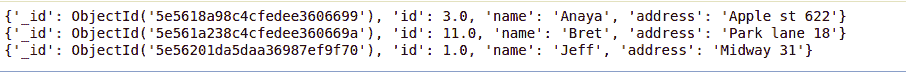
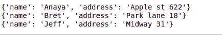

# python mongbod—查找

> 原文:[https://www.geeksforgeeks.org/python-mongodb-find/](https://www.geeksforgeeks.org/python-mongodb-find/)

MongoDB 是一个跨平台的面向文档的数据库程序，也是最流行的 NoSQL 数据库程序。NoSQL 这个术语的意思是非关系的。MongoDB 以键值对的形式存储数据。它是一个开源的文档数据库，提供高性能和可伸缩性，以及企业应用程序中大量数据集的数据建模和数据管理。MongoDB 还提供了自动缩放功能。它使用类似 JSON 的文档，这使得数据库非常灵活和可扩展。

## 从集合或数据库中查找数据

在 MongoDB 中，有 2 个函数用于从集合或数据库中查找数据。

*   **find_one()**
*   **find()**

#### Find_one()

在 MongoDB 中，要从集合中选择数据，我们使用`find_one()`方法。它返回选择中第一个出现的信息，并作为输出返回。在`find_one()`方法中，不需要参数，因为它从数据库中获取第一次出现的信息。

**示例 1:** 从学生的收藏/数据库中找到第一个文档。

让我们假设数据库如下所示–


## 蟒蛇 3

```
# Python program to demonstrate
# find_one()

import pymongo

mystudent = pymongo.MongoClient('localhost', 27017)

# Name of the database
mydb = mystudent["gfg"]

# Name of the collection
mycol = mydb["names"]

x = mycol.find_one()

print(x)
```

**输出:**


#### 查找()

`find()`方法用于从数据库中选择数据。它返回集合中存储的所有信息。它有两种类型的参数，`find()`方法的第一个参数是一个查询对象。在下面的示例中，我们将使用一个空的 Query 对象，该对象将从集合中选择所有信息。

**注意:**和 **SELECT*** 一样工作，没有任何参数。

**示例:**

## 蟒蛇 3

```
import pymongo

# establishing connection
# to the database
my_client = pymongo.MongoClient('localhost', 27017)

# Name of the database
mydb = my_client["gfg"]

# Name of the collection
mynew = mydb["names"]

for x in mycol.find():
    print(x)
```

**输出:**



find()方法的第二个参数是您可以指定要包含在结果中的字段。find()方法中传递的第二个参数是描述字段的对象类型。因此，该参数是可选的。

如果省略，则集合/数据库中的所有字段都将显示在结果中。
要将该字段包含在结果中，传递的参数值应为 1，如果该值为 0，则将从结果中排除。

**示例:**只返回姓名和地址，不返回 id:

## 蟒蛇 3

```
import pymongo

# establishing connection
# to the database
my_client = pymongo.MongoClient('localhost', 27017)

# Name of the database
mydb = my_client["gfg"]

# Name of the collection
mynew = mydb["names"]

for x in mycol.find({}, {"_id":0, "name": 1, "address": 1 }):
    print(x)
```

**输出:**

