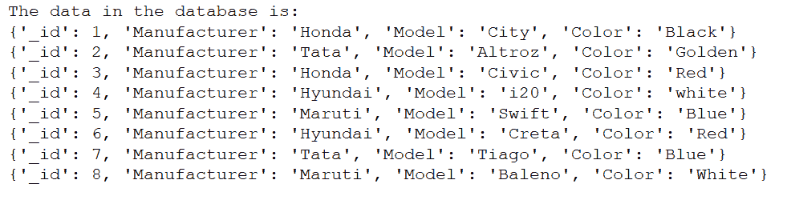
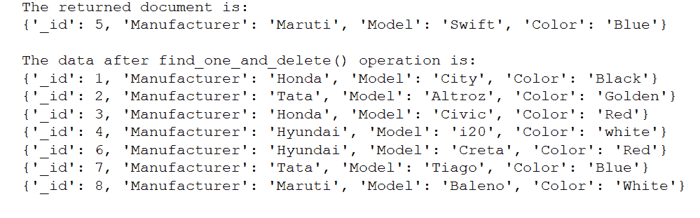
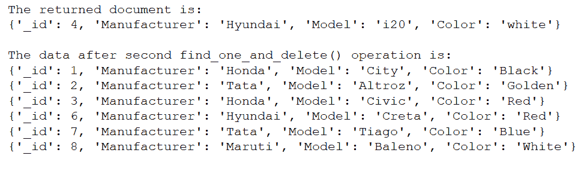

# Python MongoDB–find _ one _ and _ delete 查询

> 原文:[https://www . geesforgeks . org/python-MongoDB-find _ one _ and _ delete-query/](https://www.geeksforgeeks.org/python-mongodb-find_one_and_delete-query/)

**[【MongoDB】](https://www.geeksforgeeks.org/mongodb-and-python/)**是一个跨平台的面向文档和非关系(即 NoSQL)的数据库程序。它是一个开源文档数据库，以键值对的形式存储数据。

## 查找和删除查询

此函数用于根据我们传递的过滤器从集合中删除单个文档，并从集合中返回删除的文档。它找到与过滤器匹配的第一个匹配字段，并将其从集合中删除，即找到单个文档并将其删除，返回该文档。

> **语法:****collection . find _ one _ and _ delete(筛选，投影=无，排序=无，会话=无，**kwargs)**
> 
> **参数:**
> 
> *   **“筛选”:**与要删除的文档匹配的查询。
> *   **“投影”(可选):**应在结果文档中返回的字段名称列表或指定要包括或排除的字段的映射。如果“projection”是列表，将总是返回“_id”。使用映射从结果中排除字段(例如，投影= {“_ id”:False })。
> *   **“排序”(可选):**指定查询排序顺序的(键、方向)对列表。如果多个文档与查询匹配，则会对它们进行排序，并删除第一个文档。
> *   **‘session’(可选):**一个类:“~pymongo.client_session。ClientSession”。
> *   **'**kwargs '(可选):**其他命令参数可以作为关键字参数传递(例如，maxTimeMS 可以用于最近的服务器版本)。

**例 1:**

**样本数据库:**



```
# importing Mongoclient from pymongo
from pymongo import MongoClient 

# Making Connection
myclient = MongoClient("mongodb://localhost:27017/") 

# database 
db = myclient["mydatabase"]

# Created or Switched to collection 
# names: GeeksForGeeks
Collection = db["GeeksForGeeks"]

# Defining the filter that we want to use.
Filter ={'Manufacturer': 'Maruti'}

# Using find_one_and_delete() function.
print("The returned document is:")
print(Collection.find_one_and_delete(Filter,
                                     projection = None,
                                     sort = None))

# Printing the data in the collection
# after find_one_and_delete() operation.
print("\nThe data after find_one_and_delete() operation is:")

for data in Collection.find():
    print(data)
```

**输出:**


**例 2:**

```
# importing Mongoclient from pymongo
from pymongo import MongoClient 

# Making Connection
myclient = MongoClient("mongodb://localhost:27017/") 

# database 
db = myclient["mydatabase"]

# Created or Switched to collection 
# names: GeeksForGeeks
Collection = db["GeeksForGeeks"]

# Defining the filter that we want to use.
Filter ={'Manufacturer': 'Hyundai'}

# Using find_one_and_delete() function.
print("The returned document is:")
print(Collection.find_one_and_delete(Filter,
                                     projection = None,
                                     sort = None))

# Printing the data in the collection
# after find_one_and_delete() operation.
print("\nThe data after find_one_and_delete() operation is:")

for data in Collection.find():
    print(data)
```

**输出:**
