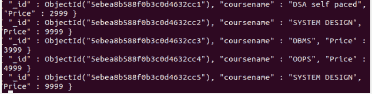
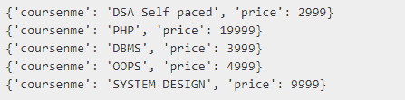

# Python MongoDB–find _ one _ and _ replace 查询

> 原文:[https://www . geesforgeks . org/python-MongoDB-find _ one _ and _ replace-query/](https://www.geeksforgeeks.org/python-mongodb-find_one_and_replace-query/)

**find_one_and_replace()** 方法搜索一个文档，如果找到则替换为 [MongoDb](https://www.geeksforgeeks.org/mongodb-and-python/) 中给定的第二个参数。 **find_one_and_replace()** 方法不同于 **find_one_and_update()** 借助过滤器将其替换文档而不是更新现有文档。

> **语法:** find_one_and_replace(筛选，替换，投影=无，排序=无，return_document=ReturnDocument。BEFORE，session=None，**kwargs)
> **参数**
> **过滤器:**替换匹配文档的查询。
> **替换:**替换文档。
> **投影:**可选。应在结果中返回的字段列表。
> **排序:**键，方向对为查询的排序顺序。
> **return_document:** 退回原单据，不替换。
> *** *夸格斯:**附加命令。

**以下所有示例中使用的示例数据库:**



**例 1:**

## 蟒蛇 3

```
import pymongo

# establishing connection
# to the database
client = pymongo.MongoClient("mongodb://localhost:27017/")

# Database name
db = client["mydatabase"]

# Collection name
col = db["gfg"]

# replace with the help of
# find_one_and_replace()
col.find_one_and_replace({'coursename':'SYSTEM DESIGN'},
                         {'coursename': 'PHP'})

# print the document after replacement
for x in col.find({}, {"_id":0, "coursename": 1, "price": 1 }):
    print(x)
```

**输出:**


**例 2:**

## 蟒蛇 3

```
import pymongo

# establishing connection
# to the database
client = pymongo.MongoClient("mongodb://localhost:27017/")

# Database name
db = client["mydatabase"]

# Collection name
col = db["gfg"]

# replace with the help of
# find_one_and_replace()
col.find_one_and_replace({'price':9999}, {'price':19999})

# print the document after replacement
for x in col.find({}, {"_id":0, "coursename": 1, "price": 1 }):
    print(x)
```

**输出:**

