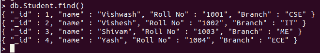
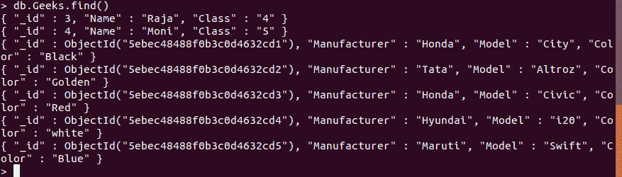

# Python MongoDB–insert _ multi 查询

> 原文:[https://www . geesforgeks . org/python-MongoDB-insert _ multi-query/](https://www.geeksforgeeks.org/python-mongodb-insert_many-query/)

**[【MongoDB】](https://www.geeksforgeeks.org/mongodb-and-python/)**是一个跨平台的面向文档和非关系(即 NoSQL)的数据库程序。它是一个开源文档数据库，以键值对的形式存储数据。MongoDB 由 MongoDB Inc .开发，最初于 2009 年 2 月 11 日发布。它是用 C++、Go、JavaScript、Python 语言编写的。MongoDB 提供了高速度、高可用性和高扩展性。

## insert _ multi()

此方法用于在 MongoDB 的集合或数据库中插入多个条目。此方法的参数是一个列表，其中包含我们要插入到集合中的数据的字典。

此方法返回类“~ pymongo . results . insertmany result”的实例，该实例有一个保存插入文档 id 的“_id”字段。如果文档没有指定“_id”字段，那么 MongoDB 会将“_id”字段添加到列表中的所有数据中，并在插入之前为文档分配一个唯一的对象 id。

> **语法:** collection.insert_many(文档，有序=真，旁路 _ 文档 _ 验证=假，会话=无)
> 
> **参数:**
> 
> *   **“文档”**:可插入的文档列表。
> *   **“有序”(可选):**如果“真”(默认)，文档将按提供的顺序连续插入服务器。如果出现错误，所有剩余的插入都将中止。如果为“假”，将在服务器上以任意顺序插入文档，可能是并行的，并且将尝试所有的文档插入。
> *   **‘bypass _ document _ validation’(可选):**如果为“真”，则允许写操作选择退出文档级验证。默认值为“假”。
> *   **'session '(可选):**一个类' ~pymongo.client_session。ClientSession。

**例 1:** 在本例中提供了 _id。

```py
# importing Mongoclient from pymongo
from pymongo import MongoClient 

myclient = MongoClient("mongodb://localhost:27017/")

# database 
db = myclient["GFG"]

# Created or Switched to collection 
# names: GeeksForGeeks
collection = db["Student"]

# Creating a list of records which we 
# insert in the collection using the
# update_many() method.
mylist = [
  { "_id": 1, "name": "Vishwash", "Roll No": "1001", "Branch":"CSE"},
  { "_id": 2, "name": "Vishesh", "Roll No": "1002", "Branch":"IT"},
  { "_id": 3, "name": "Shivam", "Roll No": "1003", "Branch":"ME"},
  { "_id": 4, "name": "Yash", "Roll No": "1004", "Branch":"ECE"},
]

# In the above list _id field is provided so it inserted in 
# the collection as specified.

# Inseting the entire list in the collection
collection.insert_many(mylist)
```

**输出:**



**例 2:** 本例中未提供 _id，由 MongoDB 自动分配。

```py
# importing Mongoclient from pymongo
from pymongo import MongoClient 

myclient = MongoClient("mongodb://localhost:27017/")

# database 
db = myclient["GFG"]

# Created or Switched to collection
# names: GeeksForGeeks
collection = db["Geeks"]

# Creating a list of records which we 
# insert in the collection using the
# update_many() method.
mylist = [
  {"Manufacturer":"Honda", "Model":"City", "Color":"Black"},
  {"Manufacturer":"Tata", "Model":"Altroz", "Color":"Golden"},
  {"Manufacturer":"Honda", "Model":"Civic", "Color":"Red"},
  {"Manufacturer":"Hyundai", "Model":"i20", "Color":"white"},
  {"Manufacturer":"Maruti", "Model":"Swift", "Color":"Blue"},
]
# In the above list we do not specify the _id, the MongoDB assigns 
# a unique id to all the records in the collection by default.

# Inseting the entire list in the collection
collection.insert_many(mylist)
```

**输出:**

