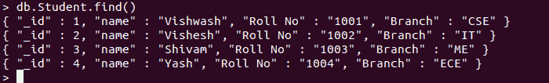

# Python MongoDB–insert _ one 查询

> 原文:[https://www . geesforgeks . org/python-MongoDB-insert _ one-query/](https://www.geeksforgeeks.org/python-mongodb-insert_one-query/)

[**【MongoDB】**](https://www.geeksforgeeks.org/mongodb-and-python/)是一个跨平台的面向文档和非关系(即 NoSQL)的数据库程序。它是一个开源文档数据库，以键值对的形式存储数据。MongoDB 由 MongoDB Inc .开发，最初于 2009 年 2 月 11 日发布。它是用 C++、Go、JavaScript、Python 语言编写的。MongoDB 提供了高速度、高可用性和高扩展性。

## insert_one()

通过这种方法，我们可以在 MongoDB 的集合或数据库中插入一个条目。如果集合不存在，此方法将创建一个新集合并将数据插入其中。它将 dictionary 作为一个参数，包含要插入集合的文档中每个字段的名称和值。
这个方法返回类“~ pymongo . results . insertone result”的一个实例，它有一个“_id”字段保存插入文档的 id。如果文档没有指定“_id”字段，那么 MongoDB 将添加“_id”字段，并在插入之前为文档分配唯一的对象 id。

> **语法:**collection . insert _ one(document，bypass _ document _ validation = False，session=None)
> 
> **参数:**
> 
> *   **“文档”:**要插入的文档。必须是可变映射类型。如果文档没有 _id 字段，将自动添加一个。
> *   **‘bypass _ document _ validation’(可选):**如果为“真”，则允许写操作选择退出文档级验证。默认值为“假”。
> *   **'session '(可选):**一个类' ~pymongo.client_session。ClientSession。

**例 1:**

**样本数据库:**



## 蟒蛇 3

```py
# importing Mongoclient from pymongo
from pymongo import MongoClient 

# Making Connection
myclient = MongoClient("mongodb://localhost:27017/") 

# database 
db = myclient["GFG"]

# Created or Switched to collection 
# names: GeeksForGeeks
collection = db["Student"]

# Creating Dictionary of records to be 
# inserted
record = { "_id": 5,
          "name": "Raju",
          "Roll No": "1005",
          "Branch": "CSE"}

# Inserting the record1 in the collection 
# by using collection.insert_one()
rec_id1 = collection.insert_one(record)
```

**输出:**


**示例 2:** 插入多个值

## 蟒蛇 3

```py
# importing Mongoclient from pymongo
from pymongo import MongoClient 

# Making Connection
myclient = MongoClient("mongodb://localhost:27017/") 

# database 
db = myclient["GFG"]

# Created or Switched to collection 
# names: GeeksForGeeks
collection = db["Student"]

# Creating Dictionary of records to be 
# inserted
records = {
    "record1": { "_id": 6,
    "name": "Anshul",
    "Roll No": "1006",
    "Branch": "CSE"},

    "record2": { "_id": 7,
    "name": "Abhinav",
    "Roll No": "1007",
    "Branch": "ME"}
}

# Inserting the records in the collection 
# by using collection.insert_one()
for record in records.values():
    collection.insert_one(record)
```

**输出:**

