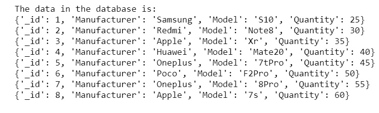
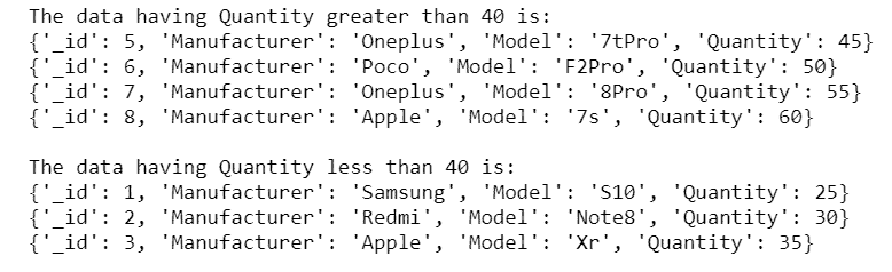
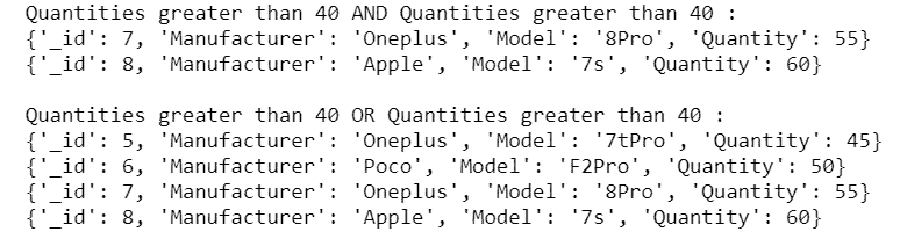

# python mongbod—查询

> 原文:[https://www.geeksforgeeks.org/python-mongodb-query/](https://www.geeksforgeeks.org/python-mongodb-query/)

**[【MongoDB】](https://www.geeksforgeeks.org/mongodb-and-python/)**是一个跨平台的面向文档和非关系(即 NoSQL)的数据库程序。它是一个开源文档数据库，以键值对的形式存储数据。

## 什么是蒙古数据库查询？

MongoDB 查询用于在通过`db.find()`方法从集合中检索数据时，使用查询运算符指定选择过滤器。我们可以使用查询对象轻松过滤文档。要对集合应用过滤器，我们可以将指定所需文档条件的查询作为参数传递给该方法，这是`db.find()`方法的可选参数。

**查询选择器:**

以下是 MongoDB 查询中使用的一些运算符的列表。

| 操作 | 句法 | 描述 |
| --- | --- | --- |
| 平等 | {“键”:“值”} | 匹配等于指定值的值。 |
| 不到 | {"key" :{$lt:"value"}} | 匹配小于指定值的值。 |
| 大于 | {“键”:{$gt:“值”}} | 匹配大于指定值的值。 |
| 小于等于 | {“key”:{ $ LTE:“value”} } | 匹配小于或等于指定值的值。 |
| 大于等于 | {“key”:{ $ LTE:“value”} } | 匹配大于或等于指定值的值。 |
| 不等于 | {“key”:{ $ ne:“value”} } | 匹配所有不等于指定值的值。 |
| 逻辑“与” | { "$and":[{exp1}，{exp2}，…，{expN}] } | 用逻辑“与”连接查询子句会返回所有符合两个子句条件的文档。 |
| 逻辑或 | { "$or":[{exp1}，{ | 用逻辑“或”连接查询子句会返回符合任一子句条件的所有文档。 |
| 逻辑非 | { "$not":[{exp1}、{exp2}、…、{expN}] } | 反转查询表达式的效果，并返回与查询表达式不匹配的文档。 |

**我们操作的数据库或集合:**


**例 1:**

```py
# importing Mongoclient from pymongo
from pymongo import MongoClient 

# Making Connection
myclient = MongoClient("mongodb://localhost:27017/") 

# database 
db = myclient["mydatabase"]

# Created or Switched to collection
# names: GeeksForGeeks
Collection = db["GeeksForGeeks"]

# Filtering the Quantities greater
# than 40 using query.
cursor = Collection.find({"Quantity":{"$gt":40}})

# Printing the filterd data.
print("The data having Quantity greater than 40 is:")
for record in cursor: 
    print(record) 

# Filtering the Quantities less 
# than 40 using query.
cursor = Collection.find({"Quantity":{"$lt":40}})

# Printing the filterd data.
print("\nThe data having Quantity less than 40 is:")
for record in cursor: 
    print(record) 
```

**输出:**



**例 2:**

```py
# importing Mongoclient from pymongo
from pymongo import MongoClient 

# Making Connection
myclient = MongoClient("mongodb://localhost:27017/") 

# database 
db = myclient["mydatabase"]

# Created or Switched to collection 
# names: GeeksForGeeks
Collection = db["GeeksForGeeks"]

# Filtering the (Quantities greater than
# 40 AND greater than 40) using AND query.
cursor = Collection.find({"$and":[{"Quantity":{"$gt":40}},
                                  {"Quantity":{"$gt":50}}]})

# Printing the filterd data.
print("Quantities greater than 40 AND\
Quantities greater than 40 :")
for record in cursor: 
    print(record) 

# Filtering the (Quantities greater than
# 40 OR greater than 40) using OR query.
cursor = Collection.find({"$or":[{"Quantity":{"$gt":40}},
                                 {"Quantity":{"$gt":50}}]})

# Printing the filterd data.
print()
print("Quantities greater than 40 OR\
Quantities greater than 40 :")
for record in cursor: 
    print(record) 
```

**输出:**
