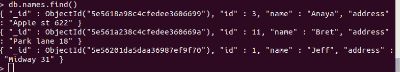
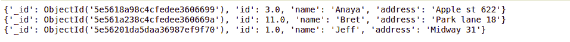
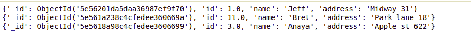

# python mongdb–sort

> 哎哎哎:# t0]https://www . geeksforgeeks . org/python-monodb-sort/

MongoDB 是一个跨平台的面向文档的数据库程序，也是最流行的 NoSQL 数据库程序。术语“NoSQL”指的是非关系的“T1”。MongoDB 以键值对的形式存储数据。它是一个开源的文档数据库，提供高性能和可伸缩性，以及企业应用程序中大量数据集的数据建模和数据管理。MongoDB 还提供了自动缩放功能。它使用类似 JSON 的文档，这使得数据库非常灵活和可扩展。

**注:**更多信息请参考 [MongoDB 和 Python](https://www.geeksforgeeks.org/mongodb-and-python/)

### 对 MongoDB 文档进行排序

`sort()`方法用于按一定顺序对数据库进行排序。这个方法接受两个参数，第一个是字段名称，第二个是排序方向。(默认情况下，它按升序排序)

**语法:**

```
sort(fieldname, direction)
```

**注意:** 1 为方向为升序，-1 为方向为降序

**示例 1:** 使用 sort()函数按名称的字母顺序对结果进行排序。

让我们假设数据库如下所示–



```
# python code to sort elements
# alphabetically in ascending order

import pymongo

# establishing connection
# to the database
my_client = pymongo.MongoClient('localhost', 27017)

# Name of the database
mydb = my_client["gfg"]

# Name of the collection
mynew = mydb["names"]

# sorting function 
mydoc = mynew.find().sort("name")

for x in mydoc:
    print(x)
```

**输出:**



**例 2:** 降序排序

```
import pymongo

# establishing connection 
# to the database
my_client = pymongo.MongoClient('localhost', 27017)

# Name of the database
mydb = my_client["gfg"]

# Name of the collection
mynew = mydb["names"]

# sorting function with -1 
# as direction
mydoc = mynew.find().sort("name", -1)

for x in mydoc:
    print(x)
```

**输出:**

