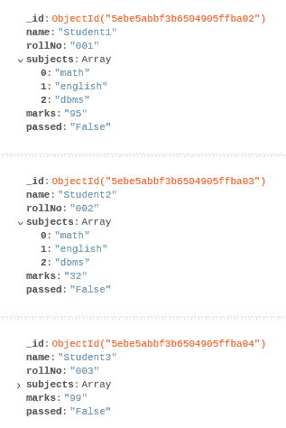
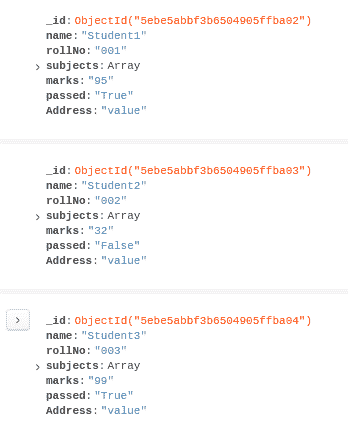

# Python MongoDB–更新 _ 多次查询

> 原文:[https://www . geesforgeks . org/python-MongoDB-update _ multi-query/](https://www.geeksforgeeks.org/python-mongodb-update_many-query/)

[**MongoDB**](https://www.geeksforgeeks.org/mongodb-and-python/) 是一个 NoSQL 的数据库管理系统。与 MySQL 不同，MongoDB 中的数据不是以关系或表的形式存储的。mongoDB 中的数据存储为文档。文档是类似于 Javascript/JSON 的对象。蒙古数据库中更正式的文档使用 BSON。 **PyMongo** 是 python 的 MongoDB API。它允许使用 python 脚本从 MongoDB 数据库中读写数据。它需要 python 和 mongoDB 都安装在系统上。

## 更新 _ 许多()

更新功能已在较新版本的 MongoDB (3.xx 及以上版本)中被否决。使用“multi = true”，早期的更新功能可用于单次更新和多次更新。但是在 mongoDB 的较新版本中，建议使用 update _ multi()和 update_one()。

主要区别在于，如果查询将更新单个或多个文档，用户需要提前做好计划。

**语法:**

```
db.collection.updateMany(
   <filter>,
   <update>,
   {
     upsert: <boolean>,
     writeConcern: <document>,
     collation: <document>,
     arrayFilters: [ <filterdocument1>, ... ],
     hint:  <document|string>
   }
)

```

**更新 MongoDB 中的操作符**

**设定值:**

*   *$set:* 用于设置字段值。
*   *$ settinsert:*仅在插入新文档时更新值。
*   *$unset:* 删除该字段及其值。

**数值运算符:**

*   *$inc:* 将值增加给定的数量。
*   *$min/$max:* 返回最小值或最大值。
*   *$mul:* 将数值乘以给定的数值。

**其他操作员:**

*   *$currentDate:* 将字段值更新为当前日期。
*   *$重命名*:重命名字段

**样本数据库:**



**我们将在本文中看到的一些用例，在这些用例中更新许多记录可能是有用的:**

1.  根据条件改变或增加几个元素。
2.  向多个或所有文档插入新字段。

**例 1:** 成绩大于 35 分的学生全部通过。

## 蟒蛇 3

```
from pymongo import MongoClient

# Creating an instance of MongoClient 
# on default localhost
client = MongoClient('mongodb://localhost:27017')

# Accessing desired database and collection
db = client.gfg
collection = db["classroom"]

# Update passed field to be true for all
# students with marks greater than 35
collection.update_many(
    {"marks": { "$gt": "35" } },
        {
            "$set": { "passed" : "True" }
        }
)
```

**查询后数据库:**


**示例 2:** 添加到所有文档的名为地址的新字段

## 计算机编程语言

```
from pymongo import MongoClient

# Creating an instance of MongoClient 
# on default localhost
client = MongoClient('mongodb://localhost:27017')

# Accessing desired database and collection
db = client.gfg
collection = db["classroom"]

# Address filed to be added to all documents
collection.update_many(
        {},
        {"$set":
            {
                "Address": "value"
            }
        },

   # don't insert if no document found
   upsert=False,
   array_filters=None
   )
```

**查询后数据库:**

