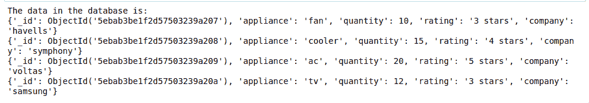
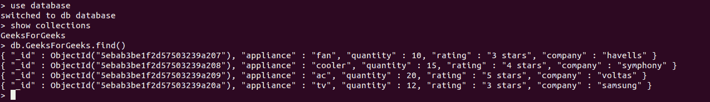
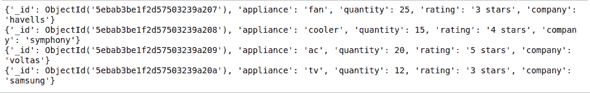
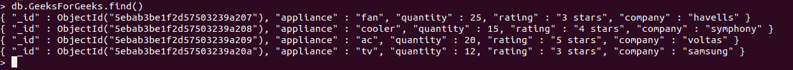
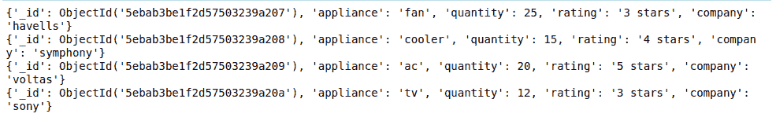
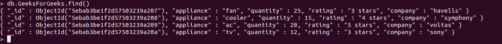

# Python MongoDB–Update _ one()

> 原文:[https://www.geeksforgeeks.org/python-mongodb-update_one/](https://www.geeksforgeeks.org/python-mongodb-update_one/)

**MongoDB** 是一个跨平台的面向文档和非关系(即 NoSQL)的数据库程序。它是一个开源文档数据库，以键值对的形式存储数据。

**首先创建一个数据库，我们在其上执行 update_one()操作:**

```
# importing Mongoclient from pymongo
from pymongo import MongoClient 

try: 
    conn = MongoClient()  # Making coonection

except: 
    print("Could not connect to MongoDB") 

# database 
db = conn.database 

# Created or Switched to collection
# names: GeeksForGeeks
collection = db.GeeksForGeeks 

# Creating Records:
record1 = { "appliance":"fan",
           "quantity":10,
           "rating":"3 stars",
           "company":"havells"} 
record2 = { "appliance":"cooler", 
           "quantity":15,
           "rating":"4 stars",
           "company":"symphony"} 
record3 = { "appliance":"ac",
           "quantity":20,
           "rating":"5 stars",
           "company":"voltas"} 
record4 = { "appliance":"tv",
           "quantity":12,
           "rating":"3 stars",
           "company":"samsung"} 

# Inserting the Data 
rec_id1 = collection.insert_one(record1) 
rec_id2 = collection.insert_one(record2) 
rec_id3 = collection.insert_one(record3) 
rec_id4 = collection.insert_one(record4)

# Printing the data inserted 
print("The data in the database is:")
cursor = collection.find() 
for record in cursor: 
    print(record) 
```

**输出:**



**蒙戈布外壳:**



## 已更新()

这是一个函数，通过它我们可以更新 MongoDB 数据库或集合中的记录。这个方法主要关注我们传递的两个参数一个是定义更新哪个文档的查询(即过滤器)对象，第二个是定义文档新值(即 new_values)的对象，剩下的参数是可选的，我们将在语法部分讨论。此函数查找与查询匹配的第一个文档，并使用定义文档新值的对象对其进行更新，即根据过滤器更新集合中的单个文档。
**语法:**

> collection.update_one(筛选器，new_values，upsert = False，bypass _ document _ validation = False，排序规则=无，array _ filters =无，session =无)
> 
> **参数:**
> 
> *   **“过滤器”:**匹配要更新的文档的查询。
> *   **“new _ values”**:要应用的修改。
> *   **“向上插入”(可选):**如果“真”，如果没有文档与过滤器匹配，则执行插入。
> *   **‘bypass _ document _ validation’(可选):**如果为“真”，则允许写操作选择退出文档级验证。默认值为“假”。
> *   **“归类”(可选):**类的一个实例:“~ pymongo . collection . collection”。此选项仅在 MongoDB 3.4 及更高版本上受支持。
> *   **“array _ filters”(可选):**指定应该应用更新的数组元素的过滤器列表。需要 MongoDB 3.6+。
> *   **'session '(可选):**一个类:' ~pymongo.client_session。ClientSession。

**例 1:** 在本例中，我们将风扇数量从 10 个更新为 25 个。

```
# importing Mongoclient from pymongo
from pymongo import MongoClient 

conn = MongoClient('localhost', 27017) 
# database 
db = conn.database 

# Created or Switched to collection
# names: GeeksForGeeks
collection = db.GeeksForGeeks

# Updating fan quantity form 10 to 25.
filter = { 'appliance': 'fan' }

# Values to be updated.
newvalues = { "$set": { 'quantity': 25 } }

# Using update_one() method for single 
# updation.
collection.update_one(filter, newvalues) 

# Printing the updated content of the 
# database
cursor = collection.find()
for record in cursor: 
    print(record) 
```

**输出:**



**蒙戈布外壳:**



**示例 2:** 在本例中，我们使用 update_one()将电视公司名称从“三星”更改为“索尼”:

```
# importing Mongoclient from pymongo
from pymongo import MongoClient 

conn = MongoClient('localhost', 27017) 

# database 
db = conn.database 

# Created or Switched to collection 
# names: GeeksForGeeks
collection = db.GeeksForGeeks

# Updating the tv company name from
# 'samsung' to 'sony'.
filter = { 'appliance': 'tv' }

# Values to be updated.
newvalues = { "$set": { 'company': "sony" } } 

# Using update_one() method for single updation.
collection.update_one(filter, newvalues) 

# Printing the updated content of the database
cursor = collection.find()
for record in cursor: 
    print(record) 
```

**输出:**



**MongoDB Shell:**


**注意:**运算符“$set”用指定的值替换字段的值。如果字段不存在，“$set”将添加一个具有指定值的新字段，前提是新字段不违反类型约束。