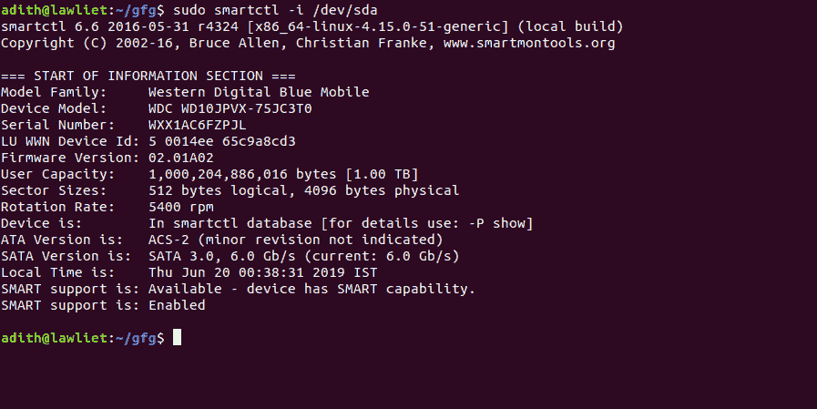
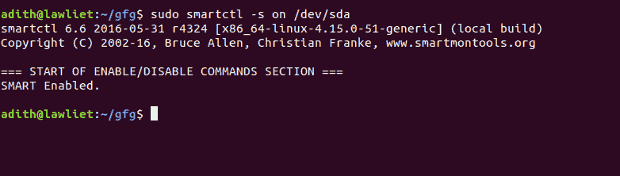
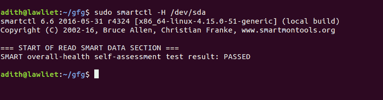
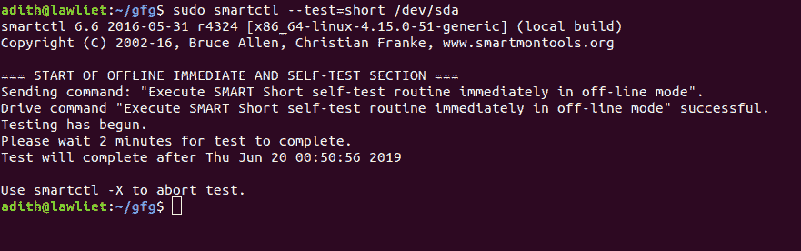
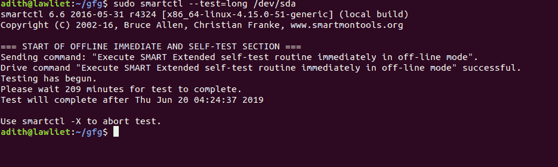
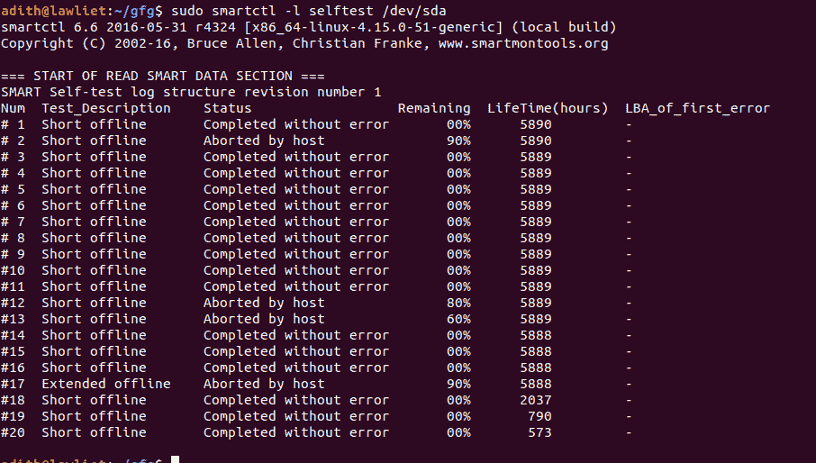
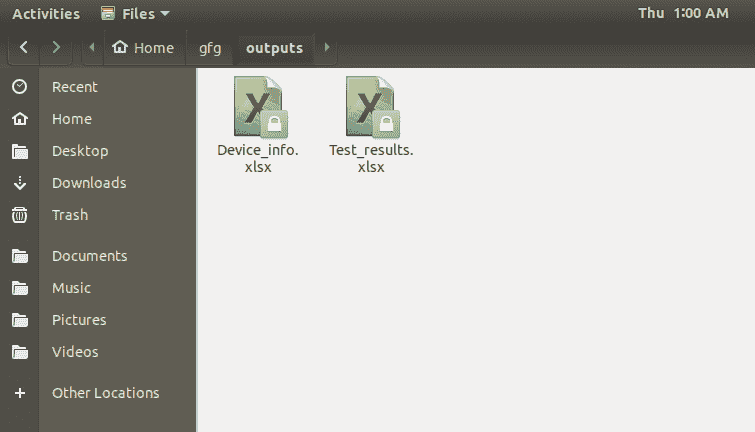
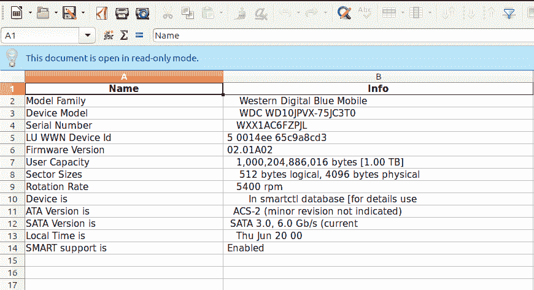
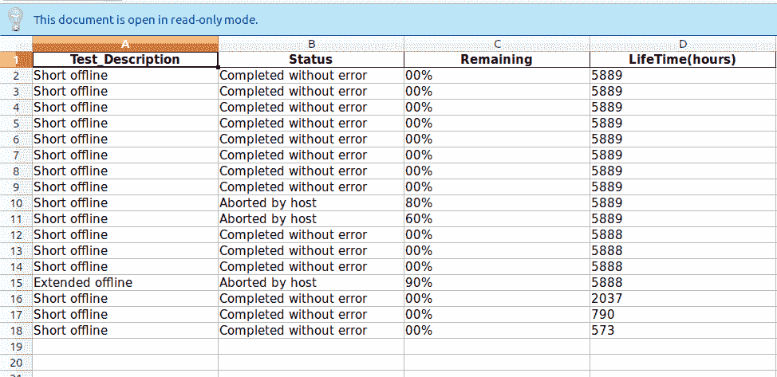

# Python |使用智能工具监控硬盘运行状况

> 原文:[https://www . geesforgeks . org/python-monitor-hard-disk-health-use-smart montools/](https://www.geeksforgeeks.org/python-monitor-hard-disk-health-using-smartmontools/)

**Smartmontools** ，是“S.M.A.R.T 监控”工具的首字母缩写，是一个包，用于使用内置于大多数现代(P)ATA、串行 ATA、SCSI/SAS 设备中的 **S.M.A.R.T.** (自我监控、分析和报告技术)系统来控制和监控计算机存储系统。
包含 2 个实用程序: ***smartctl*** 和 ***smartd*** 。这些实用程序会发出磁盘降级和故障的警告或警报。
`**smartmontools**` 可用于任何基于 Unix/Linux 的操作系统。它允许我们运行各种测试来检查系统中硬盘或固态硬盘的运行状况。

## 南麻省理工学院

大多数现代硬盘都使用自我监控、分析和报告技术来评估其状况，以确定设备是否有问题。这允许用户查看硬盘的 SMART 数据，并采取必要的措施来修复或更换设备。

在本文中，我们将探索 smartmontools 并检索系统中硬盘和固态硬盘上的信息。我们还将编写一个 python 脚本来解析 smartmontools 的输出，并将输出存储在 excel 工作表中。

## 安装–

```
sudo pip3 install pandas
sudo apt-get install smartmontools 
```

安装 smartmontools 后，我们可以使用终端或命令行来获取硬盘的详细信息。

## 设备信息–

要检查您的设备是否支持 SMART 监控，并获取设备型号、容量、序列号等其他信息，我们使用以下命令:

```
sudo smartctl -i /dev/sda
```



如果未启用，以下命令将启用智能监控:

```
sudo smartctl -s on /dev/sda
```



## 检查设备的健康状况

要显示磁盘的整体运行状况，我们使用以下命令:

```
sudo smartctl -H /dev/sda
```

这将显示硬盘的状态。如果它显示任何错误，那么您的硬盘可能遇到一些问题，您应该考虑备份您的数据。



## 测试–

**运行一个短测试:**

```
sudo smartctl --test=short /dev/sda
```



简短测试的目标是快速识别有缺陷的硬盘。因此，短测试的最大运行时间为 2 分钟。

**进行长时间测试:**

```
sudo smartctl --test=long /dev/sda
```

长时间的测试也能发现缺陷，但这里没有时间限制。测试更加彻底。



**检查测试结果:**

```
sudo smartctl -l selftest /dev/sda
```



## 一个例子

我们可以使用 Python 来自动化这个过程并生成一个报告。为此，我们将使用 Pandas 将结果存储在 excel 表格中，并使用 os 模块运行命令。

```
# importing libraries
import os
import pandas as pd
from pandas import ExcelWriter

# class to hold all the
# details about the device
class Device():

    def __init__(self):

        self.device_name = None
        self.info = {}
        self.results = []

    # get the details of the device
    def get_device_name(self):

        cmd = 'smartctl --scan'

        data = os.popen(cmd)
        res = data.read()
        temp = res.split(' ')

        temp = temp[0].split('/')
        name = temp[2]
        self.device_name = name

    # get the device info (sda or sdb)
    def get_device_info(self):

        cmd = 'smartctl -i /dev/' + self.device_name

        data = os.popen(cmd)

        res = data.read().splitlines()

        device_info = {}

        for i in range(4, len(res) - 1):
            line = res[i]
            temp = line.split(':')
            device_info[temp[0]] = temp[1]

        self.info = device_info

    # save the results as an excel file
    def save_to_excel(self):

        try:
            os.mkdir('outputs')
        except(Exception):
            pass

        os.chdir('outputs')

        col1 = list(self.info.keys())
        col2 = list(self.info.values())

        output = pd.DataFrame()
        output['Name'] = col1
        output['Info'] = col2

        writer = ExcelWriter('Device_info.xlsx')
        output.to_excel(writer, 'Info_report', index = False)

        workbook = writer.book
        worksheet = writer.sheets['Info_report']

        # Account info columns
        worksheet.set_column('A:A', 35)
        # State column
        worksheet.set_column('B:B', 55)
        # Post code
        # worksheet.set_column('F:F', 10)
        writer.save()
        os.chdir('..')

    # function to check the health
    # of the device
    def check_device_health(self):

        cmd = 'smartctl -H /dev/' + self.device_name

        data = os.popen(cmd).read()
        res = data.splitlines()
        health = res[4].split(':')
        print(health[0] + ':' + health[1])

    # function to run the short test
    def run_short_test(self):

        cmd = 'smartctl --test = short /dev/' + self.device_name
        data = os.popen(cmd).read().splitlines()

    # function to get the results
    # of the test.
    def get_results(self):

        cmd = 'smartctl -l selftest /dev/' + self.device_name
        data = os.popen(cmd).read()
        res = data.splitlines()

        # stores the names of columns
        columns = res[5].split(' ')
        columns = ' '.join(columns)
        columns = columns.split()

        info = [columns]

        # iterate through the important
        # rows since 0-5 is not required
        for i in range(6, len(res)):

            line = res[i]

            line = ' '.join(line.split())
            row = line.split(' ')
            info.append(row)

        # save the results
        self.results = info

    # function to convert the 
    # results of the test to an
    # excel file and save it
    def save_results_to_excel(self):

        # create a folder to store outputs
        try:
            os.mkdir('outputs')
        except(Exception):
            pass

        os.chdir('outputs')

        # get the columns
        columns = self.results[0]

        # create a dataframe to store
        # the result in excel
        outputs = pd.DataFrame()

        col1, col2, col3, col4 = [], [], [], []

        l = len(self.results[1])

        # iterate through all the rows and store
        # it in the data frame
        for i in range(1, len(self.results) - 1):

            if(len(self.results[i]) == l):
                col1.append(' '.join(self.results[i][2:4]))
                col2.append(' '.join(self.results[i][4:7]))
                col3.append(self.results[i][7])
                col4.append(self.results[i][8])            
            else:

                col1.append(' '.join(self.results[i][1:3]))
                col2.append(' '.join(self.results[i][3:6]))
                col3.append(self.results[i][6])
                col4.append(self.results[i][7])    

        # store the columns that we 
        # require in the data frame
        outputs[columns[1]] = col1
        outputs[columns[2]] = col2
        outputs[columns[3]] = col3
        outputs[columns[4]] = col4

        # an excel writer object to save as excel.
        writer = ExcelWriter('Test_results.xlsx')

        outputs.to_excel(writer, 'Test_report', index = False)

        # manipulating the dimensions of the columns
        # to make it more presentable.
        workbook = writer.book
        worksheet = writer.sheets['Test_report']

        worksheet.set_column('A:A', 25)
        worksheet.set_column('B:B', 25)
        worksheet.set_column('C:C', 25)
        worksheet.set_column('D:D', 25)

        # saving the file
        writer.save()

        os.chdir('..')

# driver function
if __name__ == '__main__':

    device = Device()
    device.get_device_name() 
    device.get_device_info()  
    device.save_to_excel() 
    device.check_device_health()
    device.run_short_test()
    device.get_results()
    device.save_results_to_excel()
```

**输出:**



**设备信息:**


**检测结果:**
