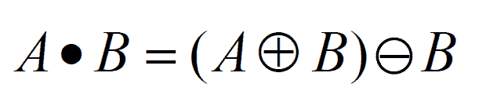
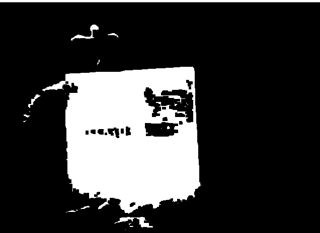

# Python |图像处理中的形态运算(关闭)| Set-2

> 原文:[https://www . geesforgeks . org/python-形态学-图像处理中的操作-关闭-set-2/](https://www.geeksforgeeks.org/python-morphological-operations-in-image-processing-closing-set-2/)

在前一篇文章中，指定了在扩张后应用腐蚀操作的“打开”操作符。它有助于消除图像中的内部噪声。**闭合**类似于打开操作。在关闭操作中，基本前提是关闭是反向执行的打开。它被简单地定义为一个**膨胀，接着是一个侵蚀**，使用的结构元素与在打开操作中使用的相同。



> **语法:** cv2.morphologyEx(image，cv2。MORPH_CLOSE，内核)
> **参数:**
> - > **图像**:输入图像数组。
> - > **cv2。形态关闭**:应用形态关闭操作。
> - > **内核**:结构化元素。

下面是解释闭合形态运算的 Python 代码–

## 蟒蛇 3

```
# Python program to illustrate
# Closing morphological operation
# on an image

# organizing imports 
import cv2 
import numpy as np 

# return video from the first webcam on your computer. 
screenRead = cv2.VideoCapture(0)

# loop runs if capturing has been initialized.
while(1):
    # reads frames from a camera
    _, image = screenRead.read()

    # Converts to HSV color space, OCV reads colors as BGR
    # frame is converted to hsv
    hsv = cv2.cvtColor(image, cv2.COLOR_BGR2HSV)

    # defining the range of masking
    blue1 = np.array([110, 50, 50])
    blue2 = np.array([130, 255, 255])

    # initializing the mask to be
    # convoluted over input image
    mask = cv2.inRange(hsv, blue1, blue2)

    # passing the bitwise_and over
    # each pixel convoluted
    res = cv2.bitwise_and(image, image, mask = mask)

    # defining the kernel i.e. Structuring element
    kernel = np.ones((5, 5), np.uint8)

    # defining the closing function
    # over the image and structuring element
    closing = cv2.morphologyEx(mask, cv2.MORPH_OPEN, kernel)

    # The mask and closing operation
    # is shown in the window
    cv2.imshow('Mask', mask)
    cv2.imshow('Closing', closing)

    # Wait for 'a' key to stop the program
    if cv2.waitKey(1) & 0xFF == ord('a'):
        break

# De-allocate any associated memory usage 
cv2.destroyAllWindows()

# Close the window / Release webcam
screenRead.release()
```

**输入帧:**


**面具:**


**输出:**

