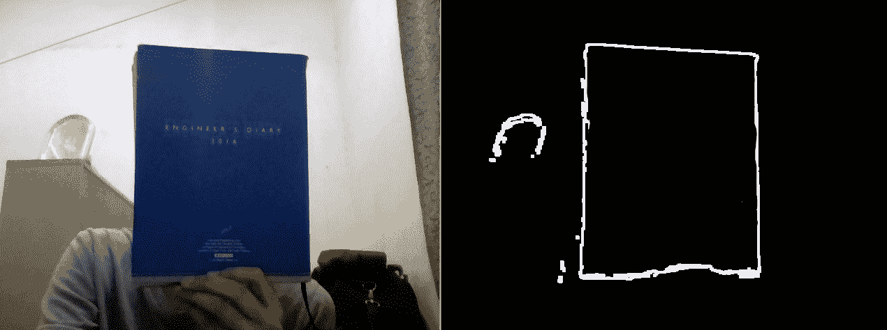

# Python |图像处理中的形态学运算(梯度)| Set-3

> 原文:[https://www . geesforgeks . org/python-形态学-图像处理中的运算-梯度-set-3/](https://www.geeksforgeeks.org/python-morphological-operations-in-image-processing-gradient-set-3/)

在前面的文章中，指定了打开操作和关闭操作。本文阐述了另一种形态学操作，即**梯度**。它用于生成图像的轮廓。有两种类型的梯度，内部和外部梯度。内部渐变增强了比背景亮的对象的内部边界和比背景暗的对象的外部边界。对于二值图像，内部渐变生成前景图像对象内部边界的遮罩。

> **语法:** cv2.morphologyEx(image，cv2。MORPH _ GRADIENT，内核)
> 
> **参数:**
> - > **图像**:输入图像数组。
> - > **cv2。形态梯度**:应用形态梯度操作。
> - > **内核**:结构化元素。

下面是解释渐变形态操作的 Python 代码–

```py
# Python programe to illustrate
# Gradient morphological operation
# on input frames

# organizing imports  
import cv2  
import numpy as np  

# return video from the first webcam on your computer.  
screenRead = cv2.VideoCapture(0)

# loop runs if capturing has been initialized.
while(1):
    # reads frames from a camera
    _, image = screenRead.read()

    # Converts to HSV color space, OCV reads colors as BGR 
    # frame is converted to hsv
    hsv = cv2.cvtColor(image, cv2.COLOR_BGR2HSV)

    # defining the range of masking
    blue1 = np.array([110, 50, 50])
    blue2 = np.array([130, 255, 255])

    # initializing the mask to be
    # convoluted over input image
    mask = cv2.inRange(hsv, blue1, blue2)

    # passing the bitwise_and over
    # each pixel convoluted
    res = cv2.bitwise_and(image, image, mask = mask)

    # defining the kernel i.e. Structuring element
    kernel = np.ones((5, 5), np.uint8)

    # defining the gradient function 
    # over the image and structuring element
    gradient = cv2.morphologyEx(mask, cv2.MORPH_GRADIENT, kernel)

    # The mask and closing operation
    # is shown in the window 
    cv2.imshow('Gradient', gradient)

    # Wait for 'a' key to stop the program 
    if cv2.waitKey(1) & 0xFF == ord('a'):
        break

# De-allocate any associated memory usage  
cv2.destroyAllWindows()

# Close the window / Release webcam 
screenRead.release()
```

**结果:**
[](https://media.geeksforgeeks.org/wp-content/uploads/20190527013313/Screenshot-57_LI.jpg) 
输出图像帧显示在蓝皮书和左上角蓝色对象上生成的轮廓。