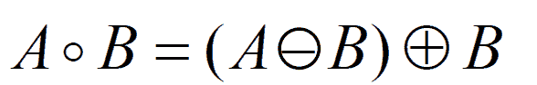
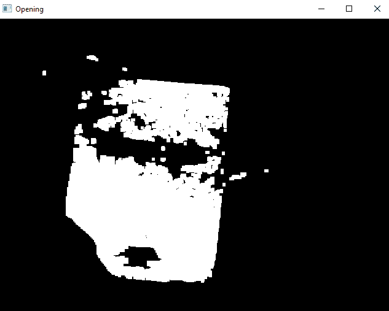

# Python |图像处理中的形态学运算(开)| Set-1

> 原文:[https://www . geesforgeks . org/python-形态学-图像处理中的操作-打开-设置-1/](https://www.geeksforgeeks.org/python-morphological-operations-in-image-processing-opening-set-1/)

形态学操作用于提取在区域形状的表示和描述中有用的图像成分。形态学操作是一些依赖于图片形状的基本任务。它通常在二进制图像上执行。它需要两个数据源，一个是**输入图像**，第二个叫做**结构化组件**。形态算子将输入图像和结构成分作为输入，然后使用集合算子组合这些元素。根据图像形状的属性来处理输入图像中的对象，这些属性被编码在结构化组件中。
**打开**类似于侵蚀，因为它倾向于从前景像素区域的边缘去除明亮的前景像素。该操作符的作用是保护前景区域，该前景区域与结构化组件具有相似性，或者可以完全包含结构化组件，同时去掉前景像素的每一个其他区域。打开操作用于去除图像中的内部噪声。
**开口是侵蚀操作，然后是扩张操作。**



> **语法:** cv2.morphologyEx(image，cv2。MORPH_OPEN，内核)
> **参数:**
> - > **图像**:输入图像数组。
> - > **cv2。形态打开**:应用形态打开操作。
> - > **内核**:结构化元素。

下面是解释开放形态操作的 Python 代码–

## 蟒蛇 3

```py
# Python program to illustrate
# Opening morphological operation
# on an image

# organizing imports 
import cv2 
import numpy as np 

# return video from the first webcam on your computer. 
screenRead = cv2.VideoCapture(0)

# loop runs if capturing has been initialized.
while(1):
    # reads frames from a camera
    _, image = screenRead.read()

    # Converts to HSV color space, OCV reads colors as BGR
    # frame is converted to hsv
    hsv = cv2.cvtColor(image, cv2.COLOR_BGR2HSV)

    # defining the range of masking
    blue1 = np.array([110, 50, 50])
    blue2 = np.array([130, 255, 255])

    # initializing the mask to be
    # convoluted over input image
    mask = cv2.inRange(hsv, blue1, blue2)

    # passing the bitwise_and over
    # each pixel convoluted
    res = cv2.bitwise_and(image, image, mask = mask)

    # defining the kernel i.e. Structuring element
    kernel = np.ones((5, 5), np.uint8)

    # defining the opening function
    # over the image and structuring element
    opening = cv2.morphologyEx(mask, cv2.MORPH_OPEN, kernel)

    # The mask and opening operation
    # is shown in the window
    cv2.imshow('Mask', mask)
    cv2.imshow('Opening', opening)

    # Wait for 'a' key to stop the program
    if cv2.waitKey(1) & 0xFF == ord('a'):
        break

# De-allocate any associated memory usage 
cv2.destroyAllWindows()

# Close the window / Release webcam
screenRead.release()
```

**输入帧:**


**面具:**


**输出帧:**



系统将定义的蓝皮书识别为输入，并在“打开”功能的帮助下消除和简化感兴趣区域的内部噪声。