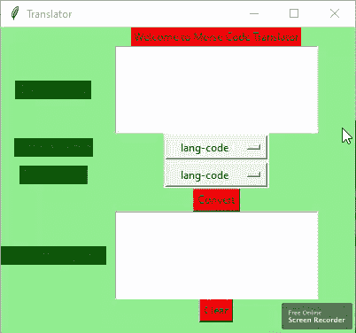

# Python–使用 Tkinter 的莫尔斯电码翻译器 GUI

> 原文:[https://www . geesforgeks . org/python-morse-code-translator-GUI-using-tkinter/](https://www.geeksforgeeks.org/python-morse-code-translator-gui-using-tkinter/)

**先决条件:**[tkinter 简介](https://www.geeksforgeeks.org/python-gui-tkinter/) | [莫尔斯电码翻译器](https://www.geeksforgeeks.org/morse-code-translator-python/)

Python 为开发图形用户界面提供了多种选择。在所有的 GUI 方法中，Tkinter 是最常用的方法。Python 搭配 Tkinter 输出了创建 GUI 应用程序最快最简单的方法。在本文中，我们将学习如何使用 Tkinter 创建一个莫尔斯电码翻译器应用程序。

> 要创建 tkinter :
> 
> *   导入模块–tkinter
> *   创建主窗口(容器)
> *   向主窗口添加任意数量的小部件。
> *   在小部件上应用事件触发器。

以下是图形用户界面的外观:



让我们创建一个基于图形用户界面的莫尔斯电码翻译应用程序，可以将莫尔斯电码转换成英语代码，反之亦然。

**下面是实现:**

## 蟒蛇 3

```
# import all functions from the tkinter 
from tkinter import *

# import messagebox class from tkinter
from tkinter import messagebox

# Create a GUI window
root = Tk()

# create a global variables 
variable1 = StringVar(root)
variable2 = StringVar(root)

# initialise the variables
variable1.set("lang-code")
variable2.set("lang-code")

'''
VARIABLE KEY
'cipher' -> 'stores the morse translated form of the english string'
'decipher' -> 'stores the english translated form of the morse string'
'citext' -> 'stores morse code of a single character'
'i' -> 'keeps count of the spaces between morse characters'
'message' -> 'stores the string to be encoded or decoded'
'''

# Dictionary representing the morse code chart
MORSE_CODE_DICT = { 'A':'.-', 'B':'-...',
                    'C':'-.-.', 'D':'-..', 'E':'.',
                    'F':'..-.', 'G':'--.', 'H':'....',
                    'I':'..', 'J':'.---', 'K':'-.-',
                    'L':'.-..', 'M':'--', 'N':'-.',
                    'O':'---', 'P':'.--.', 'Q':'--.-',
                    'R':'.-.', 'S':'...', 'T':'-',
                    'U':'..-', 'V':'...-', 'W':'.--',
                    'X':'-..-', 'Y':'-.--', 'Z':'--..',
                    '1':'.----', '2':'..---', '3':'...--',
                    '4':'....-', '5':'.....', '6':'-....',
                    '7':'--...', '8':'---..', '9':'----.',
                    '0':'-----', ', ':'--..--', '.':'.-.-.-',
                    '?':'..--..', '/':'-..-.', '-':'-....-',
                    '(':'-.--.', ')':'-.--.-'}

# Function to clear both the text areas
def clearAll() :
    # whole content of text area  is deleted
    language1_field.delete(1.0, END)
    language2_field.delete(1.0, END)

# Function to perform conversion from one
# language to another
def convert() :

    # get a whole input content from text box
    # ignoring \n from the text box content
    message = language1_field.get("1.0", "end")[:-1]

    # get the content from variable1 and 2, check their values
    if variable1.get() == variable2.get() :

        # show the error message
        messagebox.showerror("Can't Be same Language")
        return

    elif variable1.get() == "Eng" and variable2.get() == "Morse" :

        # function call
        rslt = encrypt(message)

    elif variable1.get() == "Morse" and variable2.get() == "Eng" :

        # function call
        rslt = decrypt(message)

    else :

        # show the error message
        messagebox.showerror("please choose valid language code..")
        return

    # insert content into text area
    # from rslt variable
    language2_field.insert('end -1 chars', rslt)

# Function to encrypt the string
# according to the morse code chart
def encrypt(message):
    cipher = ''
    for letter in message:
        if letter != ' ':

            # Looks up the dictionary and adds the
            # corresponding morse code
            # along with a space to separate
            # morse codes for different characters
            cipher += MORSE_CODE_DICT[letter] + ' '
        else:
            # 1 space indicates different characters
            # and 2 indicates different words
            cipher += ' '

    return cipher

# Function to decrypt the string
# from morse to english
def decrypt(message):

    # extra space added at the end to access the
    # last morse code
    message += ' '

    decipher = ''
    citext = ''
    for letter in message:

        # checks for space
        if (letter != ' '):

            # counter to keep track of space
            i = 0

            # storing morse code of a single character
            citext += letter

        # in case of space
        else:
            # if i = 1 that indicates a new character
            i += 1

            # if i = 2 that indicates a new word
            if i == 2 :

                 # adding space to separate words
                decipher += ' '
            else:

                # accessing the keys using their values
                # (reverse of encryption)
                decipher += list(MORSE_CODE_DICT.keys())[
                             list(MORSE_CODE_DICT .values()).index(citext)]
                citext = ''

    return decipher

# Driver code
if __name__ == "__main__" :

    # Set the background colour of GUI window 
    root.configure(background = 'light green') 

    # Set the configuration of GUI window (WidthxHeight)
    root.geometry("400x350") 

    # set the name of tkinter GUI window 
    root.title("Translator")

    # Create Welcome to Morse Code Translator label 
    headlabel = Label(root, text = 'Welcome to Morse Code Translator', 
                              fg = 'black', bg = "red") 

    # Create a "One Language " label 
    label1 = Label(root, text = "One Language ",
                 fg = 'black', bg = 'dark green')

    # Create a "From Language " label 
    label2 = Label(root, text = "From Language", 
                   fg = 'black', bg = 'dark green') 

    # Create a "To Language " label 
    label3 = Label(root, text = "To Language ", 
                   fg = 'black', bg = 'dark green')

    # Create a "Converted Language " label 
    label4 = Label(root, text = "Converted Language ", 
                   fg = 'black', bg = 'dark green')

    # grid method is used for placing 
    # the widgets at respective positions 
    # in table like structure .  
    headlabel.grid(row = 0, column = 1) 
    label1.grid(row = 1, column = 0) 
    label2.grid(row = 2, column = 0)
    label3.grid(row = 3, column = 0)
    label4.grid(row = 5, column = 0)

    # Create a text area box 
    # for filling or typing the information. 
    language1_field = Text(root, height = 5, width = 25,
                                     font = "lucida 13")
    language2_field = Text(root, height = 5, width = 25,
                                     font = "lucida 13")

    # padx keyword argument used to set padding along x-axis . 
    language1_field.grid(row = 1, column = 1, padx = 10) 
    language2_field.grid(row = 5, column = 1, padx = 10)

    # list of language codes
    languageCode_list = ["Eng", "Morse"]

    # create a drop down menu using OptionMenu function
    # which takes window name, variable and choices as
    # an argument. use * before the name of the list,
    # to unpack the values
    FromLanguage_option = OptionMenu(root, variable1, *languageCode_list)
    ToLanguage_option = OptionMenu(root, variable2, *languageCode_list)

    FromLanguage_option.grid(row = 2, column = 1, ipadx = 10)
    ToLanguage_option.grid(row = 3, column = 1, ipadx = 10)

    # Create a Convert Button and attached 
    # with convert function 
    button1 = Button(root, text = "Convert", bg = "red", fg = "black",
                                command = convert)

    button1.grid(row = 4, column = 1)

    # Create a Clear Button and attached 
    # with clearAll function 
    button2 = Button(root, text = "Clear", bg = "red", 
                     fg = "black", command = clearAll)

    button2.grid(row = 6, column = 1)

    # Start the GUI 
    root.mainloop() 
```

**输出:**

<video class="wp-video-shortcode" id="video-416222-1" width="640" height="360" preload="metadata" controls=""><source type="video/mp4" src="https://media.geeksforgeeks.org/wp-content/uploads/20210114115924/FreeOnlineScreenRecorderProject3.mp4?_=1">[https://media.geeksforgeeks.org/wp-content/uploads/20210114115924/FreeOnlineScreenRecorderProject3.mp4](https://media.geeksforgeeks.org/wp-content/uploads/20210114115924/FreeOnlineScreenRecorderProject3.mp4)</video>