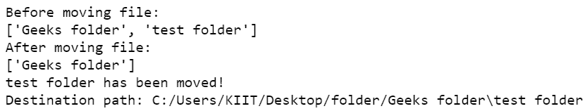
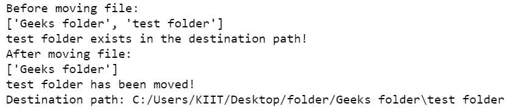

# Python–移动和覆盖文件和文件夹

> 原文:[https://www . geesforgeks . org/python-移动并覆盖文件和文件夹/](https://www.geeksforgeeks.org/python-move-and-overwrite-files-and-folders/)

在本文中，我们将学习移动文件和文件夹的集合，其中可能存在与目标中的源名称同名的文件/文件夹。因此我们可能需要用源文件覆盖现有的目标文件。

**[**shutil . move()**](https://www.geeksforgeeks.org/python-shutil-move-method/)**方法用于将文件或目录从一个地方移动到另一个地方。如果目标中存在将使用[**OS . path . is file()**](https://www.geeksforgeeks.org/python-os-path-isfile-method/)和[**OS . path . is dir()**](https://www.geeksforgeeks.org/python-os-path-isdir-method/)方法检查的现有目录或文件，则使用**[**OS . remove()**](https://www.geeksforgeeks.org/python-os-remove-method/)方法删除，如果是目录，则使用[**shutil . rmtree()**](https://www.geeksforgeeks.org/delete-an-entire-directory-tree-using-python-shutil-rmtree-method/)方法删除******

******语法:******

> ****shutil.move(源、目标、copy_function = copy2)****
> 
> ******参数:******
> 
> *   ******来源:**代表源文件路径的字符串。****
> *   ******目标:**表示目标目录路径的字符串。****
> *   ******copy_function(可选):**此参数默认值为 copy2。对于这个参数，我们可以使用其他复制函数，如 copy、copytree 等。****
> 
> ******返回值:**该方法返回一个字符串，代表新创建文件的路径。****

****通过用字符串格式的整个路径替换源和目标，调用 shutil.move(源，目标)方法。使用上述方法，从源文件开始，同名文件将被文件内容覆盖****

******示例 1:** 使用 python 编程移动包含文件的文件夹。****

****文件夹层次结构:****

```py
**Desktop
     |_folder_
              |_Geeks folder
              |_test folder_gfg.txt**
```

## ****蟒蛇 3****

```py
**# importing os module
import os

# importing shutil module
import shutil

# path
path = 'C:/Users/KIIT/Desktop/folder'

# List files and directories
print("Before moving file:")
print(os.listdir(path))

# Assign source and destination
source = 'test folder'
destination = 'Geeks folder'

sourcePath = path+'/'+source
destinationPath = path+'/'+destination

# Check if file already exists
if os.path.isdir(destinationPath+'/'+source):
    print(source, 'exists in the destination path!')
    shutil.rmtree(destinationPath+'/'+source)

elif os.path.isfile(destinationPath+'/'+source):
    os.remove(destinationPath+'/'+source)
    print(source, 'deleted in', destination)

# Move the content
# source to destination
dest = shutil.move(sourcePath, destinationPath)

# List files and directories
print("After moving file:")
print(os.listdir(path))

print(source, 'has been moved!')

# Print new path of file
print("Destination path:", dest)**
```

******输出:******

********

******示例 2:** 使用 python 编程覆盖包含文件的文件夹。****

****文件夹层次结构:****

```py
**Desktop
     |_folder_
              |_Geeks folder_test folder_gfg.txt
              |_test folder_gfg.txt**
```

## ****蟒蛇 3****

```py
**# importing os module
import os

# importing shutil module
import shutil

# path
path = 'C:/Users/KIIT/Desktop/folder'

# List files and directories
print("Before moving file:")
print(os.listdir(path))

# Assign source and destination
source = 'test folder'
destination = 'Geeks folder'

sourcePath=path+'/'+source
destinationPath=path+'/'+destination

# Check if file already exists
if os.path.isdir(destinationPath+'/'+source):
        print(source,'exists in the destination path!')
        shutil.rmtree(destinationPath+'/'+source)

elif os.path.isfile(destinationPath+'/'+source):  
        os.remove(destinationPath+'/'+source)
        print(source,'deleted in',destination)

# Move the content
# source to destination
dest = shutil.move(sourcePath, destinationPath)

# List files and directories
print("After moving file:")
print(os.listdir(path))

print(source,'has been moved!')

# Print new path of file
print("Destination path:", dest)**
```

******输出:******

********