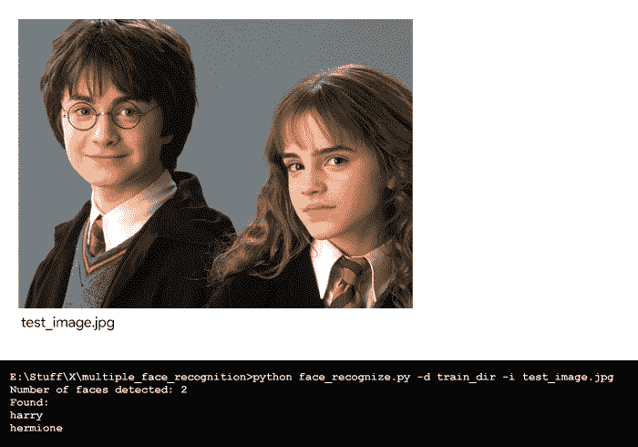

# Python |使用 dlib 的多人脸识别

> 原文:[https://www . geesforgeks . org/python-多人脸识别-使用-dlib/](https://www.geeksforgeeks.org/python-multiple-face-recognition-using-dlib/)

本文旨在快速构建一个 Python 人脸识别程序，方便地为每个人训练多幅图像，并开始识别图像中的已知人脸。

在本文中，代码使用了 Python 的 **ageitgey 的 face_recognition API** 。该应用编程接口使用 **dlib 的人脸识别算法**构建，它允许用户在您的项目中或从命令行轻松实现人脸检测、人脸识别甚至实时人脸跟踪。

**库安装:**
首先，确保您的计算机上安装了所需的库。

```py
pip install face_recognition Scikit-learn dlib docopt
```

如果你想让 dlib 在 GPU 上使用 *CUDA* ，确保 *CUDA* 和*cunn*安装正确，然后使用 pip 安装 dlib。有关在不同平台上安装的详细说明，请查看 face_recognition 的[安装指南](https://github.com/ageitgey/face_recognition#installation)。

现在，用下面的格式为每个人创建一个包含培训图像的目录。确保您有足够的训练图像(每个人至少 5 张)，否则[支持向量分类器(SVC)](https://www.geeksforgeeks.org/classifying-data-using-support-vector-machinessvms-in-python/) (在本程序中使用–在非常小的数据集上产生无意义的结果)。

**文件结构:**

```py
face_recognize.py
test_image.jpg
train_dir/
    person_1/
        person_1_face-1.jpg
        person_1_face-2.jpg
        .
        .
        person_1_face-n.jpg
    person_2/
        person_2_face-1.jpg
        person_2_face-2.jpg
        .
        .
        person_2_face-n.jpg
    .
    .
    person_n/
        person_n_face-1.jpg
        person_n_face-2.jpg
        .
        .
        person_n_face-n.jpg

```

**人脸编码:**
人脸识别 API 为图像中找到的人脸生成人脸编码。面部编码基本上是使用一组 *128* 计算机生成的测量值来表示面部的一种方式。同一个人的两张不同的照片会有相似的编码，而两个不同的人会有完全不同的编码。

生成所有人脸编码后，使用 scikit-learn 的支持向量分类器对人脸编码以及训练目录中所有已知人脸的标签进行训练。最后，应用编程接口检测您提供的测试图像中的所有人脸，训练好的支持向量机预测测试图像中的所有已知人脸。

**代码:识别多张脸。**

```py
"""
Usage:
  face_recognize.py -d <train_dir> -i <test_image>

Options:
  -h, --help                     Show this help
  -d, --train_dir =<train_dir>   Directory with 
                                 images for training
  -i, --test_image =<test_image> Test image
"""

# importing libraries
import face_recognition
import docopt
from sklearn import svm
import os

def face_recognize(dir, test):
    # Training the SVC classifier
    # The training data would be all the 
    # face encodings from all the known 
    # images and the labels are their names
    encodings = []
    names = []

    # Training directory
    if dir[-1]!='/':
        dir += '/'
    train_dir = os.listdir(dir)

    # Loop through each person in the training directory
    for person in train_dir:
        pix = os.listdir(dir + person)

        # Loop through each training image for the current person
        for person_img in pix:
            # Get the face encodings for the face in each image file
            face = face_recognition.load_image_file(
                dir + person + "/" + person_img)
            face_bounding_boxes = face_recognition.face_locations(face)

            # If training image contains exactly one face
            if len(face_bounding_boxes) == 1:
                face_enc = face_recognition.face_encodings(face)[0]
                # Add face encoding for current image 
                # with corresponding label (name) to the training data
                encodings.append(face_enc)
                names.append(person)
            else:
                print(person + "/" + person_img + " can't be used for training")

    # Create and train the SVC classifier
    clf = svm.SVC(gamma ='scale')
    clf.fit(encodings, names)

    # Load the test image with unknown faces into a numpy array
    test_image = face_recognition.load_image_file(test)

    # Find all the faces in the test image using the default HOG-based model
    face_locations = face_recognition.face_locations(test_image)
    no = len(face_locations)
    print("Number of faces detected: ", no)

    # Predict all the faces in the test image using the trained classifier
    print("Found:")
    for i in range(no):
        test_image_enc = face_recognition.face_encodings(test_image)[i]
        name = clf.predict([test_image_enc])
        print(*name)

def main():
    args = docopt.docopt(__doc__)
    train_dir = args["--train_dir"]
    test_image = args["--test_image"]
    face_recognize(train_dir, test_image)

if __name__=="__main__":
    main()
```

**如何在终端上运行:**

```py
python face_recognize.py -d train_dir -i test_image.jpg

```

**输出:**
