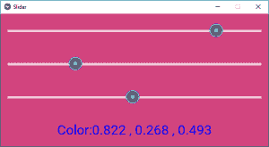

# Python |多个滑块小部件控制 Kivy 中的背景屏幕或窗口颜色

> 原文:[https://www . geesforgeks . org/python-multi-slider-widgets-control-background-screen-or-window color-in-kivy/](https://www.geeksforgeeks.org/python-multiple-sliders-widgets-controlling-background-screen-or-windowcolor-in-kivy/)

**先决条件–**[Kivy 中的滑块](https://www.geeksforgeeks.org/python-slider-widget-in-kivy/)
Kivy 是 Python 中独立于平台的 GUI 工具。因为它可以在安卓、IOS、linux 和 Windows 等平台上运行。它基本上是用来开发安卓应用程序的，但并不意味着它不能在桌面应用程序上使用。
在本文中，我们将学习如何在 kivy 中控制背景颜色，这意味着如果我们滑动滑块，窗口的颜色会相应地改变。
有很多不同的方法可以制作这个。让我们看看一个简单的方法。

> ？？？？？？？？ [Kivy 教程–通过示例学习 Kivy](https://www.geeksforgeeks.org/kivy-tutorial/)。

```
Basic Approach to make it is very simple:
1) import kivy
2) import kivyApp
3) import BoxLayout
4) set minimum version(optional)
5) Extend the class
6) set up .kv file :
        -> Set orientation
        -> Set slider color
        -> Create canvas.before property
        -> Create Sliders
        -> Create label
7) Return layout
8) Run an instance of the class
```

**Kivy 中多个滑块如何控制背景色？**

## 蟒蛇 3

```
# main.py to manipulate the window
# color or screen colour in kivy

# base Class of your App inherits from the App class. 
# app:always refers to the instance of your application 
from kivy.app import App

# BoxLayout arranges children in a vertical or horizontal box.
# or help to put the childrens at the desired location.
from kivy.uix.boxlayout import BoxLayout

# creating the root widget used in .kv file
class MultipleSliderWidget(BoxLayout):
    pass

# class in which name .kv file must be named Slider.kv.
# or creating the App class
class Multiple_Slider(App):
    def build(self):
        # returning the instance of SliderWidget class
        return MultipleSliderWidget()

# run the app   
if __name__ == '__main__':
    Multiple_Slider().run()
```

现在[。上述代码的 kv 文件](https://www.geeksforgeeks.org/python-kivy-kv-file/)为–

## 蟒蛇 3

```
# Multiple_Slider.kv file of the main.py file.

#.kv file to manipulate the window colour.
<MultipleSliderWidget>:

    # giving the orientation of Slider
    orientation: "vertical"

    # initially providing this colour to window
    slider_colors: 0.5, 0.5, 0.5

    # executed before the canvas group.
    canvas.before:
        Color:
            rgb: root.slider_colors
        Rectangle:
            pos: root.pos
            size: root.size

    # creating the Slider
    Slider:
        min: 0  # minimum value of Slider
        max: 1 # maximum value of Slider
        value: 0.5  # initial value of Slider

        # when slider moves then to increase value
        on_value: root.slider_colors[0] = self.value;

    Slider:
        min: 0
        max: 1
        value: 0.5
        on_value: root.slider_colors[1] = self.value

    Slider:
        min: 0
        max: 1
        value: 0.5
        on_value: root.slider_colors[2] = self.value

    # Adding The label
    Label:
        font_size: "30sp"
        # the for loop is for continuously changing
        # the colour as slider value changes
        text: "Color:" + ", ".join(["%.3f" %(i) for i in root.slider_colors])
        color: 0, 0, 1, 1
```

**输出:**



**视频输出:**

<video class="wp-video-shortcode" id="video-302761-1" width="640" height="360" preload="metadata" controls=""><source type="video/webm" src="https://media.geeksforgeeks.org/wp-content/uploads/20190510170127/slider.webm?_=1">[https://media.geeksforgeeks.org/wp-content/uploads/20190510170127/slider.webm](https://media.geeksforgeeks.org/wp-content/uploads/20190510170127/slider.webm)</video>