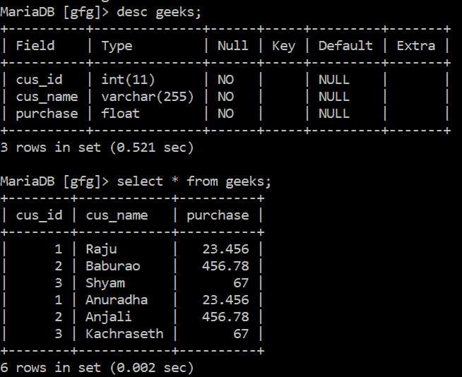
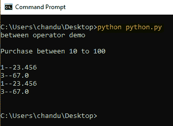
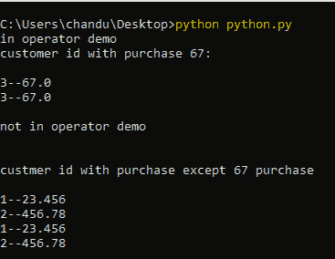

# Python MySQL–介于和输入运算符

> 原文:[https://www . geesforgeks . org/python-MySQL-in-and-in-operator/](https://www.geeksforgeeks.org/python-mysql-between-and-in-operator/)

在本文中，我们将看到使用 Python 的 MySQL 中的 BETWEEN 和 In 操作符的数据库操作。

这两个运算符都与 WHERE 查询一起使用，以检查表达式是否在 SQL 中的范围或值列表中。我们将使用下表来执行各种操作:



SQL**之间的条件用于测试表达式是否在值的范围内(包括值)。这些值包括文本、日期或数字。**

1.  **它可以与 SELECT、INSERT、UPDATE 或 DELETE 语句一起使用。**
2.  **“介于”条件将返回表达式在值 1 和值 2 范围内的记录。**

****语法:****

> **选择列 1、列 2、…。，第 n 列**
> 
> **从表名**
> 
> **其中列名介于值 1 和值 2 之间；**

****例 1:** Python MySQL 程序演示了 BETWEEN 运算符的使用。**

## **蟒蛇 3**

```
# Import mysql.connector module
import mysql.connector

# give connection with xampp
database = mysql.connector.connect(
    host="localhost",
    user="root",
    password="",
    database="gfg"
)

# Creating cursor object
cur_object = database.cursor()
print("between operator demo")

#  query
find = "SELECT cus_id,purchase from geeks where\
purchase between 10 and 100 "

# Execute the query
cur_object.execute(find)

# fetching results
data = cur_object.fetchall()
print(" ")
print("Purchase between 10 to 100 ")
print(" ")

for res in data:
    print(res[0], res[1], sep="--")
print(" ")

# Close database connection
database.close()
```

****输出:****

****

**SQL **IN** 运算符允许您轻松测试表达式是否匹配值列表中的任何值。它用于消除在选择、插入、更新或删除中对多个或条件的需要。您也可以使用“不输入”来排除列表中的行。**

****语法:****

> **选择第 1 列，第 2 列，…，第 n 列**
> 
> **FROM 表名**
> 
> **WHERE 列 IN (val1，val2，…，valn)；**

****例 2:** Python MySQL 程序演示 IN 运算符的使用。**

## **蟒蛇 3**

```
# Import mysql.connector module
import mysql.connector

# give connection with xampp
database = mysql.connector.connect(
    host="localhost",
    user="root",
    password="",
    database="gfg"
)

# Creating cursor object
cur_object = database.cursor()

#  query
print("in operator demo")
find = "SELECT cus_id,purchase from geeks where \
purchase in (67) "

# Execute the query
cur_object.execute(find)

# fetching all results
data = cur_object.fetchall()
print("customer id with purchase 67: ")
print(" ")

for res in data:
    print(res[0], res[1], sep="--")
print(" ")
print("not in operator demo")
print(" ")

find = "SELECT cus_id,purchase from geeks where purchase\
not in (67) "

# Execute the query
cur_object.execute(find)

# fetching all results
data = cur_object.fetchall()
print(" ")
print("customer id with purchase except 67 purchase ")
print(" ")

for res in data:
    print(res[0], res[1], sep="--")

# Close database connection
database.close()
```

****输出:****

****