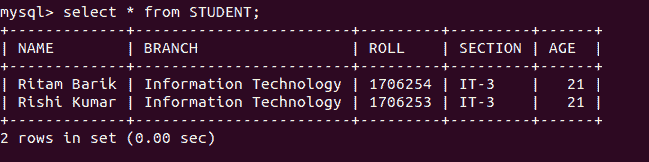

# Python MySQL–删除查询

> 原文:[https://www.geeksforgeeks.org/python-mysql-delete-query/](https://www.geeksforgeeks.org/python-mysql-delete-query/)

Python 数据库应用编程接口是标准 Python 的数据库接口。大多数 Python 数据库接口都遵守该标准。Python 数据库支持的数据库服务器有多种，如 MySQL、牛虻、PostgreSQL、微软 SQL Server 2000、Informix、Interbase、Oracle、Sybase 等。要从 Python 连接 MySQL 数据库服务器，需要导入`mysql.connector`接口。

下面是一个连接 MySQL 数据库的程序`geeks`。

```py
# importing required library 
import mysql.connector

# connecting to the database 
dataBase = mysql.connector.connect(
                     host = "localhost",
                     user = "user",
                     passwd = "pswrd",
                     database = "geeks" ) 

# preparing a cursor object 
cursorObject = dataBase.cursor() 

# disconnecting from server
dataBase.close() 
```

上面的程序说明了与 MySQL 数据库`geeks`的连接，其中主机名为`localhost`，用户名为`user`，密码为`pswrd`。

### 从表中删除查询

在 MySQL 中与数据库连接后，我们可以在其中创建表并对它们进行操作。

**语法语句:**

```py
DELETE FROM TABLE_NAME WHERE ATTRIBUTE_NAME = ATTRIBUTE_VALUE

```

**示例 1:** 下面是一个从数据库的表中删除查询的程序。

```py
# importing required library 
import mysql.connector 

# connecting to the database 
dataBase = mysql.connector.connect(
                     host = "localhost",
                     user = "user",
                     passwd = "pswrd",
                     database = "geeks" )  

# preparing a cursor object 
cursorObject = dataBase.cursor() 

# creating table  
studentRecord = """CREATE TABLE STUDENT ( 
                   NAME  VARCHAR(20) NOT NULL, 
                   BRANCH VARCHAR(50), 
                   ROLL INT NOT NULL,
                   SECTION VARCHAR(5), 
                   AGE INT
                   )"""

# table created
cursorObject.execute(studentRecord)  

# inserting data into the table
query = "INSERT INTO STUDENT (NAME, BRANCH, ROLL, SECTION, AGE) VALUES (% s, % s)"

attrValues = ("Rituraj Saha", "Information Technology", "1706256", "IT-3", "20")
cursorObject.execute(query, attrValues)

attrValues = ("Ritam Barik", "Information Technology", "1706254", "IT-3", "21")
cursorObject.execute(query, attrValues)

attrValues = ("Rishi Kumar", "Information Technology", "1706253", "IT-3", "21")
cursorObject.execute(query, attrValues)

# deleting query
query = "DELETE FROM STUDENT WHERE ROLL = 1706256"
cursorObject.execute(query, attrValues)

dataBase.commit()

# disconnecting from server
dataBase.close()
```

**输出:**



在上面的程序中，创建了一个名为`STUDENT`的表，该表具有属性`NAME`、`BRANCH`、`ROLL`、`SECTION`和`AGE`。将多个数据插入到`STUDENT`表中，然后从具有`ROLL`属性值`1706256`的表中删除单个查询。

**示例 2:** 让我们看看表中查询的另一个示例。

```py
# importing required library 
import mysql.connector

# connecting to the database 
dataBase = mysql.connector.connect(
                     host = "localhost",
                     user = "user",
                     passwd = "pswrd",
                     database = "geeks" ) 

# preparing a cursor object 
cursorObject = dataBase.cursor() 

# drop table if it already exists 
cursorObject.execute("DROP TABLE IF EXISTS PHONE_RECORD")

# creating table  
phoneRecord = """CREATE TABLE PHONE_RECORD ( 
                   NAME  VARCHAR(20) NOT NULL, 
                   PHONE VARCHAR(10) NOT NULL
                   )"""

# table created
cursorObject.execute(phoneRecord)  

# inserting data into the table
query = "INSERT INTO PHONE_RECORD (NAME, PHONE) VALUES (% s, % s)"
attrValues = ("Rituraj Saha", "9163089075")
cursorObject.execute(query, attrValues)

# deleting query
query = "DELETE FROM STUDENT WHERE NAME = 'Rituraj Saha'"
cursorObject.execute(query)

dataBase.commit()

# disconnecting from server
dataBase.close()
```

**输出:**


在上述程序中，在具有属性`NAME`和`PHONE`的名为`PHONE_RECORD`的`geeks`数据库中创建了另一个表。只有一列被插入到表中，然后使用`DELETE`语句将其删除。