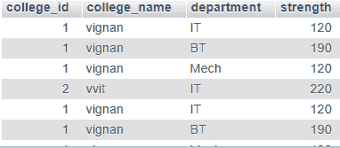
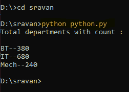
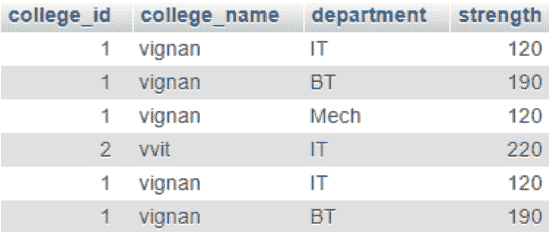
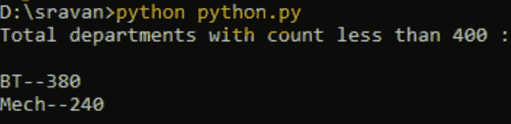

# Python MySQL–分组依据和拥有条款

> 原文:[https://www . geesforgeks . org/python-MySQL-group by-and-having-子句/](https://www.geeksforgeeks.org/python-mysql-group-by-and-having-clause/)

在本文中，我们将看到如何使用 Python 对 SQL 执行 groupby()和 HAVING()操作。在这里，我们将考虑一个学院数据库，根据学生实力对系进行分组操作。

### 分组依据

GROUP BY 语句根据使用的聚合函数将具有相同值的行分组为单个。聚合函数有(COUNT()、MAX()、MIN()、SUM()、AVG())。

> **语法:**选择 aggregare_function(第 1 列)，第 2 列，…，第 n 列
> 
> 从表名
> 
> 按列名分组；

**正在使用的数据库:**



**示例:**

## 蟒蛇 3

```py
# Establish connection to MySQL database
import mysql.connector 

database = mysql.connector.connect( 
    host="localhost", 
    user="root", 
    password="", 
    database="sravan"
) 

# Creating cursor object
cur_object = database.cursor() 

# Execute the query 
find = "SELECT  department,sum(strength) from \
college_data GROUP BY(department)";
cur_object.execute(find) 

# fetching all results
data = cur_object.fetchall() 
print("Total departments with count : ")
print(" ")
for res in data: 
    print(res[0],res[1],sep="--") 

# Close database connection 
database.close() 
```

**输出:**



### 按拥有分组

Having 子句基本上类似于 GROUP BY 子句的聚合函数。HAVING 子句用于聚合函数，而不是 WHERE。而 GROUP BY 子句将具有相同值的行分组到汇总行中。having 子句与 where 子句一起使用，以便查找具有特定条件的行。having 子句总是用在 Group By 子句之后。

> **语法:**SELECT aggregate _ function(column _ name)，column1，column2，…，columnn FROM table_name
> 
> 按列名分组
> 
> HAVING aggregate_function(列名)条件；

**正在使用的数据库:**



**示例:**

## 蟒蛇 3

```py
# Establish connection to MySQL database
import mysql.connector 

# give connection with xampp
database = mysql.connector.connect( 
    host="localhost", 
    user="root", 
    password="", 
    database="sravan"
) 

# Creating cursor object
cur_object = database.cursor() 

find = "SELECT  department,sum(strength) from college_data\
GROUP BY(department) HAVING sum(strength)<=400 ";

# Execute the query 
cur_object.execute(find) 

# fetching all results
data = cur_object.fetchall() 
print("Total departments with count less than 400 : ")
print(" ")
for res in data: 
    print(res[0],res[1],sep="--") 

# Close database connection 
database.close() 
```

**输出:**

