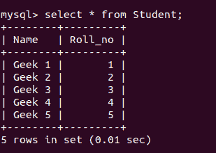
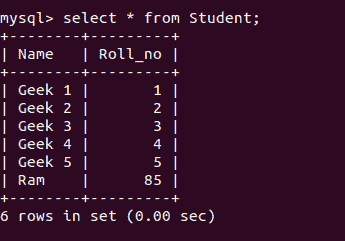
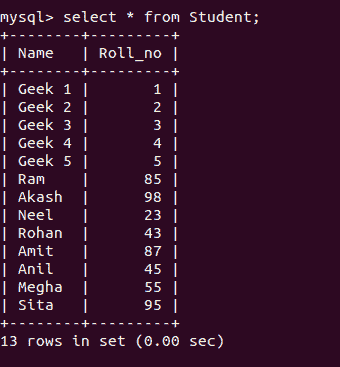

# Python MySQL–插入表格

> 原文:[https://www . geesforgeks . org/python-MySQL-insert-in-table/](https://www.geeksforgeeks.org/python-mysql-insert-into-table/)

MySQL 是一个关系数据库管理系统(RDBMS)，而结构化查询语言(SQL)是使用命令处理 RDBMS 的语言，即创建、插入、更新和删除数据库中的数据。SQL 命令不区分大小写，即 create 和 CREATE 表示相同的命令。

**注意:**在将数据插入数据库之前，我们需要创建一个表。为此，请参考 [Python: MySQL 创建表。](https://www.geeksforgeeks.org/python-mysql-create-table/)

## 插入数据

您可以一次插入一行或多行。将命令连接到特定数据库需要连接器代码。

**连接器查询**

```py
# Enter the server name in host
# followed by your user and
# password along with the database 
# name provided by you.

import mysql.connector

mydb = mysql.connector.connect(
  host = "localhost",
  user = "username",
  password = "password",
  database = "database_name"
) 

mycursor = mydb.cursor()
```

现在**插入查询**可以写成如下形式:

**示例:**让我们假设记录如下所示–



```py
sql = "INSERT INTO Student (Name, Roll_no) VALUES (%s, %s)"
val = ("Ram", "85")

mycursor.execute(sql, val)
mydb.commit()

print(mycursor.rowcount, "details inserted")

# disconnecting from server
mydb.close()
```

**输出:**

```py
1 details inserted
```



要一次插入多个值，请使用`executemany()`方法。此方法遍历参数序列，将当前参数传递给执行方法。

**示例:**

```py
sql = "INSERT INTO Student (Name, Roll_no) VALUES (%s, %s)"
val = [("Akash", "98"),
       ("Neel", "23"),
       ("Rohan", "43"),
       ("Amit", "87"),
       ("Anil", "45"), 
       ("Megha", "55"), 
       ("Sita", "95")]

mycursor.executemany(sql, val)
mydb.commit()

print(mycursor.rowcount, "details inserted")

# disconnecting from server
mydb.close()
```

**输出:**

```py
7 details inserted
```



**注:**

*   `cursor()` 用于遍历行。
*   没有`mydb.commit()`命令，更改不会被保存。