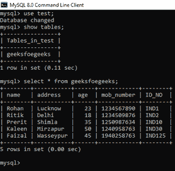
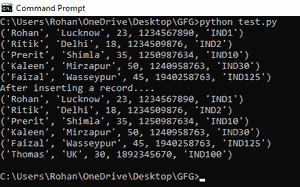
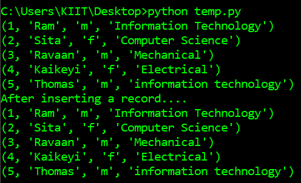
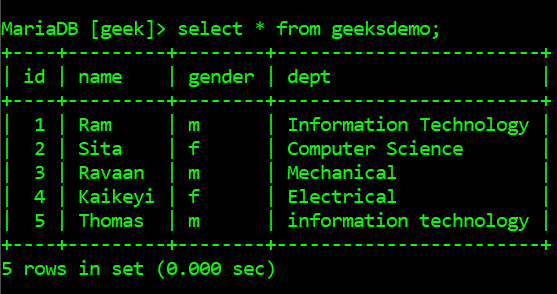

# Python MySQL–如果表

中不存在记录，则插入记录

> 原文:[https://www . geesforgeks . org/python-MySQL-insert-record-if-not-exists-in-table/](https://www.geeksforgeeks.org/python-mysql-insert-record-if-not-exists-in-table/)

**先决条件:** [**将 MySQL 数据库连接到 Python**](https://www.geeksforgeeks.org/connect-to-mysql-using-pymysql-in-python/)

在本文中，我们将尝试插入记录并检查它**是否存在**。SQL 中的 EXISTS 条件用于检查相关嵌套查询的结果是否为空(不包含元组)。可用于*插入*、*选择、更新、*或*删除*语句。

我们使用 python 程序的查询是:

> 插入到表名(列 1，列 2，列 3) \
> 选择* FROM(选择 val1，val2，val3)作为 temp \
> 不存在的地方\
> (从表名中选择主键，主键=插入的记录)限制 1

假设我们有一个名为 *test* 的数据库和一个名为*极客*的表。以下是该表的模式和数据:



数据库ˌ资料库

由于每个人都有唯一的识别号，我们将插入记录并检查该人的*身份证号*。如果表中没有*标识号*，记录将被插入，否则记录将被丢弃。让我们用下面的例子来理解:

**例 1:** 当表中不存在记录时。

## 蟒蛇 3

```py
# import required modules
import pymysql

# establish connection to MySQL
connection = pymysql.connect(
    # specify host name

    host="localhost",

    # specify username
    user="root",

    # enter password for above user
    password="1234",

    # default port number for MySQL is 3306
    port=3306,

    # specify database name
    db="test"
)

# make cursor for establish connection
mycursor = connection.cursor()

# display records before inserting
mycursor.execute("Select * from geeksfoegeeks")
myresult = mycursor.fetchall()
for i in myresult:
    print(i)

# statement to insert record
mycursor.execute(
    "Insert into geeksfoegeeks(name,address,age,mob_number,ID_NO) \
    select * from( Select 'Thomas','UK',30,1892345670,'IND100') as temp \
    where not exists \
    (Select ID_NO from geeksfoegeeks where ID_NO='IND100') LIMIT 1")
print("After inserting a record....")

# print records after insertion
mycursor.execute("Select * from geeksfoegeeks")
myresult = mycursor.fetchall()
for i in myresult:
    print(i)
mycursor.execute("Commit")

# close connection
connection.close()
```

**输出**



插入后的 python 输出

在上面的输出中，我们可以看到记录 *('Thomas '，' UK '，30，1892345670，' ind 100 ')*被插入到 MySQL 表中。

**示例 2:** 当记录已经存在时

以下是数据库*极客:*中表*极客数据库*的模式和数据


现在，我们将尝试插入一个已经存在的记录。

## 蟒蛇 3

```py
# import required modules
import pymysql

# establish connection to MySQL
connection = pymysql.connect(
    # specify host name
    host="localhost",

    # specify username
    user="root",

    # enter password for above user
    password="",

    # default port number for MySQL is 3306
    port=3306,

    # specify database name
    db="geek"
)

# make cursor for establish connection
mycursor = connection.cursor()

# display records before inserting
mycursor.execute("Select * from geeksdemo")
myresult = mycursor.fetchall()
for i in myresult:
    print(i)

# statement to insert record
mycursor.execute(
    "Insert into geeksdemo(id,name,gender,dept) \
    select * from( Select 5,'Thomas','m','information technology') as temp \
    where not exists \
    (Select id from geeksdemo where id=5) LIMIT 1")
print("After inserting a record....")

# print records after insertion
mycursor.execute("Select * from geeksdemo")

myresult = mycursor.fetchall()
for i in myresult:
    print(i)
mycursor.execute("Commit")

# close connection
connection.close()
```

**输出**



我们观察到记录 *(5，‘Thomas’，‘m’，‘information technology’)*没有再次插入表中。下图是运行上述 python 脚本后 MySQL 数据库的输出。



我们可以看到 0 行受到影响。因此，没有插入记录，因为它已经存在于具有另一个记录的表中。