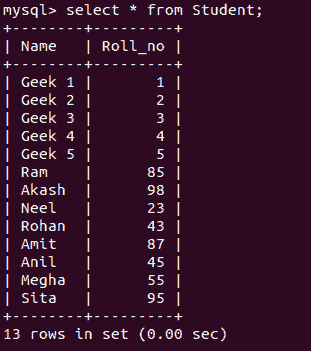
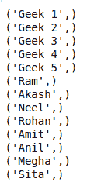
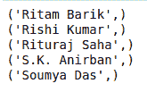
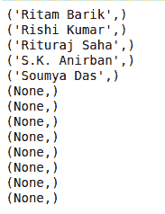

# Python MySQL–加入

> 原文:[https://www.geeksforgeeks.org/python-mysql-join/](https://www.geeksforgeeks.org/python-mysql-join/)

当我们不得不使用 mysql 和其他编程语言时，连接器就被使用了。mysql 连接器的工作是提供对所需语言的 MySQL 驱动程序的访问。因此，它在编程语言和 MySQL 服务器之间生成了一个连接。

#### python-MySQL-连接器

这是一个 MySQL 连接器，允许 Python 访问 MySQL 驱动程序，并在其编程工具中实现 SQL 查询。这里我们将尝试在我们的数据库中实现 **Join** 子句，并将研究生成的输出。

## SQL 的连接子句

联接允许您根据两个或多个表之间的相关列，在 SQL 中组合它们。基于这种连接的应用，有三种连接类型:


*   **INNER JOIN**
    给出匹配列产生的记录。JOIN 和 INNER JOIN 的工作原理相同。
    **语法:**

    ```
    SELECT column1, column2...
    FROM tablename
    JOIN tablename ON condition;
    ```

    ```
    SELECT column1, column2...
    FROM tablename
    INNER JOIN tablename ON condition;
    ```

*   **左连接**
    给出表 1 中的那些记录，删除 2
    **的独占内容语法:**

    ```
    SELECT column1, column2...
    FROM tablename
    LEFT JOIN tablename ON condition;
    ```

*   **RIGHT JOIN**
    去掉 1 的独占记录后，给出表 2 的所有记录。
    **语法:**

    ```
    SELECT column1, column2...
    FROM tablename
    RIGHT JOIN tablename ON condition;
    ```

以下程序将帮助您更好地理解这一点。
**使用中的数据库:**




**程序 1:** 使用内部连接

```
import mysql.connector

# Conencting to the database
mydb = mysql.connector.connect(
  host ='localhost',
  database ='College',
  user ='root',
)

cs = mydb.cursor()

# STUDENT and STudent are
# two different database
statement ="SELECT S.NAME from Student S JOIN \
Student on S.Roll_no = Student.Roll_no"

cs.execute(statement)
result_set = cs.fetchall()

for x in result_set:
    print(x)
```

**输出:**



**程序 2:** 使用左连接

```
import mysql.connector

# Conencting to the database
mydb = mysql.connector.connect(
  host ='localhost',
  database ='College',
  user ='root',
)

cs = mydb.cursor()

# STUDENT and STudent are
# two different database
statement ="SELECT S.Name from STUDENT S\
 LEFT JOIN Student s ON S.Roll_no = s.Roll_no"

cs.execute(statement)
result_set = cs.fetchall()

for x in result_set:
    print(x)
```

**输出:**



**程序 3 :** 使用右连接

```
import mysql.connector

# Conencting to the database
mydb = mysql.connector.connect(
  host ='localhost',
  database ='College',
  user ='root',
)

cs = mydb.cursor()

# STUDENT and STudent are
# two different database
statement ="SELECT S.Name from STUDENT S RIGHT \
JOIN Student s ON S.Roll_no = s.Roll_no"

cs.execute(statement)
result_set = cs.fetchall()

for x in result_set:
    print(x)
```

**输出:**

