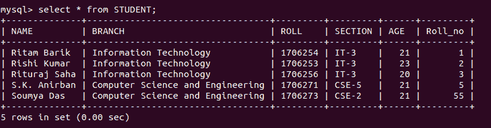
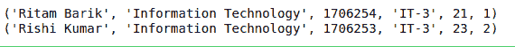
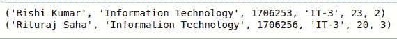

# Python MySQL–限制条款

> 原文:[https://www.geeksforgeeks.org/python-mysql-limit-clause/](https://www.geeksforgeeks.org/python-mysql-limit-clause/)

当我们不得不使用 MySQL 和其他编程语言时，就要用到连接器。mysql 连接器的工作是提供对所需语言的 MySQL 驱动程序的访问。因此，它在编程语言和 MySQL 服务器之间生成了一个连接。

#### python-MySQL-连接器

这是一个 MySQL 连接器，允许 Python 访问 MySQL 驱动程序，并在其编程工具中实现 SQL 查询。这里我们将尝试在我们的数据库中实现 **Limit** 子句，并将研究生成的输出。

## SQL 的限制子句

在 SQL 中，Limit 子句用于控制或限制从生成的查询返回的结果集中的记录数。默认情况下，SQL 从顶部开始给出所需的记录数，但它允许使用 OFFSET 关键字。OFFSET 允许您从一个自定义行开始，并获得所需数量的结果行。

**语法:**

```py
SELECT * FROM tablename LIMIT limit;

SELECT * FROM tablename LIMIT limit OFFSET offset;

```

以下程序将帮助您更好地理解这一点。
**使用中的数据库:**



**示例 1:** 仅显示 2 条记录的程序

```py
import mysql.connector

# Conencting to the database
mydb = mysql.connector.connect(
  host ='localhost',
  database ='College',
  user ='root',
)

cs = mydb.cursor()

# STUDENT and STudent are
# two different database
statement ="SELECT * FROM STUDENT LIMIT 2"

cs.execute(statement)
result_set = cs.fetchall()

for x in result_set:
    print(x)
```

**输出:**



**例 2:** 从第二条记录开始编程，显示前两条记录

```py
import mysql.connector

# Conencting to the database
mydb = mysql.connector.connect(
  host ='localhost',
  database ='College',
  user ='root',
)

cs = mydb.cursor()

# STUDENT and STudent are
# two different database
statement ="SELECT * FROM STUDENT LIMIT 2 OFFSET 1"

cs.execute(statement)
result_set = cs.fetchall()

for x in result_set:
    print(x)
```

**输出:**

