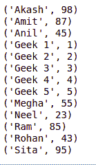
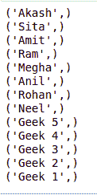

# Python MySQL–订单条款

> 原文:[https://www.geeksforgeeks.org/python-mysql-order-by-clause/](https://www.geeksforgeeks.org/python-mysql-order-by-clause/)

当我们不得不使用 MySQL 和其他编程语言时，就要用到连接器。MySQL 连接器的工作是提供对所需语言的 MySQL 驱动程序的访问。因此，它在编程语言和 MySQL 服务器之间生成了一个连接。

## 排序依据条款

OrderBy 用于以升序或降序排列结果集。默认情况下，它总是按升序排列，除非提到“DESC”，这将按降序排列。
“ASC”也可以用来明确按升序排列。但是，通常不会这样做，因为违约已经这样做了。

**语法-**

```py
SELECT column1, column2
FROM table_name
ORDER BY column_name ASC|DESC;

```

以下程序将帮助您更好地理解这一点。
**使用中的数据库:**


**例 1:** 按名称升序排列数据的程序

```py
# Python program to demonstrate
# order by clause

import mysql.connector

# Connecting to the Database
mydb = mysql.connector.connect(
  host ='localhost',
  database ='College',
  user ='root',
  password = ''
)

cs = mydb.cursor()

# Order by clause
statement ="SELECT * FROM Student ORDER BY Name"
cs.execute(statement)

result_set = cs.fetchall()

for x in result_set:
    print(x)

# Disconnecting from the database
mydb.close()
```

**输出:**



**例 2:** 按降序排列数据库

```py
# Python program to demonstrate
# order by clause

import mysql.connector

# Connecting to the Database
mydb = mysql.connector.connect(
  host ='localhost',
  database ='College',
  user ='root',
)

cs = mydb.cursor()

# Order by clause
statement ="SELECT * FROM Student ORDER BY Name DESC"
cs.execute(statement)

result_set = cs.fetchall()

for x in result_set:
    print(x)

# Disconnecting from the database  
mydb.close()
```

**输出:**


**例 3:** 从表中获取名称的程序，按卷号降序排列

```py
# Python program to demonstrate
# order by clause

import mysql.connector

# Connecting to the Database
mydb = mysql.connector.connect(
  host ='localhost',
  database ='College',
  user ='root',
)

cs = mydb.cursor()

# Order by clause
statement ="SELECT Name FROM Student ORDER BY Roll_no DESC"
cs.execute(statement)

result_set = cs.fetchall()

for x in result_set:
    print(x)

# Disconnecting from the database
mydb.close()
```

**输出:**

