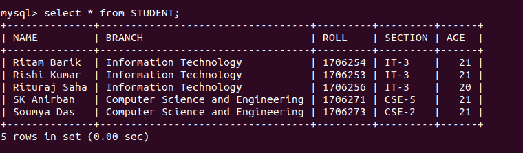
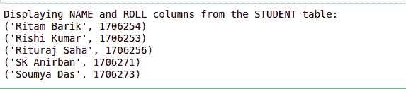
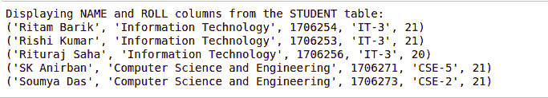

# Python MySQL–选择查询

> 原文:[https://www.geeksforgeeks.org/python-mysql-select-query/](https://www.geeksforgeeks.org/python-mysql-select-query/)

Python 数据库应用编程接口是标准 Python 的数据库接口。大多数 Python 数据库接口都遵守该标准。Python 数据库支持的数据库服务器有多种，如 MySQL、牛虻、mSQL、PostgreSQL、微软 SQL Server 2000、Informix、Interbase、Oracle、Sybase 等。要从 Python 连接 MySQL 数据库服务器，需要导入`mysql.connector`模块。

下面是一个连接 MySQL 数据库的程序`geeks`。

```py
# importing required library 
import mysql.connector

# connecting to the database 
dataBase = mysql.connector.connect(
                     host = "localhost",
                     user = "user",
                     passwd = "pswrd",
                     database = "geeks" ) 

# preparing a cursor object 
cursorObject = dataBase.cursor() 

# disconnecting from server
dataBase.close() 
```

上面的程序说明了与 MySQL 数据库`geeks`的连接，其中主机名为`localhost`，用户名为`user`，密码为`pswrd`。

## 选择查询

在 MySQL 中连接数据库后，我们可以从其中的表中选择查询。

**语法:**

*   为了从表中选择特定的属性列，我们编写属性名。

    ```py
    SELECT attr1, attr2 FROM table_name
    ```

*   为了从表中选择所有属性列，我们使用星号“*”符号。

    ```py
    SELECT * FROM table_name
    ```

**示例 1:** 让我们考虑一下该表的外观–



下面是一个从数据库表中选择查询的程序。

```py
# importing required library 
import mysql.connector 

# connecting to the database 
dataBase = mysql.connector.connect(
                     host = "localhost",
                     user = "user",
                     passwd = "pswrd",
                     database = "geeks" ) 

# preparing a cursor object 
cursorObject = dataBase.cursor()

print("Displaying NAME and ROLL columns from the STUDENT table:")

# selecting query
query = "SELECT NAME, ROLL FROM STUDENT"
cursorObject.execute(query)

myresult = cursorObject.fetchall()

for x in myresult:
    print(x)

# disconnecting from server
dataBase.close()
```

**输出:**



**示例 2:** 让我们看另一个在表中选择查询的示例。

```py
# importing required library 
import mysql.connector 

# connecting to the database 
dataBase = mysql.connector.connect(
                     host = "localhost",
                     user = "user",
                     passwd = "pswrd",
                     database = "geeks" )  

# preparing a cursor object 
cursorObject = dataBase.cursor()

print("Displaying NAME and ROLL columns from the STUDENT table:")

# selecting query
query = "SELECT * FROM STUDENT"
cursorObject.execute(query)

myresult = cursorObject.fetchall()

for x in myresult:
    print(x)

# disconnecting from server
dataBase.close()
```

**输出:**

