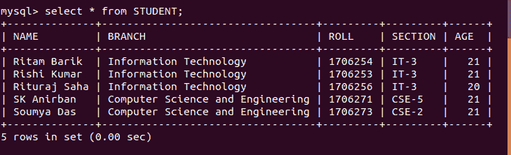
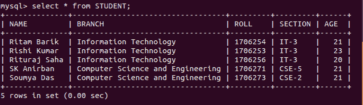
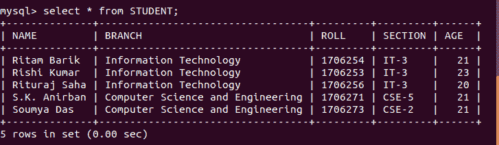

# Python MySQL–更新查询

> 原文:[https://www.geeksforgeeks.org/python-mysql-update-query/](https://www.geeksforgeeks.org/python-mysql-update-query/)

当我们不得不使用 MySQL 和其他编程语言时，就要用到连接器。MySQL 连接器的工作是提供对所需语言的 MySQL 驱动程序的访问。因此，它在编程语言和 MySQL 服务器之间生成了一个连接。

## 更新条款

更新用于更改数据库中的现有值。通过使用更新，可以更正或更新特定的值。它只影响数据，不影响表的结构。
该命令提供的基本优点是保持了表格的准确性。

**语法:**

```py
UPDATE tablename
SET ="new value"
WHERE ="old value";

```

以下程序将帮助您更好地理解这一点。
**使用中的数据库:**



**例 1:** 更新名为里什·库马尔的学生年龄的程序。

```py
# Python program to demonstrate
# update clause

import mysql.connector

# Connecting to the Database
mydb = mysql.connector.connect(
  host ='localhost',
  database ='College',
  user ='root',
)

cs = mydb.cursor()

# drop clause
statement ="UPDATE STUDENT SET AGE = 23 WHERE Name ='Rishi Kumar'"

cs.execute(statement)
mydb.commit()

# Disconnecting from the database
mydb.close()
```

**输出:**



**示例 2:** 一个名为 SK 的学生的拼写纠正程序

```py
# Python program to demonstrate
# update clause

import mysql.connector

# Connecting to the Database
mydb = mysql.connector.connect(
  host ='localhost',
  database ='College',
  user ='root',
)

cs = mydb.cursor()

# drop clause
statement ="UPDATE STUDENT SET Name = 'S.K. Anirban' WHERE Name ='SK Anirban'"

cs.execute(statement)
mydb.commit()

# Disconnecting from the database
mydb.close()
```

**输出:**

