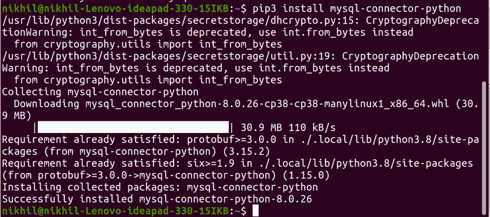
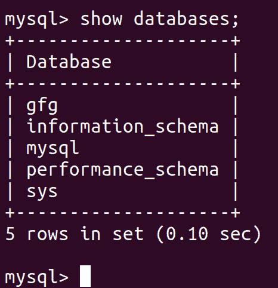
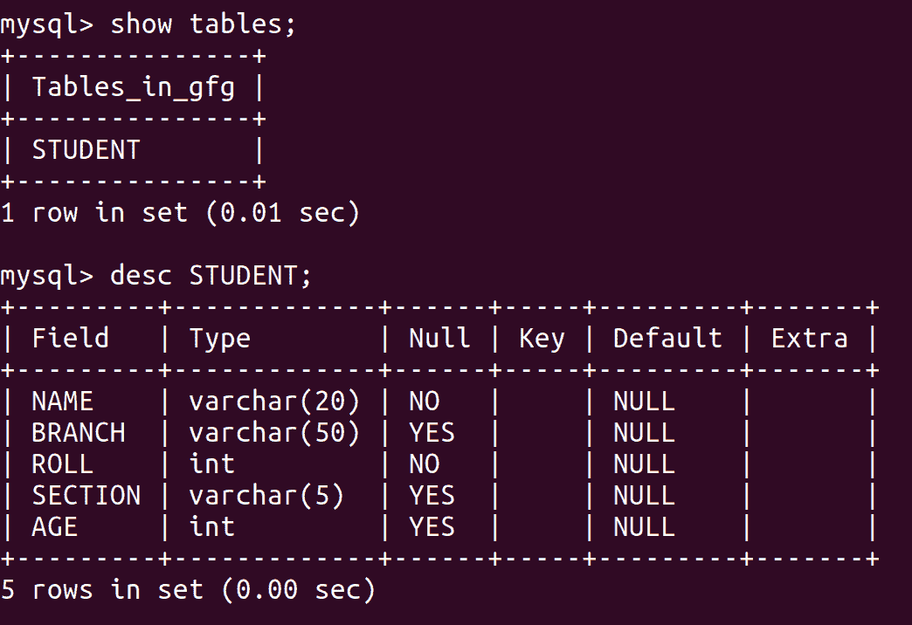
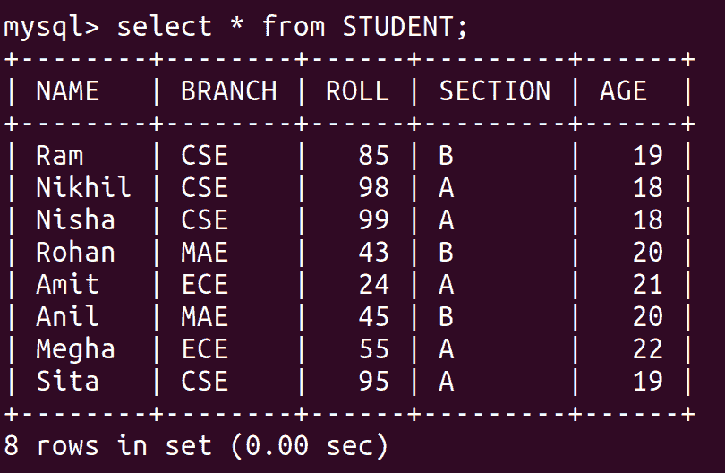
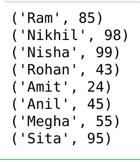
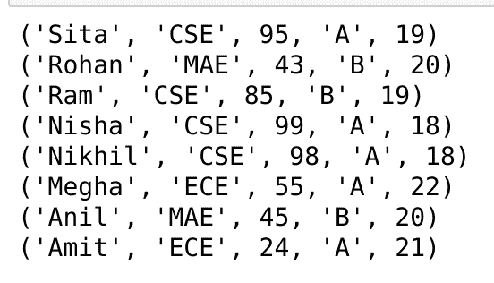
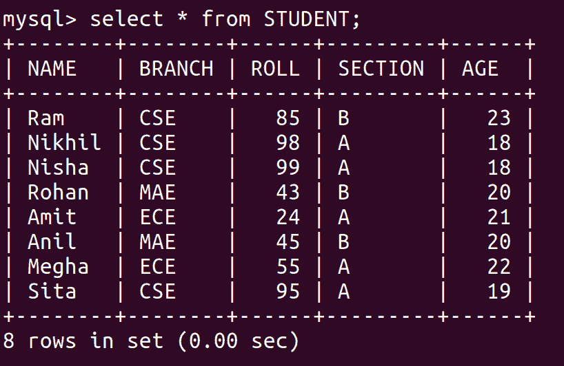
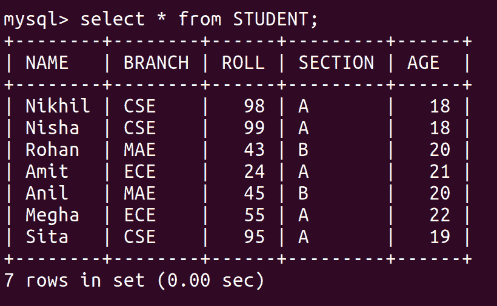
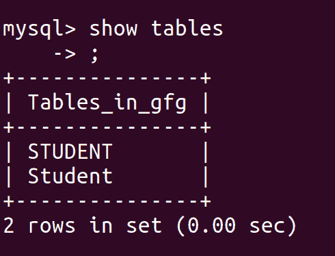
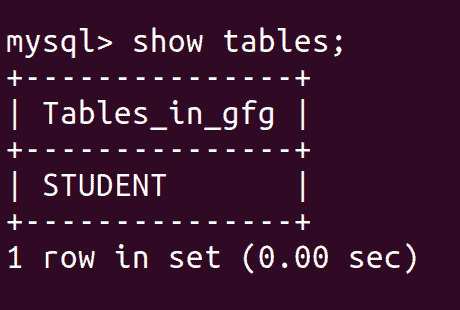

# Python MySQL

> 哎哎哎:# t0]https://www . geeksforgeeks . org/python-MySQL/

**Python MySQL Connector** 是一个 Python 驱动程序，帮助整合 Python 和 MySQL。这个 Python MySQL 库允许 Python 和 MySQL 数据类型之间的转换。MySQL Connector API 使用纯 Python 实现，不需要任何第三方库。


本 **Python MySQL 教程**将帮助学习如何将 MySQL 与 Python 一起使用，从基础到高级，包括所有必要的函数和查询，借助好的 Python MySQL 示例进行详细解释。那么，让我们开始吧。

## 装置

要安装 **Python-mysql 连接器**模块，必须在系统上预装 Python 和 PIP。如果已经安装了 Python 和 pip，请在终端中键入以下命令。

```
pip3 install mysql-connector-python
```

**注意:**如果 Python 不存在，请通过 [Windows](https://www.geeksforgeeks.org/how-to-install-python-on-windows/) 和 [Linux](https://www.geeksforgeeks.org/how-to-install-python-on-linux/) 如何安装 Python？并遵循提供的说明。



## 连接到 MySQL 服务器

我们可以使用 connect()方法连接到 MySQL 服务器。

## 蟒蛇 3

```
# importing required libraries
import mysql.connector

dataBase = mysql.connector.connect(
  host ="localhost",
  user ="user",
  passwd ="password"
)

print(dataBase)

# Disconnecting from the server
dataBase.close()
```

**输出:**

**注:**更多信息请参考[使用 MySQL-Connector Python 连接 MySQL 数据库](https://www.geeksforgeeks.org/connect-mysql-database-using-mysql-connector-python/)。

## 创建数据库

连接到 MySQL 服务器后，让我们看看如何使用 Python[创建 MySQL 数据库](https://www.geeksforgeeks.org/python-mysql-create-database/)。为此，我们将首先创建一个 cursor()对象，然后将 SQL 命令作为字符串传递给 execute()方法。创建数据库的 SQL 命令是–

```
CREATE DATABASE DATABASE_NAME
```

### 示例:用 Python 创建 MySQL 数据库

## 蟒蛇 3

```
# importing required libraries
import mysql.connector

dataBase = mysql.connector.connect(
  host ="localhost",
  user ="user",
  passwd ="password"
)

# preparing a cursor object
cursorObject = dataBase.cursor()

# creating database
cursorObject.execute("CREATE DATABASE gfg")
```

**输出:**



## 创建表格

对于[创建表](https://www.geeksforgeeks.org/python-mysql-create-table/)，我们将遵循类似的方法，将 SQL 命令写成字符串，然后将其传递给游标对象的 execute()方法。用于创建表的 SQL 命令是–

```
CREATE TABLE
(
    column_name_1 column_Data_type,
    column_name_2 column_Data_type,
    :
    :
    column_name_n column_Data_type
);
```

### 示例:使用 Python 创建 MySQL 表

## 蟒蛇 3

```
# importing required libraries
import mysql.connector

dataBase = mysql.connector.connect(
  host ="localhost",
  user ="user",
  passwd ="password",
  database = "gfg"
)

# preparing a cursor object
cursorObject = dataBase.cursor()

# creating table
studentRecord = """CREATE TABLE STUDENT (
                   NAME  VARCHAR(20) NOT NULL,
                   BRANCH VARCHAR(50),
                   ROLL INT NOT NULL,
                   SECTION VARCHAR(5),
                   AGE INT
                   )"""

# table created
cursorObject.execute(studentRecord)

# disconnecting from server
dataBase.close()
```

**输出:**



## 将数据插入表格

要将数据[插入到 MySQL 表中**插入到**中使用查询。](https://www.geeksforgeeks.org/python-mysql-insert-into-table/)

**语法:**

```
INSERT INTO table_name (column_names) VALUES (data)
```

### 示例 1:插入单行

## 蟒蛇 3

```
# importing required libraries
import mysql.connector

dataBase = mysql.connector.connect(
  host ="localhost",
  user ="user",
  passwd ="password",
  database = "gfg"
)

# preparing a cursor object
cursorObject = dataBase.cursor()

sql = "INSERT INTO STUDENT (NAME, BRANCH, ROLL, SECTION, AGE)\
VALUES (%s, %s, %s, %s, %s)"
val = ("Ram", "CSE", "85", "B", "19")

cursorObject.execute(sql, val)
dataBase.commit()

# disconnecting from server
dataBase.close()
```

**输出:**


### 示例 2:插入多行

若要一次插入多个值，请使用 executemany()方法。此方法遍历参数序列，将当前参数传递给执行方法。

## 蟒蛇 3

```
# importing required libraries
import mysql.connector

dataBase = mysql.connector.connect(
  host ="localhost",
  user ="user",
  passwd ="password",
  database = "gfg"
)

# preparing a cursor object
cursorObject = dataBase.cursor()

sql = "INSERT INTO STUDENT (NAME, BRANCH, ROLL, SECTION, AGE)\
VALUES (%s, %s, %s, %s, %s)"
val = [("Nikhil", "CSE", "98", "A", "18"),
       ("Nisha", "CSE", "99", "A", "18"),
       ("Rohan", "MAE", "43", "B", "20"),
       ("Amit", "ECE", "24", "A", "21"),
       ("Anil", "MAE", "45", "B", "20"),
       ("Megha", "ECE", "55", "A", "22"),
       ("Sita", "CSE", "95", "A", "19")]

cursorObject.executemany(sql, val)
dataBase.commit()

# disconnecting from server
dataBase.close()
```

**输出:**



## 正在获取数据

我们可以通过以下方式在 MySQL 表上使用[选择查询](https://www.geeksforgeeks.org/python-mysql-select-query/)—

*   为了从表中选择特定的属性列，我们编写属性名。

```
SELECT attr1, attr2 FROM table_name
```

*   为了从表中选择所有属性列，我们使用星号“*”符号。

```
SELECT * FROM table_name
```

### **示例:使用 **Python** 从 MySQL 表**中选择数据

## 蟒蛇 3

```
# importing required libraries
import mysql.connector

dataBase = mysql.connector.connect(
  host ="localhost",
  user ="user",
  passwd ="password",
  database = "gfg"
)

# preparing a cursor object
cursorObject = dataBase.cursor()

query = "SELECT NAME, ROLL FROM STUDENT"
cursorObject.execute(query)

myresult = cursorObject.fetchall()

for x in myresult:
    print(x)

# disconnecting from server
dataBase.close()
```

**输出:**



### Where 子句

[在 MySQL 数据库中使用 Where 子句](https://www.geeksforgeeks.org/python-mysql-where-clause/)根据需要的条件过滤数据。通过使用 where 子句，可以获取、删除或更新 MySQL 数据库中的特定数据集。

**语法:**

> 选择列 1、列 2、…。从[表名]开始的列，其中[条件]；

### **示例:使用 Python 的 MySQL 中的 Where 子句**

## 蟒蛇 3

```
# importing required libraries
import mysql.connector

dataBase = mysql.connector.connect(
  host ="localhost",
  user ="user",
  passwd ="password",
  database = "gfg"
)

# preparing a cursor object
cursorObject = dataBase.cursor()

query = "SELECT * FROM STUDENT where AGE >=20"
cursorObject.execute(query)

myresult = cursorObject.fetchall()

for x in myresult:
    print(x)

# disconnecting from server
dataBase.close()
```

**输出:**

```
('Rohan', 'MAE', 43, 'B', 20)
('Amit', 'ECE', 24, 'A', 21)
('Anil', 'MAE', 45, 'B', 20)
('Megha', 'ECE', 55, 'A', 22)
```

### 按条款排序

[OrderBy](https://www.geeksforgeeks.org/python-mysql-order-by-clause/) 用于以升序或降序排列结果集。默认情况下，它总是按升序排列，除非提到“DESC”，这将按降序排列。“ASC”也可以用来明确地按升序排列。但是，通常不会这样做，因为违约已经这样做了。

**语法:**

```
SELECT column1, column2
FROM table_name
ORDER BY column_name ASC|DESC;
```

### 示例:使用 Python 的 MySQL 中的 Order By 子句

## 蟒蛇 3

```
# importing required libraries
import mysql.connector

dataBase = mysql.connector.connect(
  host ="localhost",
  user ="user",
  passwd ="password",
  database = "gfg"
)

# preparing a cursor object
cursorObject = dataBase.cursor()

query = "SELECT * FROM STUDENT ORDER BY NAME DESC"
cursorObject.execute(query)

myresult = cursorObject.fetchall()

for x in myresult:
    print(x)

# disconnecting from server
dataBase.close()
```

**输出:**



### 限制条款

在 SQL 中使用 [Limit 子句](https://www.geeksforgeeks.org/python-mysql-limit-clause/)来控制或限制从生成的查询返回的结果集中的记录数量。默认情况下，SQL 从顶部开始给出所需的记录数，但它允许使用 OFFSET 关键字。OFFSET 允许您从一个自定义行开始，并获得所需数量的结果行。

**语法:**

```
SELECT * FROM tablename LIMIT limit;
SELECT * FROM tablename LIMIT limit OFFSET offset;
```

### 示例:使用 Python 的 MySQL 中的 Limit 子句

## 蟒蛇 3

```
# importing required libraries
import mysql.connector

dataBase = mysql.connector.connect(
  host ="localhost",
  user ="user",
  passwd ="password",
  database = "gfg"
)

# preparing a cursor object
cursorObject = dataBase.cursor()

query = "SELECT * FROM STUDENT LIMIT 2 OFFSET 1"
cursorObject.execute(query)

myresult = cursorObject.fetchall()

for x in myresult:
    print(x)

# disconnecting from server
dataBase.close()
```

**输出:**

```
('Nikhil', 'CSE', 98, 'A', 18)
('Nisha', 'CSE', 99, 'A', 18)
```

## 更新数据

[更新查询](https://www.geeksforgeeks.org/python-mysql-update-query/)用于更改数据库中的现有值。通过使用更新，可以更正或更新特定的值。它只影响数据，不影响表的结构。该命令提供的基本优势是它可以保持表格的准确性。

**语法:**

```
UPDATE tablename
SET ="new value"
WHERE ="old value";
```

### 示例:使用 Python 更新 MySQL 表

## 蟒蛇 3

```
# importing required libraries
import mysql.connector

dataBase = mysql.connector.connect(
  host ="localhost",
  user ="user",
  passwd ="password",
  database = "gfg"
)

# preparing a cursor object
cursorObject = dataBase.cursor()

query = "UPDATE STUDENT SET AGE = 23 WHERE Name ='Ram'"
cursorObject.execute(query)
dataBase.commit()

# disconnecting from server
dataBase.close()
```

**输出:**



## 从表中删除数据

我们可以使用[删除查询](https://www.geeksforgeeks.org/python-mysql-delete-query/)从 MySQL 的表中删除数据。

**语法:**

```
DELETE FROM TABLE_NAME WHERE ATTRIBUTE_NAME = ATTRIBUTE_VALUE
```

### 示例:使用 Python 从 MySQL 表中删除数据

## 蟒蛇 3

```
# importing required libraries
import mysql.connector

dataBase = mysql.connector.connect(
  host ="localhost",
  user ="user",
  passwd ="password",
  database = "gfg"
)

# preparing a cursor object
cursorObject = dataBase.cursor()

query = "DELETE FROM STUDENT WHERE NAME = 'Ram'"
cursorObject.execute(query)
dataBase.commit()

# disconnecting from server
dataBase.close()
```

**输出:**



## 翻桌

[Drop 命令](https://www.geeksforgeeks.org/python-mysql-drop-table/)影响的是表的结构，而不是数据。它用于删除已经存在的表。如果您不确定要删除的表是否存在，请使用“如果存在，删除表”命令。这两种情况将在下面的例子中讨论。

**语法:**

```
DROP TABLE tablename;
DROP TABLE IF EXISTS tablename;
```

首先，让我们看看数据库中的表列表。



我们可以看到有两张桌子给学生，所以让我们放下第二张桌子。

### 示例 1:使用 Python 在 MySQL 中删除表

## 蟒蛇 3

```
# importing required libraries
import mysql.connector

dataBase = mysql.connector.connect(
  host ="localhost",
  user ="user",
  passwd ="password",
  database = "gfg"
)

# preparing a cursor object
cursorObject = dataBase.cursor()

query ="DROP TABLE Student;"

cursorObject.execute(query)
dataBase.commit()

# disconnecting from server
dataBase.close()
```

**输出:**



### 示例 2:删除表(如果存在)

## 蟒蛇 3

```
# importing required libraries
import mysql.connector

dataBase = mysql.connector.connect(
  host ="localhost",
  user ="user",
  passwd ="password",
  database = "gfg"
)

# preparing a cursor object
cursorObject = dataBase.cursor()

query ="Drop Table if exists Employee;"

cursorObject.execute(query)
dataBase.commit()

# disconnecting from server
dataBase.close()
```

上面的例子，不会产生任何错误和输出，因为我们已经使用了 Drop Table is exists 查询。如果我们简单地使用 Drop 表 Employee，那么**编程错误:1051 (42S02):未知表' gfg。员工的**被提升。

## Python MySQL 练习

### 使用表格

*   [如何使用 Python 向 MySQL 服务器表中插入值？](https://www.geeksforgeeks.org/how-to-insert-values-into-mysql-server-table-using-python/)
*   [如何用 Python 显示 MySQL 中的所有表？](https://www.geeksforgeeks.org/how-to-show-all-tables-in-mysql-using-python/)
*   [如何用 Python 获取 MySQL 中一个表的大小？](https://www.geeksforgeeks.org/how-to-get-the-size-of-a-table-in-mysql-using-python/)
*   [如何在 Python 中重命名 MySQL 表？](https://www.geeksforgeeks.org/how-to-rename-a-mysql-table-in-python/)
*   [如何用 Python 复制 MySQL 中的表？](https://www.geeksforgeeks.org/how-to-copy-a-table-in-mysql-using-python/)
*   [如何用 Python 在 MySQL 中复制一个表定义？](https://www.geeksforgeeks.org/how-to-copy-a-table-definition-in-mysql-using-python/)
*   [使用 Python 在 MySQL 数据库中插入后获取 id](https://www.geeksforgeeks.org/get-the-id-after-insert-into-mysql-database-using-python/)
*   [如何使用 Python 在 MySQL 中使用 IF 语句](https://www.geeksforgeeks.org/how-to-use-if-statement-in-mysql-using-python/)
*   [使用 Python 从 MySql 的表中删除元素](https://www.geeksforgeeks.org/deleting-element-from-table-in-mysql-using-python/)
*   [使用 Python 授予 MySQL 表和列权限](https://www.geeksforgeeks.org/grant-mysql-table-and-column-permissions-using-python/)

### 处理列

*   [如何用 Python 统计一个 MySQL 表的行数？](https://www.geeksforgeeks.org/how-to-count-the-number-of-rows-in-a-mysql-table-in-python/)
*   [使用 Python 对 SQL 表列进行计数](https://www.geeksforgeeks.org/count-sql-table-column-using-python/)
*   [如何在 Python 中给 MySQL 表添加一列？](https://www.geeksforgeeks.org/how-to-add-a-column-to-a-mysql-table-in-python/)
*   [如何用 Python 获取 MySQL 表的一列的最小值和最大值？](https://www.geeksforgeeks.org/how-to-get-the-minimum-and-maximum-value-of-a-column-of-a-mysql-table-using-python/)
*   [如何使用 Python 跨 MySQL 表的列执行算术运算？](https://www.geeksforgeeks.org/how-to-perform-arithmetic-across-columns-of-a-mysql-table-using-python/)
*   [如何用 Python 连接 MySQL 表的列值？](https://www.geeksforgeeks.org/how-to-concatenate-column-values-of-a-mysql-table-using-python/)
*   [使用 Python 给 MySQL 中的列添加注释](https://www.geeksforgeeks.org/add-comment-to-column-in-mysql-using-python/)
*   [使用 Python 授予 MySQL 表和列权限](https://www.geeksforgeeks.org/grant-mysql-table-and-column-permissions-using-python/)

## Python MySQL 应用程序和项目

*   [使用 Tkinter](https://www.geeksforgeeks.org/create-mysql-database-login-page-in-python-using-tkinter/) 用 Python 创建 MySQL 数据库登录页面
*   [使用 Python 中的 MySQL-Connector 和 XAMPP 从数据库中提取数据](https://www.geeksforgeeks.org/extract-data-from-database-using-mysql-connector-and-xampp-in-python/)