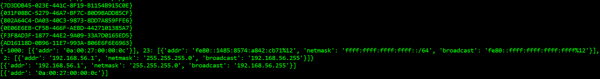

# Python–网络接口

> 原文:[https://www.geeksforgeeks.org/python-network-interface/](https://www.geeksforgeeks.org/python-network-interface/)

**网络接口**无非是计算机网络中两个硬件设备或协议层之间的互联。网络接口通常具有某种形式的网络地址。一般是没有任何物理存在的网络接口卡。它可以在软件界面中实现。

当我们有多个接口时，很难跟踪接口名称、状态或与它们相关的任何其他信息。为此，Python 有一个名为*netifces*的库，可以列出接口及其状态。*网络*模块是一个可移植的第三方库，它列举了本地机器上的网络接口。下面是一个使用 python *网络*模块的简单例子，给出了接口及其状态的细节。

**安装:**

```py
pip install netifaces
```

**实现各种网络操作的** ***网络*** **模块:**

## 蟒蛇 3

```py
# Import libraries
import netifaces

# Showing gateway list
netifaces.gateways()

# Getting interfaces
interfaces = netifaces.interfaces()

# Showing interfaces
for interface in interfaces:
    print(interface)

# Getting interface info
print(netifaces.ifaddresses(str(interfaces[0])))

# Getting interface status
addrs = netifaces.ifaddresses(str(interfaces[0]))
print(addrs[netifaces.AF_INET])
print(addrs[netifaces.AF_LINK])
```

**输出:**

