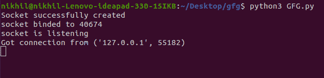
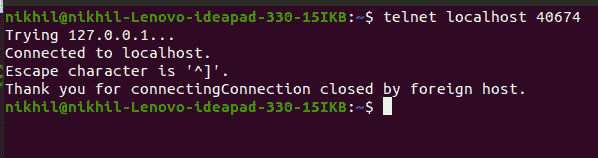
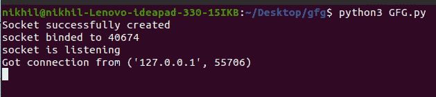
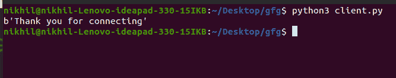

# Python 网络编程

> 原文:[https://www.geeksforgeeks.org/python-network-programming/](https://www.geeksforgeeks.org/python-network-programming/)

Python 提供了两种级别的网络编程访问。这些是–

*   **低级访问:**在低级，可以访问操作系统的基本套接字支持。您可以为面向连接和无连接的协议实现客户机和服务器。
*   **高级访问:**在高级允许实现 HTTP、FTP 等协议。

在本文中，我们将讨论网络套接字编程。但是在开始之前，让我们先了解一下什么是插座。

## 什么是插座？

考虑一个双向通信通道，套接字是这个通信通道的端点。这些套接字(端点)可以在一个进程内、同一台机器上的进程之间或不同机器上的进程之间进行通信。套接字使用不同的协议来确定客户端和服务器之间端口对端口通信的连接类型。

## 插座词汇

套接字有自己的一套词汇，让我们来看看它们–

<figure class="table">

| 学期 | 描述 |
| --- | --- |
| 领域 | 用于传输机制的一组协议，如 AF_INET、PF_INET 等。 |
| 类型 | 套接字之间的通信类型 |
| 草案 | 标识域和类型中使用的协议类型。通常为零 |
| 港口 | 服务器监听客户端在一个或多个端口上的调用。它可以是包含端口号、服务名称或 Fixnum 端口的字符串 |
| 主机名 | 标识网络接口。它可以是一个

*   包含主机名、IPv6 地址或双四元地址的字符串。
*   整数
*   零长度字符串
*   一串“<brodcast>”</brodcast>

 |

</figure>

## 套接字编程

[Socket 编程](https://www.geeksforgeeks.org/socket-programming-python/)是连接网络上两个节点相互通信的一种方式。一个套接字(节点)监听某个 IP 的特定端口，而另一个套接字则与另一个套接字建立连接。服务器形成侦听器套接字，而客户端则连接到服务器。他们是网络浏览背后真正的中坚力量。简单来说，有一个服务器和一个客户端。我们可以使用套接字模块进行套接字编程。为此，我们必须包括**插座模块**–

```
import socket
```

要创建套接字，我们必须使用 socket.socket()方法。

**语法:**

```
socket.socket(socket_family, socket_type, protocol=0)
```

哪里，

*   **socket_family:** 或者 AF_UNIX，或者 AF_INET
*   **socket _ type:**SOCK _ STREAM 或 SOCK_DGRAM 中的任意一个。
*   **协议:**通常被忽略，默认为 0。

**示例:**

## 蟒蛇 3

```
import socket

s = socket.socket(socket.AF_INET, socket.SOCK_STREAM)
print(s)
```

**输出:**

套接字模块为客户端和服务器端编程提供了各种方法。让我们详细看看每种方法。

## 套接字服务器方法

这些方法在服务器端使用。让我们详细看看每种方法–

<figure class="table">

| 函数名 | 描述 |
| --- | --- |
| s.bind() | 将地址绑定到套接字。该地址包含主机名和端口号对。 |
| 听着 | 启动 TCP 侦听器 |
| 接受() | 被动接受 TCP 客户端连接并阻止，直到连接到达 |

</figure>

## 套接字客户端方法

此方法在客户端使用。让我们详细看看这个方法–

<figure class="table">

| 函数名 | 描述 |
| --- | --- |
| s.connect() | 主动启动 TCP 服务器连接 |

</figure>

## 套接字通用方法

这些是套接字模块的一般方法。让我们详细看看每种方法。

<figure class="table">

| 函数名 | 描述 |
| --- | --- |
| s.send() | 发送 TCP 消息 |
| s.sendto() | 发送 UDP 消息 |
| s.recv() | 接收传输控制协议消息 |
| s.recvfrom() | 接收 UDP 消息 |
| 关 | 关闭插座 |
| socket.ghostname() | 返回主机名 |

</figure>

## 简单服务器客户端程序

### 计算机网络服务器

服务器有一个 bind()方法，将它绑定到一个特定的 IP 和端口，这样它就可以监听该 IP 和端口上的传入请求。服务器有一个 listen()方法，它将服务器置于侦听模式。这允许服务器监听传入的连接。最后，服务器有一个 accept()和 close()方法。accept 方法启动与客户端的连接，close 方法关闭与客户端的连接。

**示例:网络编程服务器端**

## 蟒蛇 3

```
# first of all import the socket library
import socket

# next create a socket object
s = socket.socket()
print ("Socket successfully created")

# reserve a port on your computer in our
# case it is 40674 but it can be anything
port = 40674

# Next bind to the port
# we have not typed any ip in the ip field
# instead we have inputted an empty string
# this makes the server listen to requests
# coming from other computers on the network
s.bind(('', port))
print ("socket binded to %s" %(port))

# put the socket into listening mode
s.listen(5)    
print ("socket is listening")

# a forever loop until we interrupt it or
# an error occurs
while True:

    # Establish connection with client.
    c, addr = s.accept()
    print ('Got connection from', addr )

    # send a thank you message to the client.
    c.send(b'Thank you for connecting')

    # Close the connection with the client
    c.close()
```

**说明:**

*   我们制作了一个套接字对象，并在我们的电脑上预留了一个端口。
*   之后，我们将服务器绑定到指定的端口。传递空字符串意味着服务器也可以监听来自其他计算机的传入连接。如果我们通过了 127.0.0.1，那么它将只监听本地计算机内的那些呼叫。
*   之后，我们将服务器置于监听模式。这里的 5 表示如果服务器忙，5 个连接保持等待，如果第 6 个套接字试图连接，那么连接被拒绝。
*   最后，我们做一个 while 循环，开始接受所有传入的连接，并在向所有连接的套接字发送感谢消息后关闭这些连接。

### 客户

现在我们需要服务器可以与之交互的东西。我们可以像这样对服务器进行特殊化，只是为了知道我们的服务器正在工作。在终端中键入以下命令:

```
# start the server
python server.py

# keep the above terminal open
# now open another terminal and type:

telnet localhost 12345
```

**输出:**



在 telnet 终端中，您会看到:



这个输出显示我们的服务器正在工作。现在对于客户端:

**示例:网络编程客户端**

## 蟒蛇 3

```
# Import socket module
import socket

# Create a socket object
s = socket.socket()

# Define the port on which you want to connect
port = 40674

# connect to the server on local computer
s.connect(('127.0.0.1', port))

# receive data from the server
print(s.recv(1024))

# close the connection
s.close()
```

**输出:**

 

**说明:**

*   我们通过端口 40674(我们的服务器运行的端口)连接到 localhost，最后，我们从服务器接收数据并关闭连接。
*   现在将此文件保存为 client.py，并在启动服务器脚本后从终端运行它。

**注意:**关于套接字编程的更多信息，请参考 Python 教程中的[套接字编程](https://www.geeksforgeeks.org/socket-programming-python/)