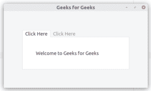
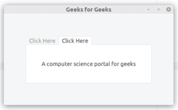

# Python–GTK+3 中的笔记本

> 原文:[https://www.geeksforgeeks.org/python-notebook-in-gtk-3/](https://www.geeksforgeeks.org/python-notebook-in-gtk-3/)

Gtk。笔记本小部件是一个 Gtk。子级为页面的容器，这些页面可以使用标签沿一条边进行切换。

【GtkNotebook 的配置选项。

1.  Gtk。Notebook.set_tab_pos()用于选择选项卡应该出现在哪个边缘。
2.  Gtk。Notebook.set _ scrollable()用于使笔记本变大和添加滚动选项。
3.  Gtk。Notebook.popup_enable()，Gtk。Notebook.popup_disable()表示是否会有弹出菜单允许用户切换页面

**遵循以下步骤:**

*   导入 GTK+ 3 模块。
*   创建笔记本。
*   创建盒子。

**示例:**

```py
import gi
# Since a system can have multiple versions
# of GTK + installed, we want to make 
# sure that we are importing GTK + 3.
gi.require_version("Gtk", "3.0")
from gi.repository import Gtk

class MyWindow(Gtk.Window):
    def __init__(self):
        Gtk.Window.__init__(self, title ="Geeks for Geeks")
        self.set_border_width(70)

        # Create Notebook
        self.notebook = Gtk.Notebook()
        self.add(self.notebook)

        # Create Boxes
        self.page1 = Gtk.Box()
        self.page1.set_border_width(50)
        self.page1.add(Gtk.Label("Welcome to Geeks for Geeks"))
        self.notebook.append_page(self.page1, Gtk.Label("Click Here"))

        self.page2 = Gtk.Box()
        self.page2.set_border_width(50)
        self.page2.add(Gtk.Label("A computer science portal for geeks"))
        self.notebook.append_page(self.page2, Gtk.Label("Click Here"))

win = MyWindow()
win.connect("destroy", Gtk.main_quit)
# Display the window.
win.show_all()
# Start the GTK + processing loop
Gtk.main()
```

**输出:**


