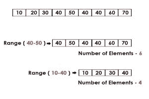

# Python |给定范围内列表中的数字

> 原文:[https://www . geesforgeks . org/python-numbers-list-在给定范围内/](https://www.geeksforgeeks.org/python-numbers-list-within-given-range/)

给定一个列表，打印给定范围内的数字。



示例:

```
Input : [10, 20, 30, 40, 50, 40, 40, 60, 70] range: 40-80
Output : 6

Input : [10, 20, 30, 40, 50, 40, 40, 60, 70] range: 10-40
Output : 4 
```

**多线进场:**
遍历列表，检查每个数字。如果数字在指定范围内，则增加计数器。遍历结束时，计数器的值将是指定范围内数字个数的答案。
下面是上述方法的 Python 实现

## 计算机编程语言

```
# Python program to count the
# number of numbers in a given range
# using traversal and multiple line code

def count(list1, l, r):
    c = 0
    # traverse in the list1
    for x in list1:
        # condition check
        if x>= l and x<= r:
            c+= 1
    return c

# driver code
list1 = [10, 20, 30, 40, 50, 40, 40, 60, 70]
l = 40
r = 80
print count(list1, l, r)
```

**输出:**

```
6
```

**单线法:**
我们可以写一条单线一起遍历和检查条件:

```
x for x in list1 if l <= x <= r
```

条件检查的返回值(true)存储在一个列表中，在列表的末尾返回答案。
下面是上述方法的 Python 实现

## 计算机编程语言

```
# Python program to count the
# number of numbers in a given range

def count(list1, l, r):

    # x for x in list1 is same as traversal in the list
    # the if condition checks for the number of numbers in the range
    # l to r
    # the return is stored in a list
    # whose length is the answer
    return len(list(x for x in list1 if l <= x <= r))

# driver code
list1 = [10, 20, 30, 40, 50, 40, 40, 60, 70]
l = 40
r = 80
print count(list1, l, r)
```

**输出:**

```
6 
```