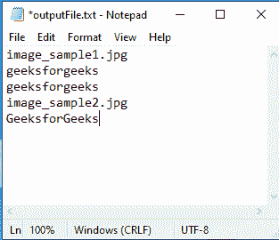

# Python |同时对文件夹中的所有图像进行光学字符识别

> 原文:[https://www . geesforgeks . org/python-ocr-on-all-images-present-in-a-folder-only/](https://www.geeksforgeeks.org/python-ocr-on-all-the-images-present-in-a-folder-simultaneously/)

如果你有一个文件夹充满了图像，其中有一些文本需要提取到一个单独的文件夹中，有相应的图像文件名或在一个文件中，那么这是你正在寻找的完美代码。

本文不仅为您提供了 **OCR(光学字符识别)**的基础，还可以帮助您为主文件夹内的每张图像创建`output.txt`文件，并将其保存在某个预定的方向。

需要的库–

```py
pip3 install pillow
pip3 install os-sys
```

您还需要**宇宙魔方-华侨城**和**宇宙魔方**库。`tesseract-ocr`可以从[这里](https://github.com/UB-Mannheim/tesseract/wiki)下载安装，`pytesseract`可以使用`pip3 install pytesseract`安装

Below is the Python implementation –

```py
# Python program to extract text from all the images in a folder
# storing the text in corresponding files in a different folder
from PIL import Image
import pytesseract as pt
import os

def main():
    # path for the folder for getting the raw images
    path ="E:\\GeeksforGeeks\\images"

    # path for the folder for getting the output
    tempPath ="E:\\GeeksforGeeks\\textFiles"

    # iterating the images inside the folder
    for imageName in os.listdir(path):

        inputPath = os.path.join(path, imageName)
        img = Image.open(inputPath)

        # applying ocr using pytesseract for python
        text = pt.image_to_string(img, lang ="eng")

        # for removing the .jpg from the imagePath
        imagePath = imagePath[0:-4]

        fullTempPath = os.path.join(tempPath, 'time_'+imageName+".txt")
        print(text)

        # saving the  text for every image in a separate .txt file
        file1 = open(fullTempPath, "w")
        file1.write(text)
        file1.close() 

if __name__ == '__main__':
    main()
```

**输入图像:**


图像 _ 样本 1

**输出:**

```py
geeksforgeeks
geeksforgeeks

```

如果你想把图像中的所有文本存储在一个输出文件中，那么代码会有一点不同。主要区别在于，我们将要写入的文件模式将更改为“**+一个**”来追加文本，并创建`output.txt`文件(如果它还不存在的话)。

```py
# extract text from all the images in a folder
# storing the text in a single file
from PIL import Image
import pytesseract as pt
import os

def main():
    # path for the folder for getting the raw images
    path ="E:\\GeeksforGeeks\\images"

    # link to the file in which output needs to be kept
    fullTempPath ="E:\\GeeksforGeeks\\output\\outputFile.txt"

    # iterating the images inside the folder
    for imageName in os.listdir(path):
        inputPath = os.path.join(path, imageName)
        img = Image.open(inputPath)

        # applying ocr using pytesseract for python
        text = pt.image_to_string(img, lang ="eng")

        # saving the  text for appending it to the output.txt file
        # a + parameter used for creating the file if not present
        # and if present then append the text content
        file1 = open(fullTempPath, "a+")

        # providing the name of the image
        file1.write(imageName+"\n")

        # providing the content in the image
        file1.write(text+"\n")
        file1.close() 

    # for printing the output file
    file2 = open(fullTempPath, 'r')
    print(file2.read())
    file2.close()        

if __name__ == '__main__':
    main()
```

**输入图像:**


图像 _ 样本 1


图像 _ 样本 2

**输出:**


它给出了从文件夹内的图像中提取所有信息后创建的单个文件的输出。文件的格式是这样的–

```py
Name of the image
Content of the image
Name of the next image and so on .....
```