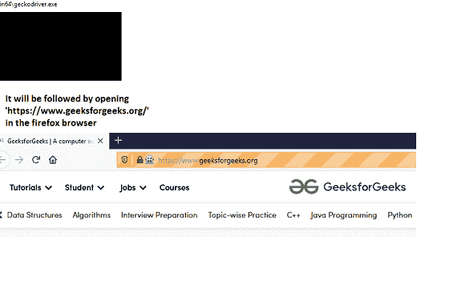
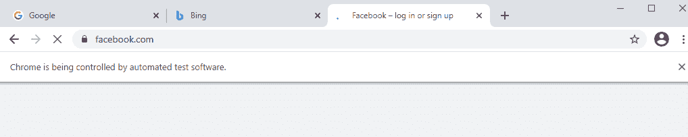

# Python–使用 Selenium 打开多个选项卡

> 原文:[https://www . geesforgeks . org/python-打开-多个选项卡-使用-selenium/](https://www.geeksforgeeks.org/python-opening-multiple-tabs-using-selenium/)

测试是软件方法论中的一个重要概念。软件只有在没有错误的情况下才被认为是有效的。测试可以手动完成，也可以通过自动化完成。在 Python 中，硒用于进行自动化测试。selenium 包是可用的，它们对 Python 中的网络浏览器交互自动化非常有帮助。

在本文中，我们将讨论如何使用 selenium 打开多个选项卡。

**安装**

```py
pip install selenium
```

**不同浏览器的硒驱动需求:**

每个浏览器都是不同的，同样，它们需要不同的 selenium 网络驱动程序。

像 Chrome、火狐等流行浏览器。，下面给出了它们的网络驱动程序下载路径

```py
Chrome: https://sites.google.com/a/chromium.org/chromedriver/downloads
Edge: https://developer.microsoft.com/en-us/microsoft-edge/tools/webdriver/
Firefox: https://github.com/mozilla/geckodriver/releases
Safari: https://webkit.org/blog/6900/webdriver-support-in-safari-10
```

首先，让我们看一个打开 firefox 浏览器的正常例子

**所需步骤:**

*   我们需要壁虎河来打开火狐浏览器。可以从[https://github.com/mozilla/geckodriver/releases](https://github.com/mozilla/geckodriver/releases)下载。它必须在窗口中的“路径”变量中设置，在 Linux 和 Mac 中也是如此，必须在各自的位置进行设置。
*   从 Python 打开一个新的火狐浏览器。
*   然后在给定的有效网址加载页面。

## 蟒蛇 3

```py
# Necessary webdrivers ned to be imported
from selenium import webdriver

# This is for Firefox. Similarly if 
# chrome is needed , then it has to be specified
webBrowser = webdriver.Firefox()

# This will open geeksforgeeks site in Firefox
webBrowser.get('https://www.geeksforgeeks.org/')
```

在代码执行时，我们可以看到如下所示的操作:



**使用 Selenium 打开多个标签页的方法:**

*   在为 selenium 指定了 Firefox/Chrome 驱动程序之后，首先，我们需要打开一个网页
*   我们需要调用“execute_script”方法，该方法依次执行 window.open('about:blank '，' secondtab') javascript。
*   然后，我们需要切换到该选项卡，并为该选项卡可以提供任何有效的网址。

## 蟒蛇 3

```py
# Necessary webdrivers ned to be imported
from selenium import webdriver

# This is for Firefox. Similarly if 
# chrome is needed , then it has to be specified
webBrowser = webdriver.Firefox()

# first tab. Open google.com in the first tab
webBrowser.get('http://google.com')

# second tab
# execute_script->Executes JavaScript snippet. 
# Here the snippet is window.open that means, it 
# opens in a new browser tab
webBrowser.execute_script("window.open('about:blank', 
                          'secondtab');")

# It is switching to second tab now
webBrowser.switch_to.window("secondtab")

# In the second tab, it opens geeksforgeeks
webBrowser.get('https://www.geeksforgeeks.org/')
```

**输出:**

<video class="wp-video-shortcode" id="video-561492-1" width="640" height="360" preload="metadata" controls=""><source type="video/mp4" src="https://media.geeksforgeeks.org/wp-content/uploads/20210217170156/multiple-tab-opening.mp4?_=1">[https://media.geeksforgeeks.org/wp-content/uploads/20210217170156/multiple-tab-opening.mp4](https://media.geeksforgeeks.org/wp-content/uploads/20210217170156/multiple-tab-opening.mp4)</video>

同样的程序也可以使用 chrome 驱动程序运行。Chrome 驱动程序是特定于版本的，因此我们需要下载相应版本的 chrome 浏览器


上面代码中的一个小变化是代替了“webdriver”。Firefox()”，我们应该有 webdriver。Chrome()

现在让我们看看如何使用 chrome 驱动程序打开 3 个标签

## 蟒蛇 3

```py
# Necessary webdrivers ned to be imported
from selenium import webdriver
# Get the instance of the webBrowser 
# window, here we are using Chrome
webBrowser = webdriver.Chrome()

# Lets open google.com in the first tab
webBrowser.get('http://google.com')

# Lets open https://www.bing.com/ in the second tab
webBrowser.execute_script("window.open('about:blank', 
                          'secondtab');")
webBrowser.switch_to.window("secondtab")
webBrowser.get('https://www.bing.com/')

# Lets open https://www.facebook.com/ in the third tab
webBrowser.execute_script("window.open('about:blank', 
                          'thirdtab');")
webBrowser.switch_to.window("thirdtab")
webBrowser.get('https://www.facebook.com/')
```

在脚本执行时，我们可以看到:



让我们检查如何以浏览器名称为输入指定不同的驱动程序，并打开多个选项卡

## 蟒蛇 3

```py
# Necessary imports
from selenium import webdriver

# initially webdriver is empty
webdriver.driver = None
browserName = input("Enter your browser name(chrome/firefox/edge/ie):")

# Depends upon the browser name, drivers are selected,
# in order to check for all given 4 browser checkings, 
# all 4 drivers must be installed and they should be 
# available in "Path"
if browserName.upper() == "CHROME":
    driver = webdriver.Chrome()
elif browserName.upper() == "FIREFOX":
    driver = webdriver.Firefox()
elif browserName.upper() == "EDGE":

    # MicrosoftWebDriver.exe should be 
    # downloaded and available in Path
    driver = webdriver.Edge()
elif browserName.upper() == "IE":

    # IEDriverServer.exe should be 
    # downloaded and available in Path 
    driver = webdriver.Ie()  
else:
    print("No browser is specified")

# Lets open google.com in the first tab
driver.get('http://google.com')

# Lets open https://www.bing.com/ in the second tab
driver.execute_script("window.open('about:blank', 
                      'secondtab');")
driver.switch_to.window("secondtab")
driver.get('https://www.bing.com/')

# Lets open https://www.facebook.com/ in the third tab
driver.execute_script("window.open('about:blank', 
                      'thirdtab');")
driver.switch_to.window("thirdtab")
driver.get('https://www.facebook.com/')

# It is always good to quit the driver
# driver.quit()
```

<video class="wp-video-shortcode" id="video-561492-2" width="640" height="360" preload="metadata" controls=""><source type="video/mp4" src="https://media.geeksforgeeks.org/wp-content/uploads/20210217194225/multi-browser-demo-for-multi-tabs.mp4?_=2">[https://media.geeksforgeeks.org/wp-content/uploads/20210217194225/multi-browser-demo-for-multi-tabs.mp4](https://media.geeksforgeeks.org/wp-content/uploads/20210217194225/multi-browser-demo-for-multi-tabs.mp4)</video>

硒测试正在所有软件行业得到应用。它更快更有效。通过硒测试也克服了手工误差。随着到处都在发生自动化，测试也只是在今天以自动化的方式完成。打开多个选项卡来检查不同的功能是一项常见的任务。