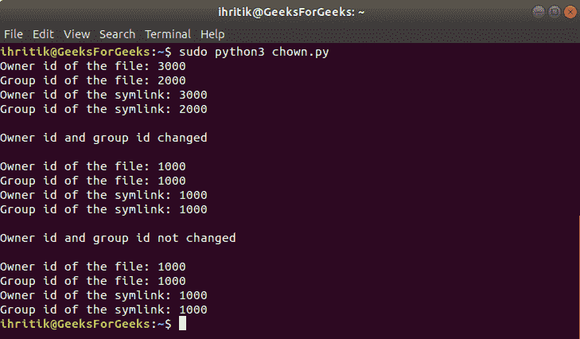

# Python | os.chown()方法

> 原文:[https://www.geeksforgeeks.org/python-os-chown-method/](https://www.geeksforgeeks.org/python-os-chown-method/)

**Python 中的 OS 模块**提供了与操作系统交互的功能。操作系统属于 Python 的标准实用程序模块。该模块提供了一种使用操作系统相关功能的可移植方式。

os 模块中的所有函数在文件名和路径无效或不可访问的情况下都会引发 **OSError** ，或者其他具有正确类型但不被操作系统接受的参数。

Python 中的`***os.chown()***`方法用于将指定路径的*所有者*和*组 id* 更改为指定的数字*所有者 id* (UID)和*组 id* (GID)。

**注意:** `***os.chown()***`方法仅在 UNIX 平台上可用，该方法的功能通常只对超级用户或特权用户可用。

> ***语法:*** os.chown(路径，uid，gid，* dir _ FD =无，follow_symlinks =真)
> 
> ***参数:***
> **路径**:表示要设置 uid 和 gid 的文件的文件描述符
> **uid** :表示要为路径设置的所有者 id 的整数值。
> **gid** :表示要为路径设置的组 id 的整数值。要保持任何一个 id 不变，请将其设置为-1。
> **dir_fd** (可选):引用目录的文件描述符。此参数的默认值为“无”。
> **follow _ symlink**(可选):该参数默认值为 True。如果我们不希望 os.chown()方法遵循 symlink，我们可以将其设置为 False。如果为 False，方法将对符号链接本身而不是链接指向的文件进行操作。
> 
> **注意:**参数列表中的“*”表示以下所有参数(在我们的例子中为“dir_fd”和“follow _ symlinks”)都是仅包含关键字的参数，并且可以使用它们的名称来提供，而不是作为位置参数。
> 
> ***返回类型:*** 此方法不返回值。

**Code #1:** Use of os.chown() method

```
# Python program to explain os.chown() method 

# importing os module 
import os

# File path
path = "./file.txt"

# Print the current owner id
# and group id of the
# specified file path

# os.stat() method will return a 
# 'stat_result’ object of
# ‘os.stat_result’ class whose
# 'st_uid' and 'st_gid' attributes
# will represent owner id and group id
# of the file respectively 
print("Owner id of the file:", os.stat(path).st_uid)
print("Group id of the file:", os.stat(path).st_gid) 

# Change the owner id and 
# the group id of the file
# using os.chown() method
uid = 2000
gid = 2000
os.chown(path, uid, gid)
print("\nOwner and group id of the file changed")

# Print the owner id
# and group id of the file
print("\nOwner id of the file:", os.stat(path).st_uid)
print("Group id of the file:", os.stat(path).st_gid) 
```

**输出:**


**Code #2:** Use of os.chown() method to set any one id and leave other unchanged

```
# Python program to explain os.chown() method 

# importing os module 
import os

# File
path = "./file.txt"

# Print the current owner id
# and group id of the file

# os.stat() method will return a 
# 'stat_result’ object of
# ‘os.stat_result’ class whose
# 'st_uid' and 'st_gid' attributes
# will represent owner id and group id
# of the file respectively 
print("Owner id of the file:", os.stat(path).st_uid)
print("Group id of the file:", os.stat(path).st_gid) 

# Change only owner id of 
# the file and leave
# group id unchanged

# set id as -1 to leave
# it unchanged
uid = 3000
gid = -1
os.chown(path, uid, gid)
print("\nOwner id of the file changed")

# Print the owner id
# and group id of the file
print("\nOwner id of the file:", os.stat(path).st_uid)
print("Group id of the file:", os.stat(path).st_gid) 
```

**输出:**


**Code #3:** If the specified path is a symlink

```
# Python program to explain os.chown() method 

# importing os module 
import os

# File path
path = "./file.txt"

# Creating a symlink
# of the above path  
# using os.symlink() method
symlink = "./file(symlink).txt"
os.symlink(path, symlink)

# Print the current owner id
# and group id of the file
# as well as the symlink pointing
# to the above specified file path 
print("Owner id of the file:", os.stat(path).st_uid)
print("Group id of the file:", os.stat(path).st_gid) 

print("Owner id of the symlink:", os.stat(symlink).st_uid)
print("Group id of the symlink:", os.stat(symlink).st_gid) 

# Change the ownership 
# of the symlink pointing 
# to the above file './file.txt'
uid = 1000
gid = 1000
os.chown(symlink, uid, gid)
print("\nOwner id and group id changed")

# Print the owner id
# and group id of the file
# as well as the symlink
print("\nOwner id of the file:", os.stat(path).st_uid)
print("Group id of the file:", os.stat(path).st_gid) 

print("Owner id of the symlink:", os.stat(symlink).st_uid)
print("Group id of the symlink:", os.stat(symlink).st_gid)

# As os.chown() method
# follows symlink
# so, we can change the
# owner and group id 
# through a symlink 

# We can modify the follow_symlinks
# parameter if we do not
# want os.chown() method to
# follow symlink

# Change the ownership 
# of the symlink pointing 
# to the above file './file.txt'
uid = 4000
gid = 4000
os.chown(symlink, uid, gid, follow_symlinks = False)
print("\nOwner id and group id not changed")

# Print the owner id
# and group id of the file
# as well as the symlink
# pointing to it
print("\nOwner id of the file:", os.stat(path).st_uid)
print("Group id of the file:", os.stat(path).st_gid) 

print("Owner id of the symlink:", os.stat(symlink).st_uid)
print("Group id of the symlink:", os.stat(symlink).st_gid)
```

**输出:**


**参考:**T2】https://docs.python.org/3/library/os.html