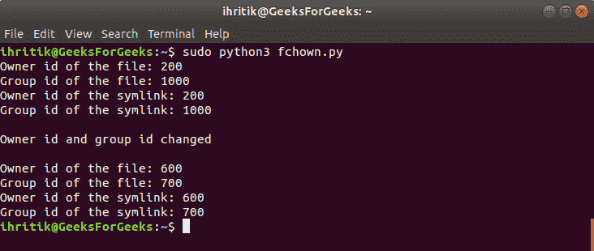

# Python | os.fchown()方法

> 原文:[https://www.geeksforgeeks.org/python-os-fchown-method/](https://www.geeksforgeeks.org/python-os-fchown-method/)

**Python 中的 OS 模块**提供了与操作系统交互的功能。操作系统属于 Python 的标准实用程序模块。该模块提供了一种使用操作系统相关功能的可移植方式。

os 模块中的所有函数在文件名和路径无效或不可访问的情况下都会引发 **OSError** ，或者其他具有正确类型但不被操作系统接受的参数。

Python 中的`***os.fchown()***`方法用于将与指定文件描述符关联的文件的*所有者*和*组 id* 更改为指定的数字*所有者 id* (UID)和*组 id* (GID)。这个方法相当于`***os.chown(fd, uid, gid)***`方法。

**注意:** `***os.fchown()***`方法仅在 UNIX 平台上可用，该方法的功能通常只对超级用户或特权用户可用。

> ***语法:*** os.fchown(fd，uid，gid)
> 
> ***参数:***
> **fd** :表示要设置 uid 和 gid 的文件的文件描述符
> **uid** :表示要为文件设置的所有者 id 的整数值。
> **gid** :代表要为文件设置的组 id 的整数值。要保持任何一个 id 不变，请将其设置为-1。
> 
> ***返回类型:*** 此方法不返回值。

**Code #1:** Use of os.fchown() method

```py
# Python program to explain os.fchown() method 

# importing os module 
import os

# File
filename = "file.txt"

# Open the file and get the 
# file descriptor associated
# with it using os.open() method
fd = os.open(filename, os.O_RDWR)

# Print the current owner id
# and group id of the file

# os.stat() method will return a 
# 'stat_result’ object of
# ‘os.stat_result’ class whose
# 'st_uid' and 'st_gid' attributes
# will represent owner id and group id
# of the file respectively 
print("Owner id of the file:", os.stat(fd).st_uid)
print("Group id of the file:", os.stat(fd).st_gid) 

# Change the owner id and 
# the group id of the file
# associated with the file descriptor
# using os.fchown() method
uid = 200
gid = 300
os.fchown(fd, uid, gid)
print("\nOwner and group id of the file changed")

# Print the owner id
# and group id of the file
print("\nOwner id of the file:", os.stat(fd).st_uid)
print("Group id of the file:", os.stat(fd).st_gid) 
```

**输出:**


**Code #2:** Use of os.fchown() method to set any one id and leave other unchanged

```py
# Python program to explain os.fchown() method 

# importing os module 
import os

# File
filename = "file.txt"

# Open the file and get the 
# file descriptor associated
# with it using os.open() method
fd = os.open(filename, os.O_RDWR)

# Print the current owner id
# and group id of the file

# os.stat() method will return a 
# 'stat_result’ object of
# ‘os.stat_result’ class whose
# 'st_uid' and 'st_gid' attributes
# will represent owner id and group id
# of the file respectively 
print("Owner id of the file:", os.stat(fd).st_uid)
print("Group id of the file:", os.stat(fd).st_gid) 

# Change only group id of 
# the file and leave owner id
# unchanged

# set id as -1 to leave
# it unchanged
uid = -1
gid = 1000
os.fchown(fd, uid, gid)
print("\ngroup id of the file changed")

# Print the owner id
# and group id of the file
print("\nOwner id of the file:", os.stat(fd).st_uid)
print("Group id of the file:", os.stat(fd).st_gid) 
```

**输出:**


**Code #3:** If the specified path is a symlink

```py
# Python program to explain os.fchown() method 

# importing os module 
import os

# File path
path = "./file.txt"

# Creating a symlink
# of the above path  
# using os.symlink() method
symlink = "./file(symlink).txt"
os.symlink(path, symlink)

# Open the symlink
# and get the file descriptor
# associated with it using
# os.open() method
fd = os.open(symlink, os.O_RDWR)

# Print the current owner id
# and group id of the file
# as well as the symlink pointing
# to the above specified file path 
print("Owner id of the file:", os.stat(path).st_uid)
print("Group id of the file:", os.stat(path).st_gid) 

print("Owner id of the symlink:", os.stat(symlink).st_uid)
print("Group id of the symlink:", os.stat(symlink).st_gid) 

# Change the ownership 
# of the symlink pointing 
# to the above file './file.txt'
uid = 600
gid = 700
os.fchown(fd, uid, gid)
print("\nOwner id and group id changed")

# Print the owner id
# and group id of the file
# as well as the symlink
print("\nOwner id of the file:", os.stat(path).st_uid)
print("Group id of the file:", os.stat(path).st_gid) 

print("Owner id of the symlink:", os.stat(symlink).st_uid)
print("Group id of the symlink:", os.stat(symlink).st_gid)

# As os.fchown() method
# follows symlink
# so, we can change the
# owner and group id 
# through a symlink 
```

**输出:**


**参考:**T2】https://docs.python.org/3/library/os.html