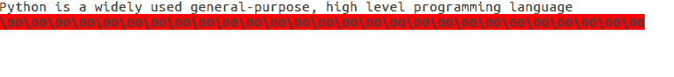

# Python | os.ftruncate()方法

> 原文:[https://www.geeksforgeeks.org/python-os-ftruncate-method-2/](https://www.geeksforgeeks.org/python-os-ftruncate-method-2/)

**Python 中的 OS 模块**提供了与操作系统交互的功能。操作系统属于 Python 的标准实用程序模块。该模块提供了一种使用操作系统相关功能的可移植方式。

Python 中的`***os.ftruncate()***`方法用于将指定文件描述符对应的文件截断到指定长度。

这个方法相当于`***os.truncate(fd, length)***`方法。

> ***语法:*** os.ftruncate(fd，length)
> 
> ***参数:***
> **fd** :表示待截断文件的文件描述符。
> **长度**:表示文件被截断长度(字节)的整数值。
> 
> ***返回类型:*** 此方法不返回值。

将以下文本视为名为 *Python_intro.txt* 的文件内容。

> Python 是一种广泛使用的通用高级编程语言。它最初由吉多·范·罗苏姆在 1991 年设计，由 Python 软件基金会开发。它主要是为了强调代码的可读性而开发的，它的语法允许程序员用更少的代码行来表达概念。Python 是一种编程语言，可以让您快速工作并更高效地集成系统。

**Code #1:** Use of os.ftruncate() method

```py
# Python program to explain os.ftruncate() method 

# importing os module 
import os

# Open the file and get 
# the file descriptor associated 
# with it using os.open() method
fd = os.open("Python_intro.txt", os.O_RDWR) 

# Print the original size of the file (in bytes)
print("File size (in bytes):", os.stat(fd).st_size)

# Length (in Bytes) to which 
# the file will be truncated
length = 72

# Truncate the file 
# to at most given length
# using os.ftruncate() method
os.ftruncate(fd, length)

# Print the content of file
size = os.stat(fd).st_size
print(os.read(fd, size).decode("utf-8"))

# Print the size of file (in bytes)
print("File size (in bytes):", os.stat(fd).st_size)
```

**Output:**

```py
File size (in bytes): 409
Content of file Python_intro.txt:
Python is a widely used general-purpose, high level programming language
File size (in bytes): 72

```

将以下文本视为名为 *Python_intro.txt* 的文件的新内容。

> Python 是一种广泛使用的通用高级编程语言

**Code #2:** If the specified length exceeds the file size

```py
# Python program to explain os.ftruncate() method 

# importing os module 
import os

# Open the file and get 
# the file descriptor associated 
# with it using os.open() method
fd = os.open("Python_intro.txt", os.O_RDWR) 

# Print the original size of the file (in bytes)
print("File size (in bytes):", os.stat(fd).st_size)

# Length (in Bytes) to which 
# the file will be truncated
length = 100

# Truncate the file 
# to at most given length
# using os.ftruncate() method
os.ftruncate(fd, length)

# Print the content of file
size = os.stat(fd).st_size
print(os.read(fd, size).decode("utf-8"))

# Print the size of file (in bytes)
print("File size (in bytes):", os.stat(fd).st_size)
```

**Output:**

```py
File size (in bytes): 72
Content of file Python_intro.txt:
Python is a widely used general-purpose, high level programming language

File size (in bytes): 100

```

将文件大小从 72 字节截断到 100 字节后的实际文件内容:

文件内容直到其原始大小都没有改变，但是为了将文件大小增加到指定大小，它填充了一些无效字符。

**Code #3:** Deleting a file content using os.ftruncate() method

```py
# Python program to explain os.ftruncate() method 

# importing os module 
import os

# Open the file and get 
# the file descriptor associated 
# with it using os.open() method
fd = os.open("Python_intro.txt", os.O_RDWR) 

# Print the original size of file (in bytes)
print("File size (in bytes):", os.stat(fd).st_size)

# specify the length as 0
# to delete the file content
length = 0

# Truncate the file 
# to length 0
# using os.ftruncate() method
os.ftruncate(fd, length)

# Print the content of file
size = os.stat(fd).st_size
print(os.read(fd, size).decode("utf-8"))

# Print the size of file (in bytes)
print("File size (in bytes):", os.stat(fd).st_size)
```

**Output:**

```py
File size (in bytes): 100
Content of file Python_intro.txt:
File size (in bytes): 0

```