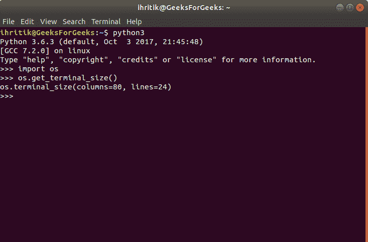

# Python | os.get_terminal_size()方法

> 原文:[https://www . geesforgeks . org/python-OS-get _ terminal _ size-method/](https://www.geeksforgeeks.org/python-os-get_terminal_size-method/)

**Python 中的 OS 模块**提供了与操作系统交互的功能。操作系统属于 Python 的标准实用程序模块。该模块提供了一种使用操作系统相关功能的可移植方式。

Python 中的`***os.get_terminal_size()***`方法用于查询终端的大小。该方法将终端的大小返回为一对*列*和*行*。这里，*列*用字符表示终端窗口的宽度，*行*用字符表示终端窗口的高度。

> ***语法:***OS . get _ terminal _ size(FD = STDOUT _ FILENO)
> 
> ***参数:***
> **fd** (可选):一个文件描述符。它指定应该查询哪个文件描述符。fd 参数的默认值是 STDOUT_FILENO 或标准输出。
> 
> ***返回类型:*** 这个方法返回一个“os.terminal_size”类的对象，它保存列和行属性。

**代码:**使用 os.get_terminal_size()方法

```py
# Python program to explain os.get_terminal_size() method 

# importing os module 
import os

# Get the size
# of the terminal
size = os.get_terminal_size()

# Print the size
# of the terminal
print(size)
```

**Output:**

```py
os.terminal_size(columns=80, lines=24)

```

