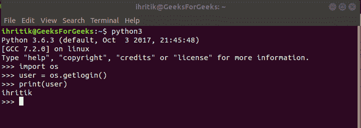

# Python | os.getlogin()方法

> 原文:[https://www.geeksforgeeks.org/python-os-getlogin-method/](https://www.geeksforgeeks.org/python-os-getlogin-method/)

**Python 中的 OS 模块**提供了与操作系统交互的功能。操作系统属于 Python 的标准实用程序模块。该模块提供了一种使用操作系统相关功能的可移植方式。

`***os.getlogin()***`Python 中的方法用于获取登录到进程控制终端的用户名称。

> ***语法*** os.getlogin()
> 
> ***参数:*** 不需要
> 
> ***返回类型:*** 该方法返回一个字符串，该字符串表示登录到进程控制终端的用户的名称。

**代码#1:** 使用 os.getlogin()方法

```
# Python program to explain os.getlogin() method 

# importing os module 
import os

# Get the name of the user
# logged in on the controlling 
# terminal of the process.
user = os.getlogin()

# Print the name of the user
# logged in on the controlling 
# terminal of the process.
print(user) 
```

**Output:**

```
ihritik

```

