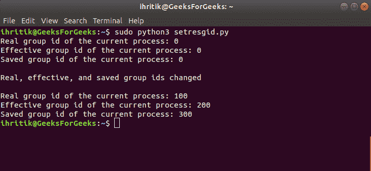

# Python | os.getresgid()和 os.setresgid()方法

> 原文:[https://www . geesforgeks . org/python-OS-getresgid-and-OS-setresgid-method/](https://www.geeksforgeeks.org/python-os-getresgid-and-os-setresgid-method/)

**Python 中的 OS 模块**提供了与操作系统交互的功能。操作系统属于 Python 的标准实用程序模块。该模块提供了一种使用操作系统相关功能的可移植方式。

os 模块中的所有函数在文件名和路径无效或不可访问的情况下都会引发 **OSError** ，或者其他具有正确类型但不被操作系统接受的参数。

Python 中的`***os.getresgid()***`方法用于获取当前流程的真实、有效和已保存的组 id，`***os.setresgid()***`方法用于设置当前流程的真实、有效和已保存的组 id。

或者，我们也可以分别使用`***os.getgid()***`和`***os.getegid()***`方法获取当前流程的真实有效组 id，也可以分别使用`***os.setgid()***`和`***os.setegid()***`方法设置当前流程的真实有效组 id。

**注意:**`***os.setresgid()***``***os.getresgid()***`方法只在 UNIX 平台上可用，`***os.setresgid()***`方法的功能通常只对超级用户可用，因为只有超级用户才能更改进程的组标识。超级用户是指拥有运行或执行操作系统中任何程序的所有权限的根用户或管理用户。

## os.getresgid()方法–

> ***语法:***OS . getrsgid()
> 
> ***参数:*** 不需要参数
> 
> ***返回类型:*** 该方法返回一个元组，该元组的属性表示当前流程的真实、有效、已保存的组标识。

**Code #1:** Use of os.getresgid() method

```py
# Python program to explain os.getresgid() method 

# importing os module 
import os

# Get the current process’s 
# real, effective, and saved group ids.
# using os.getresgid() method
rgid, egid, sgid = os.getresgid()

# Print the current process’s
# real, effective, and saved group ids.
print("Real group id of the current process:", rgid)
print("Effective group id of the current process:", egid)
print("Saved group id of the current process:", sgid)
```

**输出:**


## os.setresgid()方法–

> ***语法:***OS . setresided(RGD，egid，sgid)
> 
> ***参数:***
> **rgid** :代表当前流程新组 id 的整数值。
> **egid** :代表当前流程新的有效组 id 的整数值。
> **sgid** :代表当前流程新保存的组 id 的整数值。
> 
> ***返回类型:*** 此方法不返回值。

**Code #2:** Use of os.setresgid() method

```py
# Python program to explain os.setresgid() method 

# importing os module 
import os

# Get the current process’s 
# real, effective, and saved group ids
# using os.getresgid() method
rgid, egid, sgid = os.getresgid()

# Print the current process’s
# real, effective, and saved group ids
print("Real group id of the current process:", rgid)
print("Effective group id of the current process:", egid)
print("Saved group id of the current process:", sgid)

# Change the current process’s
# real, effective, and saved group ids
# using os.setresgid() method
rgid = 100
egid = 200
sgid = 300
os.setresgid(rgid, egid, sgid)
print("\nReal, effective, and saved group ids changed\n")

# Get the current process’s 
# real, effective, and saved group ids
# using os.getresgid() method
rgid, egid, sgid = os.getresgid()

# Print the current process’s
# real, effective, and saved group ids
print("Real group id of the current process:", rgid)
print("Effective group id of the current process:", egid)
print("Saved group id of the current process:", sgid)
```

**输出:**
