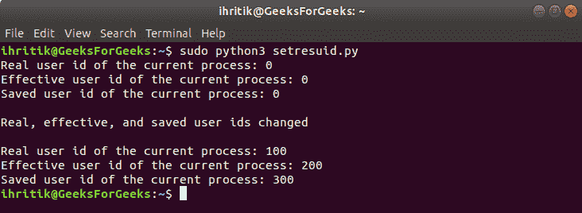

# python | OS . getrended()和 os.setresuid()方法

> 原文:[https://www . geesforgeks . org/python-OS-getresuid-and-OS-setresuid-method/](https://www.geeksforgeeks.org/python-os-getresuid-and-os-setresuid-method/)

**Python 中的 OS 模块**提供了与操作系统交互的功能。操作系统属于 Python 的标准实用程序模块。该模块提供了一种使用操作系统相关功能的可移植方式。

os 模块中的所有函数在文件名和路径无效或不可访问的情况下都会引发 **OSError** ，或者其他具有正确类型但不被操作系统接受的参数。

Python 中的`***os.getresuid()***`方法用于获取当前流程的真实、有效和已保存的用户 id，`***os.setresuid()***`方法用于设置当前流程的真实、有效和已保存的用户 id。

像操作系统一样，Unix 中的每个用户都由不同的整数标识，这个唯一的数字被称为 UserID。为进程定义了三种类型的用户标识，可以根据任务的权限动态更改。

> **真实用户标识**:是该流程所有者的账号。它定义了该进程可以访问哪些文件。
> 
> **有效用户标识**:正常情况下与真实用户标识相同，但有时会更改为允许非特权用户访问只能由 root 访问的文件。
> 
> **保存的 UserID** :用于特权提升的进程(一般是 root)运行需要做一些特权不足的工作时，这可以通过临时切换到非特权账户来实现。
> 在执行低特权工作时，将有效 UID 更改为某个较低的特权值，并将 e UID 保存为已保存的 userID(suid)，以便在任务完成时切换回特权帐户。

**注意:** `***os.setresuid()***`和`***os.getresuid()***`方法仅在 UNIX 平台上可用，`***os.setresuid()***`方法的功能通常只对超级用户可用，因为只有超级用户才能更改进程的标识。
超级用户是指拥有运行或执行操作系统中任何程序的所有权限的根用户或管理用户。

## os.getresuid（） method –

> ***语法:***OS . getrended()
> 
> ***参数:*** 不需要参数
> 
> ***返回类型:*** 该方法返回一个元组，该元组的属性表示当前流程的真实、有效和已保存的用户 id。

**Code #1:** Use of os.getresuid() method

```
# Python program to explain os.getresuid() method 

# importing os module 
import os

# Get the current process’s 
# real, effective, and saved user ids.
# using os.getresuid() method
ruid, euid, suid = os.getresuid()

# Print the current process’s
# real, effective, and saved user ids.
print("Real user id of the current process:", ruid)
print("Effective user id of the current process:", euid)
print("Saved user id of the current process:", suid)
```

**输出:**


## os.setresuid()方法–

> ***语法:*** os.setresuid(噪声，euid，suid)
> 
> ***参数:***
> **ruid** :代表当前流程新用户 id 的整数值。
> **euid** :代表当前流程新的有效用户 id 的整数值。
> **suid** :代表当前进程新保存的用户 id 的整数值。
> 
> ***返回类型:*** 此方法不返回值。

**Code #2:** Use of os.setresuid() method

```
# Python program to explain os.setresuid() method 

# importing os module 
import os

# Get the current process’s 
# real, effective, and saved user ids.
# using os.getresuid() method
ruid, euid, suid = os.getresuid()

# Print the current process’s
# real, effective, and saved user ids.
print("Real user id of the current process:", ruid)
print("Effective user id of the current process:", euid)
print("Saved user id of the current process:", suid)

# Change the current process’s
# real, effective, and saved user ids
# using os.setresuid() method
ruid = 100
euid = 200
suid = 300
os.setresuid(ruid, euid, suid)
print("\nReal, effective, and saved user ids changed\n")

# Get the current process’s 
# real, effective, and saved user ids.
# using os.getresuid() method
ruid, euid, suid = os.getresuid()

# Print the current process’s
# real, effective, and saved user ids.
print("Real user id of the current process:", ruid)
print("Effective user id of the current process:", euid)
print("Saved user id of the current process:", suid)
```

**输出:**
