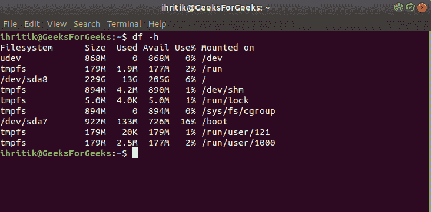

# Python | os.path.ismount()方法

> 原文:[https://www . geesforgeks . org/python-OS-path-is mount-method/](https://www.geeksforgeeks.org/python-os-path-ismount-method/)

**Python 中的 OS 模块**提供了与操作系统交互的功能。操作系统属于 Python 的标准实用程序模块。该模块提供了一种使用操作系统相关功能的可移植方式。 **os.path** 模块是 Python 中 **OS 模块**的子模块，用于公共路径名操作。

Python 中的`***os.path.ismount()***`方法用于检查给定路径是否是挂载点。
一个*挂载点*是文件系统中已经挂载了不同文件系统的一个点。

> ***语法:*** os.path.ismount(路径)
> 
> ***参数:***
> **路径**:表示文件系统路径的类路径对象。类似路径的对象是代表路径的*字符串*或*字节*对象。
> 
> ***返回类型:*** 这个方法返回一个类*布尔*的布尔值。如果给定路径是挂载点，该方法返回*真*，否则返回*假*。

在 Linux 系统上，可以使用 **df** 命令显示分区及其挂载点信息。

例如:


**代码#1:** 使用 os.path.ismount()方法检查给定路径是否是挂载点(在 Unix 上)

```
# Python program to explain os.path.islink() method 

# importing os.path module 
import os.path

# Path 
path = "/run" 

# Check whether the 
# given path is a
# mount point or not
ismount = os.path.ismount(path)

# Path 
path = "/dev" 

# Check whether the 
# given path is a
# mount point or not
ismount = os.path.ismount(path)
print(ismount)
```

**Output:**

```
True
True

```

**代码#2:** 使用 os.path.ismount()方法检查给定路径是否是挂载点(在 Windows 上)

```
# Python program to explain os.path.islink() method 

# importing os.path module 
import os.path

# On Windows, a drive letter root
# and a share UNC are always
# mount points Path 
path = "C:" 

# Check whether the 
# given path is a
# mount point or not
ismount = os.path.ismount(path)
print(ismount)
```

**Output:**

```
True

```

**参考:**T2】https://docs.python.org/3/library/os.path.html