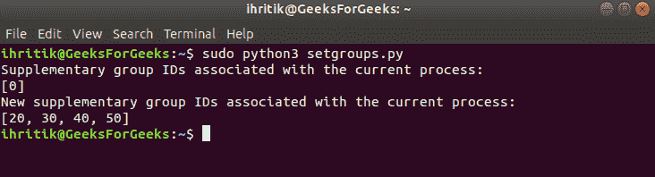

# Python | os.setgroups()方法

> 原文:[https://www.geeksforgeeks.org/python-os-setgroups-method/](https://www.geeksforgeeks.org/python-os-setgroups-method/)

**Python 中的 OS 模块**提供了与操作系统交互的功能。操作系统属于 Python 的标准实用程序模块。该模块提供了一种使用操作系统相关功能的可移植方式。

os 模块中的所有函数在文件名和路径无效或不可访问的情况下都会引发 **OSError** ，或者其他具有正确类型但不被操作系统接受的参数。

Python 中的`***os.setgroups()***`方法用于将当前进程关联的补充组 id 列表设置为指定列表。

**补充组 id**:在 Unix 系统中，每个用户必须是至少一个称为主组的组的成员。用户也有可能在组数据库的相关条目中被列为其他组的成员。这些附加组的标识称为补充组标识

**注意:** `***os.setgroups()***`方法仅在 UNIX 系统上可用，该方法的功能通常只对超级用户可用。
超级用户是指拥有运行或执行操作系统中任何程序的所有权限的根用户或管理用户。

> ***语法:***OS . setgroups(group)
> 
> ***参数:***
> **组**:需要设置的补充组标识列表。列表的每个元素必须是代表一个组的整数。
> 
> ***返回类型:*** 此方法不返回值。

**Code:** Use of os.setgroups() method

```
# Python program to explain os.setgroups() method 

# importing os module 
import os

# Get the list of supplemental
# group IDs associated with
# the current process 
# using os.getgroups() method
sgid = os.getgroups()

# Print the list
print("Supplemental group IDs associated with the current process:")
print(sgid)

new_sgid = [ 20, 30, 40, 50]

# Set the list of supplemental 
# group IDs for the current process
# using os.setgroups() method 
os.setgroups(new_sgid) 

# Get the list of supplemental
# group IDs associated with
# the current process
sgid = os.getgroups()

# Print the list
print("New supplemental group IDs associated with the current process:")
print(sgid)
```

**Output:**

```
Supplemental group IDs associated with the current process:
[0]
New supplemental group IDs associated with the current process:
[20, 30, 40, 50]

```

