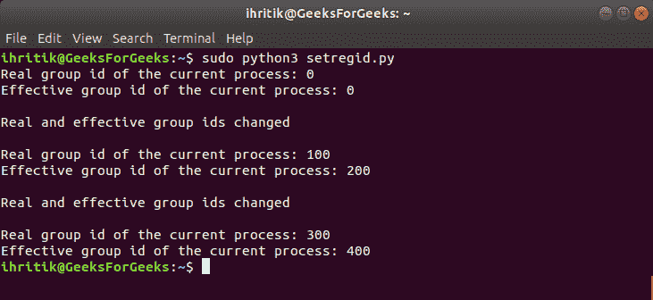

# Python | os.setregid()方法

> 原文:[https://www.geeksforgeeks.org/python-os-setregid-method/](https://www.geeksforgeeks.org/python-os-setregid-method/)

**Python 中的 OS 模块**提供了与操作系统交互的功能。操作系统属于 Python 的标准实用程序模块。该模块提供了一种使用操作系统相关功能的可移植方式。

os 模块中的所有函数在文件名和路径无效或不可访问的情况下都会引发 **OSError** ，或者其他具有正确类型但不被操作系统接受的参数。

`***os.setregid()***`Python 中的方法用于设置当前进程真实有效的组 id。但是，我们可以分别使用`***os.setgid()***`和`***os.setegid()***`方法单独设置当前流程的真实有效组标识。

**注意:** `***os.setregid()***`方法只在 UNIX 平台上可用，该方法的功能通常只对超级用户可用。超级用户是指拥有运行或执行操作系统中任何程序的所有权限的根用户或管理用户。

> ***语法:***OS . setregid(RGD，egid)
> 
> ***参数:***
> **rgid** :代表当前流程新组 id 的整数值。
> **egid** :代表当前流程新的有效组 id 的整数值。
> 
> ***返回类型:*** 此方法不返回值。

**Code:** Use of os.setregid() method

```py
# Python program to explain os.setregid() method 

# importing os module 
import os

# Get the current process’s 
# real group id
# using os.getgid() method
rgid = os.getgid()

# Get the current process’s 
# effective group id.
# using os.getegid() method
egid = os.getegid()

# Print the current process’s
# real and effective group ids.
print("Real group id of the current process:", rgid)
print("Effective group id of the current process:", egid)

# Change the current process’s
# real and effective group ids
# using os.setregid() method
rgid = 100
egid = 200
os.setregid(rgid, egid)
print("\nReal and effective group ids changed\n")

# Get the current process’s 
# real and effective group ids
rgid = os.getgid()
egid = os.getegid()

# Print the current process’s
# real and effective group ids.
print("Real group id of the current process:", rgid)
print("Effective group id of the current process:", egid)

# We can also use os.setgid() and
# os.setegid() method to set the
# current process’s real and
# effective group ids respectively

# Change the current process’s
# real group id
# using os.setgid() method
rgid = 300
os.setgid(rgid)

# Change the current process’s
# effective group id
# using os.setegid() method
egid = 400
os.setegid(egid)

print("\nReal and effective group ids changed\n")

# Print the current process’s
# real and effective group ids.
print("Real group id of the current process:", rgid)
print("Effective group id of the current process:", egid)
```

**输出:**
