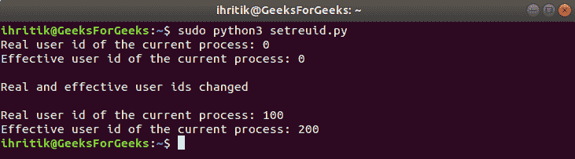

# Python | os.setreuid()方法

> 原文:[https://www.geeksforgeeks.org/python-os-setreuid-method/](https://www.geeksforgeeks.org/python-os-setreuid-method/)

**Python 中的 OS 模块**提供了与操作系统交互的功能。操作系统属于 Python 的标准实用程序模块。该模块提供了一种使用操作系统相关功能的可移植方式。

os 模块中的所有函数在文件名和路径无效或不可访问的情况下都会引发 **OSError** ，或者其他具有正确类型但不被操作系统接受的参数。

`***os.setreuid()***`Python 中的方法用于设置当前进程真实有效的用户 id。

像操作系统一样，Unix 中的每个用户都由不同的整数标识，这个唯一的数字被称为 UserID。**真实用户标识**代表流程所有者的账户。它定义了该进程可以访问哪些文件。**有效用户标识**通常与真实用户标识相同，但有时会更改为允许非特权用户访问只能由 root 访问的文件。

**注意:** `***os.setreuid()***`方法只在 UNIX 平台上可用，该方法的功能通常只对超级用户可用。
超级用户是指拥有运行或执行操作系统中任何程序的所有权限的根用户或管理用户。

> ***语法:*** os.setreuid(噪音，美国)
> 
> ***参数:***
> **ruid** :代表当前流程新用户 id 的整数值。
> **euid** :代表当前流程新的有效用户 id 的整数值。
> 
> ***返回类型:*** 此方法不返回值。

**Code:** Use of os.setreuid() method

```
# Python program to explain os.setreuid() method 

# importing os module 
import os

# Get the current process’s 
# real user id
# using os.getuid() method
ruid = os.getuid()

# Get the current process’s 
# effective user id.
# using os.geteuid() method
euid = os.geteuid()

# Print the current process’s
# real and effective user id.
print("Real user id of the current process:", ruid)
print("Effective user id of the current process:", euid)

# Change the current process’s
# real and effective user ids
# using os.setreuid() method
ruid = 100
euid = 200
os.setreuid(ruid, euid)
print("\nReal and effective user ids changed\n")

# Get the current process’s 
# real and effective user ids
ruid = os.getuid()
euid = os.geteuid()

# Print the current process’s
# real and effective user id.
print("Real user id of the current process:", ruid)
print("Effective user id of the current process:", euid)
```

**Output:**

```
Real user id of the current process: 0
Effective user id of the current process: 0

Real and effective user ids changed

Real user id of the current process: 100
Effective user id of the current process: 200

```

