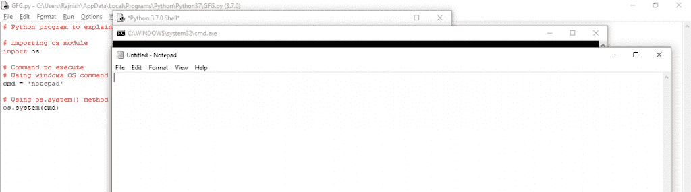

# Python | os.system()方法

> 原文:[https://www.geeksforgeeks.org/python-os-system-method/](https://www.geeksforgeeks.org/python-os-system-method/)

python 中的操作系统模块提供了与操作系统交互的功能。操作系统，属于 Python 的标准实用程序模块。该模块提供了一种使用操作系统相关功能的可移植方式。

`os.system()`方法在子外壳中执行命令(字符串)。这个方法是通过调用**标准 C 函数系统()**实现的，有同样的局限性。如果命令生成任何输出，它将被发送到解释器标准输出流。每当使用此方法时，操作系统的相应外壳就会打开，并在其上执行命令。

> **语法:** os.system(命令)
> 
> **参数:**
> **命令:**是字符串类型，告诉执行哪个命令。
> 
> **返回值:**在 Unix 上，返回值是进程的退出状态，在 Windows 上，返回值是系统 shell 运行命令后返回的值。

**示例#1 :**
使用`os.system()`方法获取计算机的当前日期

```
# Python program to explain os.system() method 

# importing os module 
import os 

# Command to execute
# Using Windows OS command
cmd = 'date'

# Using os.system() method
os.system(cmd)
```

**Output:**

**例 2 :**
使用`os.system()`方法运行**记事本**。

```
# Python program to explain os.system() method 

# importing os module 
import os 

# Command to execute
# Using Windows OS command
cmd = 'notepad'

# Using os.system() method
os.system(cmd)
```

**Output:**