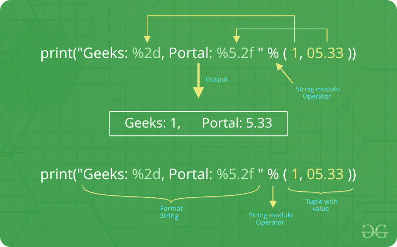
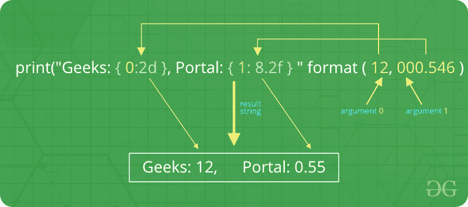

# Python |输出格式

> 原文:[https://www.geeksforgeeks.org/python-output-formatting/](https://www.geeksforgeeks.org/python-output-formatting/)

有几种方法可以显示程序的输出，数据可以以人类可读的形式打印出来，或者写入文件以备将来使用，或者甚至以某种其他指定的形式。有时，用户通常希望对输出的格式有更多的控制，而不是简单地打印以空格分隔的值。有几种格式化输出的方法。

*   要使用[格式的字符串文字](https://www.geeksforgeeks.org/formatted-string-literals-f-strings-python/)，请在左引号或三引号前以 F 开头的字符串。
*   [弦。](https://www.geeksforgeeks.org/python-format-function/) [format()](https://www.geeksforgeeks.org/python-format-function/) 字符串方法帮助用户获得更好的输出
*   用户可以通过使用字符串切片和串联操作来创建用户想要的任何布局，从而完成所有的字符串处理。字符串类型有一些方法可以执行有用的操作，将字符串填充到给定的列宽。

**使用字符串模运算符(%) :**
格式化输出%运算符也可用于字符串格式化。它解释左边的参数很像 C 语言字符串中的 printf()-样式格式，应用于右边的参数。在 Python 中，没有 printf()函数，但是古代 printf 的功能包含在 Python 中。为此，字符串类重载了模运算符%来执行字符串格式化。因此，它通常被称为字符串模(有时甚至被称为模)运算符。

字符串模运算符(%)在 Python(3.x)中仍然可用，用户正在广泛使用它。但是现在旧的格式已经从语言中消失了。

## 蟒蛇 3

```
# Python program showing how to use
# string modulo operator(%) to print
# fancier output

# print integer and float value
print("Geeks : %2d, Portal : %5.2f" % (1, 05.333))

# print integer value
print("Total students : %3d, Boys : %2d" % (240, 120))

# print octal value
print("%7.3o" % (25))

# print exponential value
print("%10.3E" % (356.08977))
```

**输出:**

```
Geeks :  1, Portal : 5.33
Total students : 240, Boys : 120
031
3.561E+02
```



在我们的示例中有两个:“%2d”和“%5.2f”。格式占位符的一般语法是:

```
 %[flags][width][.precision]type 
```

让我们看一下示例中的占位符。

*   第一个占位符“%2d”用于元组的第一个组成部分，即整数 1。该号码将打印 2 个字符。由于 1 仅由一个数字组成，输出中会填充 1 个前导空格。
*   第二个“%5.2f”是浮点数的格式描述。像其他占位符一样，它以%字符引入。接下来是字符串应该包含的总位数。该数字包括小数点和所有数字，即小数点前后的数字。
*   我们的浮点数 05.333 必须用 5 个字符格式化。数字的小数部分或精度设置为 2，即“.”后面的数字在我们的占位符中。最后，占位符的最后一个字符“f”代表“float”。

**使用格式化方法格式化输出:**
在 Python(2.6)中添加了 format()方法。字符串的格式化方法需要更多的手动操作。用户使用{}来标记变量将被替换的位置，并且可以提供详细的格式化指令，但是用户还需要提供要格式化的信息。这个方法允许我们通过位置格式化来连接输出中的元素。例如–

**代码 1:**

## 蟒蛇 3

```
# Python program showing
# use of format() method

# using format() method
print('I love {} for "{}!"'.format('Geeks', 'Geeks'))

# using format() method and referring
# a position of the object
print('{0} and {1}'.format('Geeks', 'Portal'))

print('{1} and {0}'.format('Geeks', 'Portal'))

# the above formatting can also be done by using f-Strings
# Although, this features work only with python 3.6 or above.

print(f"I love {'Geeks'} for \"{'Geeks'}!\"")

# using format() method and referring
# a position of the object
print(f"{'Geeks'} and {'Portal'}")
```

**输出:**

```
I love Geeks for "Geeks!"
Geeks and Portal
Portal and Geeks
```

其中的括号和字符(称为**格式字段**)被传递到 format()方法中的对象替换。括号中的数字可用于表示传递给 format()方法的对象的位置。

**代码 2:**

## 蟒蛇 3

```
# Python program showing
# a use of format() method

# combining positional and keyword arguments
print('Number one portal is {0}, {1}, and {other}.'
     .format('Geeks', 'For', other ='Geeks'))

# using format() method with number
print("Geeks :{0:2d}, Portal :{1:8.2f}".
      format(12, 00.546))

# Changing positional argument
print("Second argument: {1:3d}, first one: {0:7.2f}".
      format(47.42, 11))

print("Geeks: {a:5d},  Portal: {p:8.2f}".
     format(a = 453, p = 59.058))
```

**输出:**

```
Number one portal is Geeks, For, and Geeks.
Geeks :12, Portal :    0.55
Second argument:  11, first one:   47.42
Geeks:   453, Portal:    59.06
```

下图用一个用法示例描述了 format 方法如何对位置参数起作用:



**代码 3:**

## 蟒蛇 3

```
# Python program to
# show format () is
# used in dictionary

tab = {'geeks': 4127, 'for': 4098, 'geek': 8637678}

# using format() in dictionary
print('Geeks: {0[geeks]:d}; For: {0[for]:d}; '
    'Geeks: {0[geek]:d}'.format(tab))

data = dict(fun ="GeeksForGeeks", adj ="Portal")

# using format() in dictionary
print("I love {fun} computer {adj}".format(**data))
```

**输出:**

```
Geeks: 4127; For: 4098; Geeks: 8637678
I love GeeksForGeeks computer Portal
```

**使用字符串方法格式化输出:**
该输出通过使用字符串切片和串联操作进行格式化。字符串类型有一些有助于以更好的方式格式化输出的方法。有助于格式化输出一些方法是[字符串。](https://www.geeksforgeeks.org/python-string-ljust-rjust-center/) rjust [()](https://www.geeksforgeeks.org/python-string-ljust-rjust-center/) 、 [str.rjust()](https://www.geeksforgeeks.org/python-string-ljust-rjust-center/) 、 [str.centre()](https://www.geeksforgeeks.org/python-string-ljust-rjust-center/)

## 蟒蛇 3

```
# Python program to
# format a output using
# string() method

cstr = "I love geeksforgeeks"

# Printing the center aligned 
# string with fillchr
print ("Center aligned string with fillchr: ")
print (cstr.center(40, '#'))

# Printing the left aligned 
# string with "-" padding 
print ("The left aligned string is : ")
print (cstr.ljust(40, '-'))

# Printing the right aligned string
# with "-" padding 
print ("The right aligned string is : ")
print (cstr.rjust(40, '-'))
```

**输出:**

```
Center aligned string with fillchr: 
##########I love geeksforgeeks##########

The left aligned string is : 
I love geeksforgeeks--------------------

The right aligned string is : 
--------------------I love geeksforgeeks
```