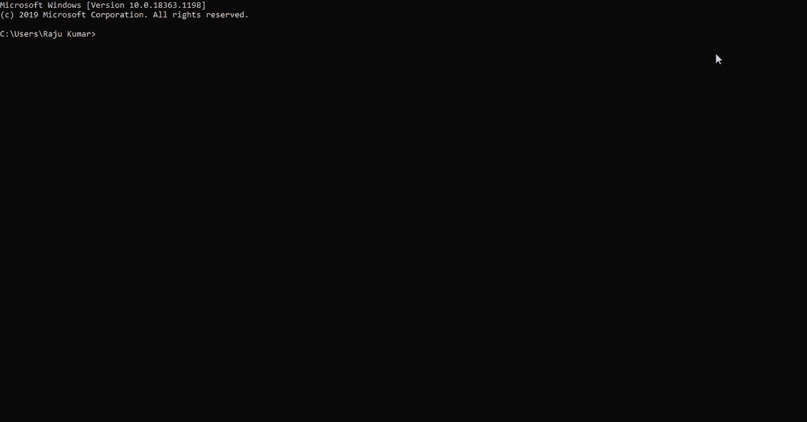

# Python |使用 print()函数输出

> 原文:[https://www . geesforgeks . org/python-output-use-print-function/](https://www.geeksforgeeks.org/python-output-using-print-function/)

**Python print()功能**将消息打印到屏幕或任何其他标准输出设备。

> **语法:**打印(值，sep= ' '，end = '\n '，file=file，flush=flush)
> 
> **参数:**
> 
> *   **值:**任意值，任意多。将在打印前转换为字符串
> *   **sep=“分隔符”:**(可选)如果有多个对象，请指定如何分隔对象。默认值:“”
> *   **end='end':** (可选)指定在末尾打印什么。默认值:“\n”
> *   **文件:**(可选)具有写方法的对象。默认值:sys.stdout
> *   **刷新:**(可选)布尔值，指定输出是刷新(真)还是缓冲(假)。默认值:假
> 
> **返回:**将输出返回屏幕。

虽然不必在 print()函数中传递参数，但它需要在末尾有一个空括号，告诉 python 执行该函数，而不是通过名称调用它。现在，让我们探索一下可以与 print()函数一起使用的可选参数。

## 字符串文字

python print 语句中的字符串文字主要用于格式化或设计使用 print()函数打印时特定字符串的显示方式。

*   **\n :** 该字符串用于在打印语句时添加新的空行。
*   **"" :** 空引号("")用于打印空行。

**示例:**

## 蟒蛇 3

```py
print("GeeksforGeeks \n is best for DSA Content.")
```

**输出:**

```py
GeeksforGeeks 
 is best for DSA Content.
```

## end= "语句"

end 关键字用于指定在 print()函数执行结束时要打印的内容。默认设置为“\n”，导致 print()语句执行后行发生变化。

### **示例:Python 打印()没有新行。**

## 蟒蛇 3

```py
# This line will automatically add a new line before the
# next print statement
print ("GeeksForGeeks is the best platform for DSA content")

# This print() function ends with "**" as set in the end argument.
print ("GeeksForGeeks is the best platform for DSA content", end= "**")
print("Welcome to GFG")
```

**输出:**

```py
GeeksForGeeks is the best platform for DSA content
GeeksForGeeks is the best platform for DSA content**Welcome to GFG
```

## 同花顺论点

python 中的 I/o 通常是缓冲的，这意味着它们是以块的形式使用的。这就是 flush 的用武之地，因为它可以帮助用户决定是否需要缓冲写入的内容。默认情况下，它设置为 false。如果设置为 true，输出将被写入一个接一个的字符序列。这个过程很慢，只是因为它更容易以块的形式写，而不是一次写一个字符。为了理解 print()函数中 flush 参数的用例，让我们举个例子。

**示例:**

假设您正在构建一个倒计时计时器，它每秒钟将剩余时间追加到同一行。它看起来如下所示:

```py
3>>>2>>>1>>>Start
```

这个的初始代码如下所示；

## 蟒蛇 3

```py
import time

count_seconds = 3
for i in reversed(range(count_seconds + 1)):
    if i > 0:
        print(i, end='>>>')
        time.sleep(1)
    else:
        print('Start')
```

因此，上面的代码添加了不带尾随换行符的文本，然后在每次添加文本后休眠一秒钟。倒计时结束时，它会打印“开始”并终止该行。如果您按原样运行代码，它会等待 3 秒钟，然后突然一次打印整个文本。如下所示，由于文本块的缓冲，浪费了 3 秒钟:



虽然缓冲有一定的作用，但它可能会产生不希望的效果，如上所示。为了解决同样的问题，flush 参数与 print()函数一起使用。现在，将 flush 参数设置为 true，并再次查看结果。

## 蟒蛇 3

```py
import time

count_seconds = 3
for i in reversed(range(count_seconds + 1)):
    if i > 0:
        print(i, end='>>>', flush = True)
        time.sleep(1)
    else:
        print('Start')
```

**输出:**

<video class="wp-video-shortcode" id="video-255232-1" width="640" height="360" preload="metadata" controls=""><source type="video/mp4" src="https://media.geeksforgeeks.org/wp-content/uploads/20201222163647/Untitled26---Jupyter-Notebook---Google-Chrome-2020-12-22-16-33-02.mp4?_=1">[https://media.geeksforgeeks.org/wp-content/uploads/20201222163647/Untitled26---Jupyter-Notebook---Google-Chrome-2020-12-22-16-33-02.mp4](https://media.geeksforgeeks.org/wp-content/uploads/20201222163647/Untitled26---Jupyter-Notebook---Google-Chrome-2020-12-22-16-33-02.mp4)</video>

## 分离器

print()函数可以接受任意数量的位置参数。这些参数可以使用**、**分隔符相互分离。这些主要用于在一个 print()函数中格式化多个语句。

**示例:**

## 蟒蛇 3

```py
b = "for"

print("Geeks", b , "Geeks")
```

**输出:**

```py
Geeks for Geeks
```

## 参数文件

与普遍的看法相反，print()函数不会在屏幕上将消息转换成文本。这些都是由低层代码完成的，这些代码可以读取字节形式的数据(消息)。print()函数是这些层上的一个接口，它将实际打印委托给一个流或**类文件对象**。默认情况下，print()函数通过文件参数绑定到 *sys.stdout* 。

### **示例:Python 打印()到文件**

## 蟒蛇 3

```py
import io

# declare a dummy file
dummy_file = io.StringIO()

# add message to the dummy file
print('Hello Geeks!!', file=dummy_file)

# get the value from dummy file
dummy_file.getvalue()
```

**输出:**

```py
'Hello Geeks!!\n'
```

### **示例:**在 Python 中使用 print()函数

## 蟒蛇 3

```py
# Python 3.x program showing
# how to print data on
# a screen

# One object is passed
print("GeeksForGeeks")

x = 5
# Two objects are passed
print("x =", x)

# code for disabling the softspace feature
print('G', 'F', 'G', sep='')

# using end argument
print("Python", end='@')
print("GeeksforGeeks")
```

**输出:**

```py
GeeksForGeeks
x = 5
GFG
Python@GeeksforGeeks
```