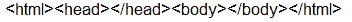

# Python | page_source 法中的 Selenium

> 原文:[https://www . geesforgeks . org/python-page _ source-in-method-selenium/](https://www.geeksforgeeks.org/python-page_source-method-in-selenium/)

`page_source`方法用于检索用户当前正在访问的网页的页面源。这种方法的主要用途是在页面源中查找一些东西，比如查找任何数据或关键字。

**页面来源:**源代码/页面来源是任何网页背后的编程。

**语法:**

```
driver.page_source

```

**参数:**

不需要争论。

**返回值:**
以字符串格式返回页面源。

**Code 1.**

```
# importing webdriver from selenium
from selenium import webdriver

# Here Chrome will be used
driver = webdriver.Chrome()

# URL of the website 
url = "https://www.geeksforgeeks.org/"

# Opening the URL
driver.get(url)

# Getting current URL source code
get_source = driver.page_source

# Printing the URL
print(get_source)
```

**输出:**该代码将打印“https://www.geeksforgeeks.org/”的源代码。

**代码 2。**没有打开网页时。

```
# importing webdriver from selenium
from selenium import webdriver

# Here Chrome  will be used
driver = webdriver.Chrome()

# Getting current URL source code
get_source = driver.page_source

# Printing the URL
print(get_source)
```

**输出:**
