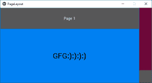
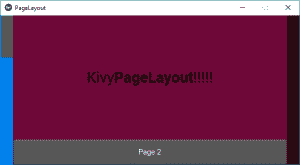
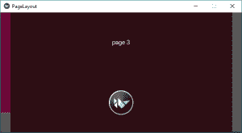
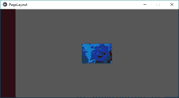

# Python |页面布局在 Kivy 中使用。kv 文件

> 原文:[https://www . geesforgeks . org/python-page layout-in-kivy-using-kv-file/](https://www.geeksforgeeks.org/python-pagelayout-in-kivy-using-kv-file/)

Kivy 是 Python 中独立于平台的 GUI 工具。因为它可以在安卓、IOS、linux 和 Windows 等平台上运行。它基本上是用来开发安卓应用程序的，但并不意味着它不能在桌面应用程序上使用。

> [Kivy 教程–通过示例学习 Kivy](https://www.geeksforgeeks.org/kivy-tutorial/)。

### 页面布局：

页面布局的工作方式不同于其他布局。这是一种动态布局，因为它允许使用边框翻页。这个想法是，它的组件堆叠在彼此的前面，我们只能看到在上面的那个。
页面布局类似于副本的页面，我们可以向右或向左移动/更改页面。

PageLayout 类用于创建一个简单的多页布局，允许使用边框轻松地从一页切换到另一页。

要使用页面布局，您必须通过以下命令导入它:

```py
from kivy.uix.pagelayout import PageLayout
```

**注意:**
页面布局目前不支持 size_hint、size_hint_min、size_hint_max 或 pos_hint 属性。这意味着我们不能在页面布局中使用所有这些。

**示例:**

```py
PageLayout:
    Button:
        text: 'page1'
    Button:
        text: 'page2'
    Button:
        text: 'page3'
```

从一页到下一页的过渡是通过从右侧或左侧的边框区域滑入来实现的。如果您想在一个页面上使用多个小部件，请使用布局来实现。理想情况下，每个页面应该包含一个布局小部件，其中包含该页面上的其余小部件。

页面布局包含许多东西，可以用来使它更有效更容易。kv 文件。

1.  **边框:**当前页面周围的边框宽度，用于在需要时显示上一页/下一页滑动区域。border 是一个 NumericProperty，默认为 50dp。
2.  **页面:**当前显示的页面。页面是一个数字属性，默认为 0。
3.  **swipe_threshold:** 用于触发 swipe 的阈值占小部件大小的百分比。swipe_threshold 是一个 NumericProperty，默认为. 5。

**使用创建页面布局的基本方法。kv 文件**

```py
1) import kivy
2) import kivyApp
3) import Pagelayout
4) Set minimum version(optional)
5) create Layout class
6) create App class
      - create build() function
7) Set up .kv file(name same as the App class)
8) return Layout/widget/Class(according to requirement)
9) Run an instance of the class
```

以下是[的实现。kv 文件【本规范中的 T1】:](https://www.geeksforgeeks.org/python-kivy-kv-file/)

> 1).kv 文件只是简单的如何创建页面。kv 文件
> 2)。kv 文件是怎么可以添加功能的哟像:颜色，文本，图像，画布，swipe_threshold，[按钮](https://www.geeksforgeeks.org/python-working-with-buttons-in-kivy/)在页面中。

**实施方法–**
**主文件**

## 蟒蛇 3

```py
## Sample Python application demonstrating the
## working of PageLayout in Kivy using .kv file

##################################################
# import kivy module  
import kivy

# base Class of your App inherits from the App class.  
# app:always refers to the instance of your application 
from kivy.app import App

# this restrict the kivy version i.e
# below this kivy version you cannot
# use the app or software
kivy.require('1.9.0')

# The PageLayout class is used to create
# a simple multi-page layout,
# in a way that allows easy flipping from
# one page to another using borders.
from kivy.uix.pagelayout import PageLayout

# creating the root widget used in .kv file
class PageLayout(PageLayout):
    pass

# creating the App class in which name
#.kv file is to be named PageLayout.kv
class PageLayoutApp(App):
    # defining build()
    def build(self):
        # returning the instance of root class
        return PageLayout()

# creating object of PageLayoutApp() class
plApp = PageLayoutApp()

# run the class
plApp.run()
```

**1)。简单页面的 kv 文件**

## 蟒蛇 3

```py
# creating simple Pagelayout using.kv

<PageLayout>:

    # creating Page 1
    Button:
        text: "Page 1"

    # creating Page 2
    Button:
        text: "Page 2"

    # creating Page 3
    Button:
        text: "Page 3"

    # creating Page 3
    Button:
        text: "Page 4"

    # create Page as may as you want
```

**输出:**
**第 1 页图片**


**第 2 页影像**


类似的是第 3 页和第 4 页。
**2)。kv 文件，在页面上有一些特性**

## 蟒蛇 3

```py
# creating simple Pagelayout using.kv

# creating page Layout
<PageLayout>:

    # Creating Page 1

    # Using BoxLayout inside PageLayout
    BoxLayout:

        # creating Canvas
        canvas:
            Color:
                rgb: 0, .5, .95, 1
            Rectangle:
                pos: self.pos
                size: self.size

        # Providing orientation to the BoxLayout
        orientation: "vertical"

        # creating Button
        Button:
            text: "Page 1"
            size_hint_y: .4

        # Adding Label to Page 1

        Label:
            markup: True
            text: "GFG[b]:):):):)[/b]"
            color: 0, 0, 0, 1
            outline_color: 0, 0.5, 0.5, 1
            font_size: 30

    # Creating Page 2
    BoxLayout:
        orientation: "vertical"

        canvas:
            Color:
                rgba: 109 / 255., 8 / 255., 57 / 255., 1
            Rectangle:
                pos: self.pos
                size: self.size
        Label:
            markup: True
            text: " Kivy[b]PageLayout[/b]!!!!! "
            color: 0, 0, 0, 1
            outline_color: 0, 0.5, 0.5, 1
            font_size: 30

        Button:
            text: "Page 2"
            size_hint_y: .2

    # Creating Page 3
    BoxLayout:

        orientation: 'vertical'

        canvas:
            Color:
                rgba: 100 / 555., 9 / 155., 37 / 455., 1
            Rectangle:
                pos: self.pos
                size: self.size

        Label:
            text: 'page 3'

        # This Image is directly from the websource
        # By using AsyncImage you can use that
        AsyncImage:
            source: 'http://kivy.org / logos / kivy-logo-black-64.png'

    # Creating Page 4
    Button:
        # Adding image
        # image must be .png
        # and present at the same folder where
        # .kv and main file is saved
        Image:
            source: "download.png"
            center_x: self.parent.center_x
            center_y: self.parent.center_y
```

**输出:**
**第 1 页**



**第 2 页**



**第 3 页**



**第 4 页**



**视频输出:**

<video class="wp-video-shortcode" id="video-307330-1" width="640" height="360" preload="metadata" controls=""><source type="video/webm" src="https://media.geeksforgeeks.org/wp-content/uploads/20190523232355/page-layout-kv.webm?_=1">[https://media.geeksforgeeks.org/wp-content/uploads/20190523232355/page-layout-kv.webm](https://media.geeksforgeeks.org/wp-content/uploads/20190523232355/page-layout-kv.webm)</video>